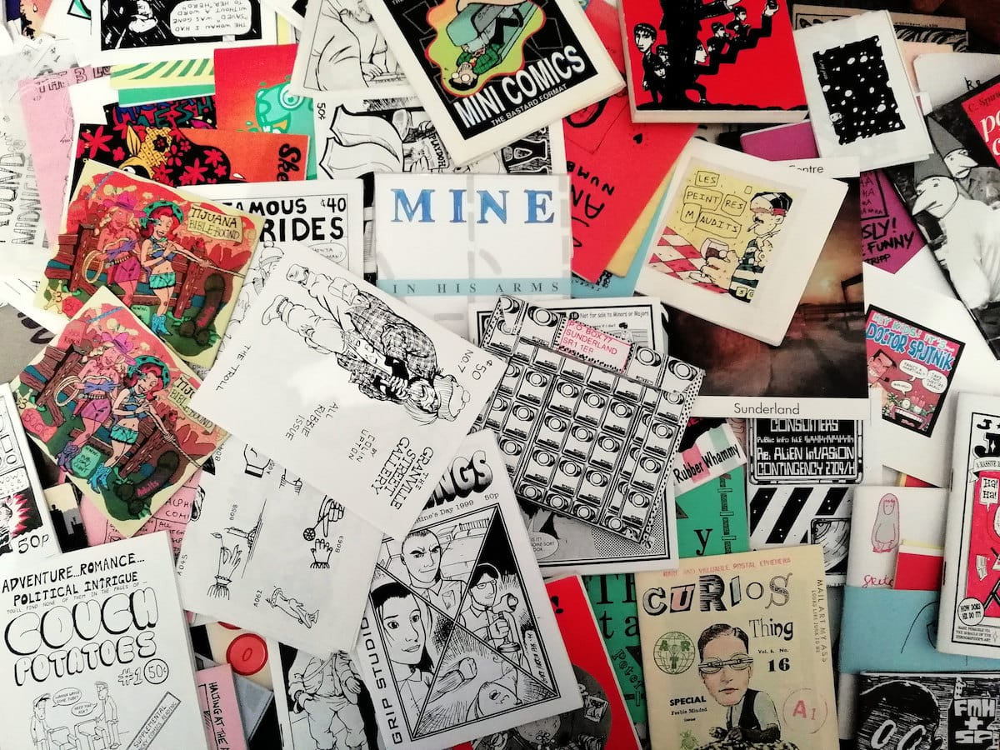

# The BugPowder archive

From 1988 to the early 2000s I amassed a collection of self published comics and zines, mostly from the UK small press comics scenes but also from across the world. I ran a review zine, TRS, and a mail order distro, BugPowder, which meant people sent me unsollicited copies of their zines for review or sale. I drifted away from the scene from around 2003 but kept all the zines in boxes. 

In 2024, while signed off work with Long-Covid-related stuff, I decided to start scanning them, opening the first box and starting from the top. This page shows my progress. 

Pete Ashton

## Info
- [Scanning the BugPowder zine archive](https://72.peteashton.com/scanning-the-bugpowder-archive/) - blog post introducing the project, 25 June 2024.
- [The archive on display in 2018.](https://art.peteashton.com/OZA/)

## Stats
Progress is measured by taking the physical height of the scanned zines (currently just A5 as I only have a normal scanner right now) vs the total height of the boxes of zines. I use this percentage to estimate the total file size and the date of the final scan. 
  
-	Date of first scan: 	6 June 2024	
-	This page updated: 	16 July 2024	
-	Size of scanned files: 	32.89	GB
-	Height of scanned zines:	237	mm
-	Total height of zines:	3,750	mm
-	Estimated total filesize	1040.82	GB
-	Boxes scanned:	0.47	/ 15
-	Progress: 	3.16%	
-	**Estimated day of final scan:	11 January 2027**


**Progress:**  
3.16%  
⬛⬛⬛🔲🔲🔲🔲🔲🔲🔲🔲🔲🔲🔲🔲🔲🔲🔲🔲🔲🔲🔲🔲🔲🔲  
🔲🔲🔲🔲🔲🔲🔲🔲🔲🔲🔲🔲🔲🔲🔲🔲🔲🔲🔲🔲🔲🔲🔲🔲🔲  
🔲🔲🔲🔲🔲🔲🔲🔲🔲🔲🔲🔲🔲🔲🔲🔲🔲🔲🔲🔲🔲🔲🔲🔲🔲  
🔲🔲🔲🔲🔲🔲🔲🔲🔲🔲🔲🔲🔲🔲🔲🔲🔲🔲🔲🔲🔲🔲🔲🔲🔲  
100%

*(Don't try to replicate my maths - there are a few qualifiers in there which would take too long to explain.)*

## The zines




As the scanning progresses I will include a searchable index of the archive (or more likely a link to a Google spreadsheet). For now here's a dump of the directories.

```
├── AMP
│   └── AMP 0 (1998)
├── Alan Macintyre
│   └── Urine
├── Alastair Maceachern
│   └── Amusing Paper 1 (2004)
├── Aleksandar Zograf
│   └── Alas Comica 6 (1996)
├── Andre Paine
│   └── Vollmond 1 (1988)
├── Andy (Konky Kru)
│   ├── Andy's Konky Kru Picture Strips (1995)
│   └── Realistische Zeichnungen 1
├── Andy Luke
│   └── TRS2 - Comics 2001 edition
├── Andy Nixon
│   ├── Angel Dust Funnies 1 (1989)
│   └── Angel Dust Funnies 4 (1989)
├── Atomic
│   └── Atomic 10 (1990-91)
├── Ben Graham
│   └── The First Job (2001)
├── Ben Hunt & Robyn Talbot
│   └── Classic Comics #2 (2001)
├── Ben Oakes
│   └── The Miserable Tale Of Demeter & Sharky (2002)
├── Big Untidy
│   └── Big Untidy - Flyer and Letter
├── Bob Lynch
│   └── Tales of Sadness (1996)
├── Brian Dean
│   ├── Anxiety Culture 1 (1995)
│   └── Anxiety Culture 3
├── Bugs & Drugs
│   ├── Bugs & Drugs 1 (1992)
│   └── Bugs & Drugs 4
├── C Cilla
│   └── The Diplomat 3 (1996)
├── Carrie McNinch
│   ├── The Assassin and the Whiner 10 (1998)
│   └── The Assassin and the Whiner 11 (1999)
├── Charise Mericle
│   └── Color Right (1995)
├── Chris Webster
│   └── Rockdrill (2005)
├── Dal
│   └── Toonadelic Times 2 (2001)
├── Dan Howland
│   └── The Journal of Ride Theory 3 (1997?)
├── Darren Powell
│   └── Theatre of Conceits 03 (1996)
├── Darryl Cunningham
│   ├── Blood Relatives (1989)
│   ├── The British Sketchbook v1 (1997)
│   └── The Marvel Sketchbook (1994)
├── David Baillie
│   └── David Baillie's Awkward Fascination Compendium (2003)
├── David Gordon
│   ├── Fury 2 (1991)
│   ├── Fury 3 (1992)
│   └── The Lightning Room [Damage 1] (1993)
├── David Willacy
│   └── The Outer Realms 3 (2004)
├── Derek Gray
│   └── Fish Wish (1993)
├── Douglas Nobel
│   ├── SFM Roma (2002)
│   └── Strip For Me 11 (2002)
├── Dylan Horrocks
│   └── Nga Pakiwaituhi o Aotearoa - New Zealand Comics (1998)
├── EL Press
│   └── Gloomy Delight (2001)
├── Factor Fiction Press
│   └── The Seven Faced Badger of Doom
├── Gary Northfield
│   └── Stupidmonsters #2 (2002)
├── Gary Parkin
│   ├── Fuzzball 4 (1997)
│   └── Fuzzball 5 (1997)
├── Goodman Bros
│   ├── Aggadon (2004)
│   ├── Zip Gun Presents - Chimera (2003)
│   └── Zip Gun Presents - Japan (2001)
├── Hisae Arai
│   └── Cheeky Monkey's Fun Book
├── Into The Abyss
│   └── Fight Amnesia! 10 (1996)
├── Jeremy Dennis
│   ├── 3inaBed 11 (1995)
│   ├── 3inaBed 15 (1996)
│   ├── Feeding the Geese
│   ├── Minute Steaks 22
│   └── The Little Blue Book Of Extraordinary Interiors (2004)
├── Jessica
│   ├── Psychosense 1 (1996)
│   └── Psychosense 9 (1997)
├── Jez Higgins
│   ├── Coffee Time 7 (1993)
│   └── TRS3 - May 2022
├── Jim Cameron
│   └── Confused (1996)
├── Jim Jones
│   └── Rider's Writes 5 (1997)
├── Jim Mcgee
│   ├── Square Eyed Stories 16 (2003)
│   └── Square Eyed Stories 17 (2004)
├── John Cake
│   └── The Bruising Pit (1998)
├── John Jaques
│   └── Fancy a Brew 1 (1997?)
├── Jone-Zee
│   └── Ain't Life A Blast 2
├── Kevin Lousy
│   └── Rinky Dink 1 (1998)
├── Liliane
│   └── Euro Liliane 11 (1996)
├── Luella Jane Wright
│   └── Mitten Brain 2 (1994)
├── Luke Walsh
│   └── Weird Astral Detective Fiction (1992)
├── Malcy Duff
│   ├── The Cloud Dog Agency (1999)
│   ├── Zero Termite 4 (1998)
│   └── Zero Termite 7 (1999)
├── Mark Pawson
│   ├── Disinfotainment - Armchair Shopping (1996)
│   └── Mapk ?237aвcoн
├── Mark Saltveit
│   └── The Palindromist 2 (1996)
├── Matthew Lawrenson
│   └── Thoughts and Words 2 (2002)
├── Mitch & Murray
│   └── Amateur demo edition (1997)
├── Mr Biggers
│   └── Loose Screws 15 (1998)
├── Paul & Neil Bristow
│   ├── Holocron 0
│   ├── Holocron 1 (1995)
│   ├── Refractor 1
│   ├── Refractor 2
│   ├── Refractor 3
│   ├── Refractor 4
│   └── The Whistleblowers (1995?)
├── Paul Lukas
│   ├── Beer Frame 10 (2000)
│   ├── Beer Frame 6 (1996)
│   └── Beer Frame 7 (1997)
├── Paul M Davies
│   ├── Fun Comics 1 (1995)
│   ├── Fun Comics 2 (1995)
│   └── Fun Comics 5 (1996)
├── Peter Poole
│   └── The Information 4 (1999)
├── Phil Elliott
│   └── Jonni Star (1998)
├── Rachel House
│   └── Art Students Stole My Vibrator (2000)
├── Ralph Kidson
│   └── Captain Dolphin 5
├── Rick Olsen
│   └── Tiddles the Wonder Cat's Super Silly Fun Book (1997)
├── Rik Hoskin
│   └── American Ant 1 (1993)
├── Rob Lenningrad
│   └── Watchblood
├── Robin Bougie
│   └── Minds Eye Presents 10 (2001)
├── Rol Hirst
│   ├── The Jock 05 (1993)
│   ├── The Jock 08 (1993)
│   ├── The Jock 09 (1993)
│   ├── The Jock 10 (1994)
│   ├── The Jock 11 (1994)
│   ├── The Jock 12 (1994)
│   ├── The Jock 14 (1994)
│   ├── The Jock 15 (1994)
│   └── The Jock 16 (1994)
├── Ros Garbles
│   └── Garbles 7 (1993)
├── Rough Cut Comics
│   └── Rough Cut Presents Trailers 1 (2001)
├── Ruel Gaviola
│   └── Amusing Yourself To Death 15 (1999)
├── Sally Anne Hickman
│   └── My Daily Review 1 (2001)
├── Sammy Wammy
│   └── Phobias (2000)
├── SchNEWS
│   ├── AKTSN 6 (1998)
│   ├── SchNEWS 158 (1998)
│   ├── SchNEWS 159 (1998)
│   ├── SchNEWS 160 (1998)
│   ├── SchNEWS 161 (1998)
│   └── SchNEWS 162 (1998)
├── Sean Azzopardi
│   └── Ed (2005)
├── Sean Duffield
│   └── Paper Tiger Comix 1 (2004)
├── Shawn Granton
│   └── Ten Foot Rule 5 (2000)
├── Simon Perrins & Andrew Livesey
│   └── Flying Monkey 3 (1998)
├── Smoke
│   └── Smoke - A London Perculiar 4 (2003)
├── Steve Blincoe
│   ├── Fat Knite 3 (1988)
│   ├── Fat Knite 4
│   ├── Fat Knite 5
│   └── Fat Knite 6
├── Terracotta
│   └── Terracotta (1996?)
├── The Desyre Foundation
│   └── The Desyre Foundation Newsletter 1 (1996)
├── Three Drunken Goths
│   └── Delirium Tremens #5 (1999)
├── Tim Brown
│   ├── Brin 2 (1998)
│   ├── Nightclub Nick 1 (2000)
│   ├── Nightclub Nick 2 (2000)
│   └── Nightclub Nick 6
├── Tom Spurgeon
│   └── Shelton (1999)
├── Tony McGee
│   ├── Angel Nebula 9 (2001)
│   └── Dark Weather 5 (1998)
├── Typewwriter
│   └── Typewriter 4 (2001)
└── Vincent Stall
    └── Robot Investigator (2001)
```

*[Pete Ashton](http://peteashton.com)*

<script data-goatcounter="https://bugpowder.goatcounter.com/count"
        async src="//gc.zgo.at/count.js"></script>

