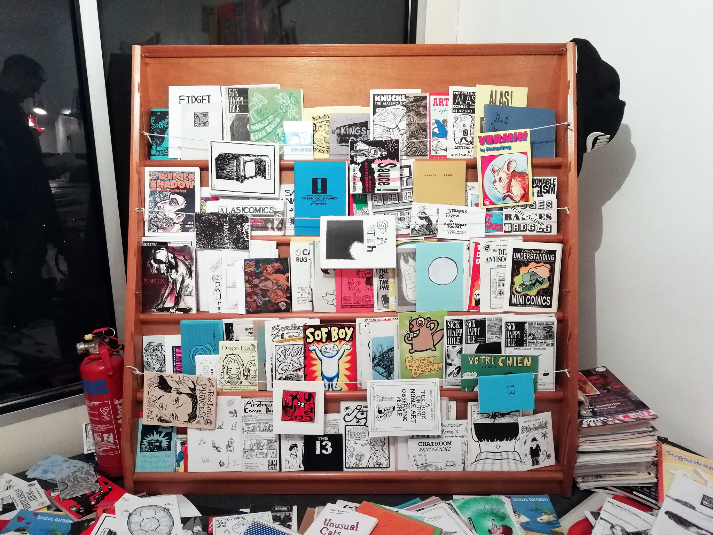
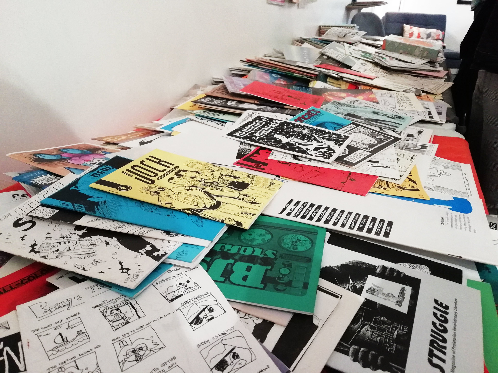
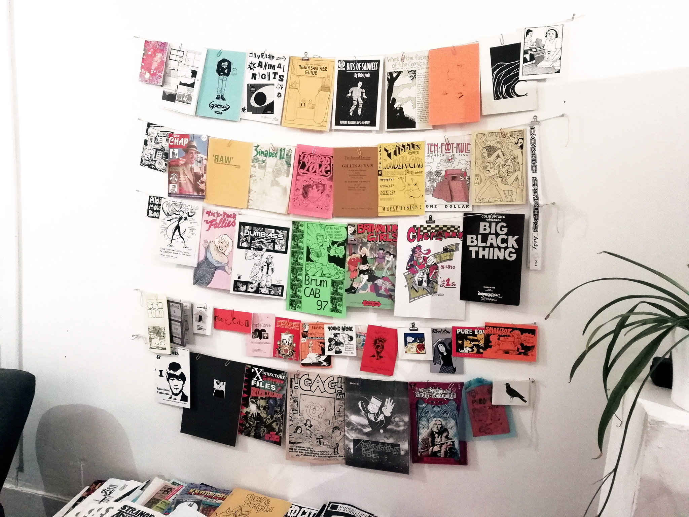
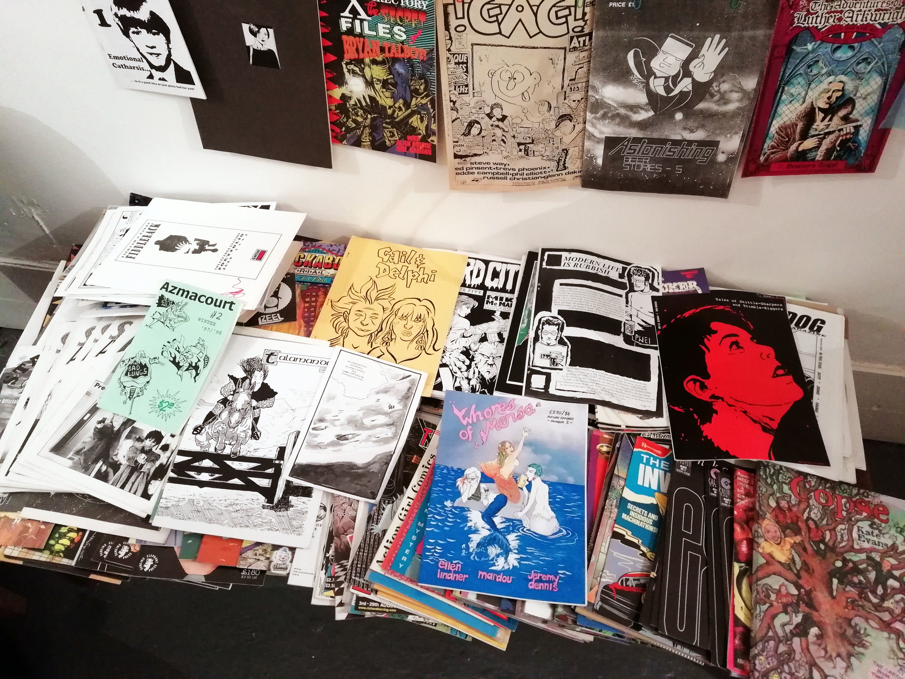
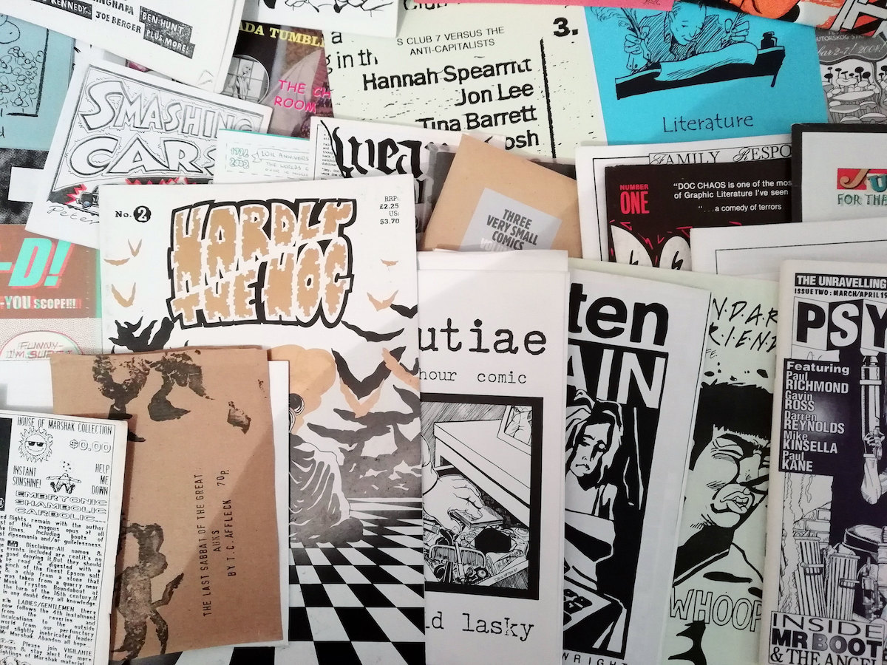

# The BugPowder archive

From 1988 to the early 2000s I amassed a collection of roughly 4-5,000 self published comics and zines, mostly from the UK small press comics scenes but also from across the world covering all manner of subjects. Most of them are photocopied or printed in very short runs. Many of them are hand-finished with personal touches. 

During the 1990s I ran a review zine, TRS, and a mail order distro, BugPowder, which meant people sent me unsolicited copies of their zines for review or sale. I drifted away from the scene from around 2003 but kept all the zines in boxes. Because while the quality may vary from the sublime to the unfortunate, they are unique objects and I feel they all have value.

In 2024, while signed off work with Long-Covid-related stuff, I decided to start scanning them, opening the first box of A5 zines and scanning a handful each evening. This page documents my progress. 

Pete Ashton  
*pete@peteashton.com*

At some point in 2025 I will have scanned all the smaller zines and will need to get an A3 scanner to do the rest. If you can advise me on which to buy and where to get one from at a reasonable price, or have one I could buy/borrow, please get in touch!

## More info about the project 

- [Scanning the BugPowder zine archive](https://72.peteashton.com/scanning-the-bugpowder-archive/) - blog post introducing the project, 25 June 2024.
- [The Open Zine Archive](https://art.peteashton.com/OZA/) - the collection on display in 2018.

## The scanned zines

As each zine is scanned it's added to a spreadsheet, the first stage of building a searchable archive: 

- [View as a web page.](https://docs.google.com/spreadsheets/d/e/2PACX-1vTrnKQwETHzJO6yjRxApwnhg-3YDlPZtRe7tNGySlMr_oOgLzX6rjShSduzq1MprZHocjUgMcs0Qrvn/pubhtml?gid=1433529062&single=true)
- [Download it as a PDF](https://docs.google.com/spreadsheets/d/e/2PACX-1vTrnKQwETHzJO6yjRxApwnhg-3YDlPZtRe7tNGySlMr_oOgLzX6rjShSduzq1MprZHocjUgMcs0Qrvn/pub?gid=1433529062&single=true&output=pdf).

Here are the covers of all zines in the order they were scanned. 

I periodically make a video slideshow of the covers in a higher resolution. 

<iframe width="560" height="315" src="https://www.youtube-nocookie.com/embed/b8R0jODRSyM?si=u8lOMqblLYgLTeza" title="YouTube video player" frameborder="0" allow="accelerometer; autoplay; clipboard-write; encrypted-media; gyroscope; picture-in-picture; web-share" referrerpolicy="strict-origin-when-cross-origin" allowfullscreen></iframe>

## Stats

Scanning is **4.8%** complete  
☑️☑️☑️☑️🔲🔲🔲🔲🔲🔲🔲🔲🔲🔲🔲🔲🔲🔲🔲🔲🔲🔲🔲🔲🔲🔲🔲🔲🔲🔲🔲🔲🔲🔲🔲🔲🔲🔲🔲🔲🔲🔲🔲🔲🔲🔲🔲🔲🔲🔲🔲🔲🔲🔲🔲🔲🔲🔲🔲🔲🔲🔲🔲🔲🔲🔲🔲🔲🔲🔲🔲🔲🔲🔲🔲🔲🔲🔲🔲🔲🔲🔲🔲🔲🔲🔲🔲🔲🔲🔲🔲🔲🔲🔲🔲🔲🔲🔲🔲🔲

This page was updated on **26 July 2024** and scanning began on **6 June 2024**.  Over those 50 days **192 zines** have been scanned, an average of **3.8 per day**. 

When stacked as an A4 pile the scanned zines are **169 mm high**.   The total height of all the zines in A4 boxes is **3,554 mm**, so we are **4.8%** of the way through the scanning. **0.68** of the 16 boxes have been scanned. *(A small but significant number of items may not technically be zines or self published, so the total height will shrink as I filter those out.)*

The 192 scanned zines comprise **5,402** pages, an average of **28.1** pages per zine. The largest zine has **92** pages and the smallest **2**. Of the scanned zines, the earliest were published in **1988** and the latest in **2005**.

The uncompressed TIFF files take up **46.6 GB** on disk. If we are 4.8% complete, the final total should be **979.3 GB**.   

At the current rate the final day of scanning should be **23 April 2027**, which is in **32.92** months.  

## Progress by format

Format | Total height | Scanned height | Progress
------ | ----- | ----- | -----
A6 / mini | 840mm | 12mm | 1.43%
A5 / digest | 1,930mm | 330mm | 17.10%
A4 / letter | 1,605mm | 1mm | 0.06%
Comic book | 1,090mm | 0mm | 0.00%

## Charts

### Distribution of page counts across scanned zines.

### Number of zines scanned each day.
(I had Covid 12-20 June...)

 

### Number of pages scanned each day.
(Some zines are bigger than others...)

 

## The zines on show

Photos taken from [an exhibition](https://art.peteashton.com/OZA/) put on in 2018. 







*[Pete Ashton](http://peteashton.com)*

