# The Covers

[< Back](../)

As of 7 August 2024 I've decided to pause scanning the contents of each zine and focus on scanning just the covers and adding them to [the spreadsheet](https://docs.google.com/spreadsheets/d/e/2PACX-1vTrnKQwETHzJO6yjRxApwnhg-3YDlPZtRe7tNGySlMr_oOgLzX6rjShSduzq1MprZHocjUgMcs0Qrvn/pubhtml?gid=1433529062&single=true). This should only take a couple of months and then we'll have a real sense of what this archive comprises. 

This page has thumbnails of the covers of all the zines sorted alphabetically by the name of their creator. Click on them to see something more legible. 

(I'll do something more interesting with them once we have a few thousand in the bag...)

<table>

<tr><td></td><td>Akiko Tamura</td><td>I Am The Corner </td><td>2005</td><td>A5</td><td>UK</td></tr>
<tr><td></td><td>Al Burian</td><td>The Long Walk Nowhere </td><td></td><td>A5</td><td>USA</td></tr>
<tr><td></td><td>Al Davison</td><td>Spiral Dreams - Sobakz's Dream </td><td>2002</td><td>A5</td><td>UK</td></tr>
<tr><td></td><td>Alan Macintyre</td><td>Urine </td><td></td><td>A5</td><td>USA</td></tr>
<tr><td></td><td>Alastair Maceachern</td><td>Amusing Paper 1</td><td>2004</td><td>A5</td><td>UK</td></tr>
<tr><td></td><td>Aleksandar Zograf</td><td>Alas Comica 6</td><td>1996</td><td>A6</td><td>Serbia</td></tr>
<tr><td></td><td>AMP</td><td>AMP 0</td><td>1998</td><td>A5</td><td>UK</td></tr>
<tr><td></td><td>Andre Paine</td><td>Vollmond 1</td><td>1988</td><td>A5</td><td>UK</td></tr>
<tr><td></td><td>Andrew Lewis</td><td>Top Notch Tosh 6</td><td>2002</td><td>A5</td><td>UK</td></tr>
<tr><td></td><td>Andy Konky Kru</td><td>Andy's Konky Kru Picture Strips </td><td>1995</td><td>A5</td><td>UK</td></tr>
<tr><td></td><td>Andy Konky Kru</td><td>Magazine 2</td><td>1998</td><td>A5</td><td>UK</td></tr>
<tr><td></td><td>Andy Konky Kru</td><td>Magazine 6</td><td>2002</td><td>A5</td><td>UK</td></tr>
<tr><td></td><td>Andy Konky Kru</td><td>Max & Moritz </td><td></td><td>A5</td><td>UK</td></tr>
<tr><td></td><td>Andy Konky Kru</td><td>Realistische Zeichnungen 1</td><td></td><td>A5</td><td>UK</td></tr>
<tr><td></td><td>Andy Konky Kru</td><td>Shtumm 1</td><td>2002</td><td>A5</td><td>UK</td></tr>
<tr><td></td><td>Andy Luke</td><td>Bob's  3</td><td>1997</td><td>A5</td><td>UK</td></tr>
<tr><td></td><td>Andy Luke</td><td>Bob's Annual 1</td><td>1997</td><td>A5</td><td>UK</td></tr>
<tr><td></td><td>Andy Luke</td><td>TRS2 - Comics 2001 edition </td><td></td><td>A5</td><td>UK</td></tr>
<tr><td></td><td>Andy Nixon</td><td>Angel Dust Funnies 1</td><td>1989</td><td>A5</td><td>UK</td></tr>
<tr><td><a href="../images/covers/100101_c.jpg">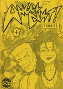</a></td><td>Andy Nixon</td><td>Angel Dust Funnies 4</td><td>1989</td><td>A5</td><td>UK</td></tr>
<tr><td></td><td>Andy Roberts</td><td>Media Assassin 9</td><td>2005</td><td>A5</td><td>UK</td></tr>
<tr><td></td><td>Andy Roberts</td><td>Media Assassin 11</td><td>2006</td><td>A5</td><td>UK</td></tr>
<tr><td></td><td>Andy Roberts</td><td>X-Ray 1</td><td>1994</td><td>A5</td><td>UK</td></tr>
<tr><td></td><td>Anthony Setchell</td><td>Circus of Deception </td><td>2001</td><td>A5</td><td>UK</td></tr>
<tr><td></td><td>Atomic</td><td>Atomic 9</td><td>1990</td><td>A5</td><td>UK</td></tr>
<tr><td><a href="../images/covers/100176_c.jpg">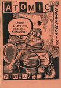</a></td><td>Atomic</td><td>Atomic 10</td><td>1990</td><td>A5</td><td>UK</td></tr>
<tr><td></td><td>Atomic</td><td>Atomic 11</td><td>1991</td><td>A5</td><td>UK</td></tr>
<tr><td></td><td>Ben Graham</td><td>The First Job </td><td>2001</td><td>A5</td><td></td></tr>
<tr><td></td><td>Ben Hunt</td><td>Tales from the Midden 45606</td><td></td><td>A5</td><td>UK</td></tr>
<tr><td></td><td>Ben Hunt</td><td>Vogarth </td><td>2001</td><td>A5</td><td>UK</td></tr>
<tr><td></td><td>Ben Hunt & Robyn Talbot</td><td>Classic Comics 2</td><td>2001</td><td>A5</td><td>UK</td></tr>
<tr><td></td><td>Ben Oakes</td><td>Fifteen Nuns 4</td><td>1997</td><td>A5</td><td>UK</td></tr>
<tr><td></td><td>Ben Oakes</td><td>Fifteen Nuns 5</td><td>1997</td><td>A5</td><td>UK</td></tr>
<tr><td></td><td>Ben Oakes</td><td>Fifteen Nuns 6</td><td>1997</td><td>A5</td><td>UK</td></tr>
<tr><td></td><td>Ben Oakes</td><td>The Lupus 3</td><td>2001</td><td>A5</td><td>UK</td></tr>
<tr><td></td><td>Ben Oakes</td><td>The Miserable Tale Of Demeter & Sharky </td><td>2002</td><td>A5</td><td>UK</td></tr>
<tr><td></td><td>Bib Edwards</td><td>Braque's Love Dart </td><td>2001</td><td>A5</td><td>UK</td></tr>
<tr><td></td><td>Big Untidy</td><td>Big Untidy - Flyer and Letter </td><td></td><td>A5</td><td></td></tr>
<tr><td></td><td>Bob Lynch</td><td>Double Bill </td><td>1992</td><td>A5</td><td>UK</td></tr>
<tr><td></td><td>Bob Lynch</td><td>Tales of Sadness </td><td>1996</td><td>A5</td><td>UK</td></tr>
<tr><td></td><td>Brian Dean</td><td>Anxiety Culture 1</td><td>1995</td><td>A5</td><td>UK</td></tr>
<tr><td></td><td>Brian Dean</td><td>Anxiety Culture 3</td><td></td><td>A5</td><td>UK</td></tr>
<tr><td></td><td>Bryan Talbot</td><td>Frank Fazakerly </td><td>1991</td><td>A5</td><td>UK</td></tr>
<tr><td></td><td>Bugs & Drugs</td><td>Bugs & Drugs 1</td><td>1992</td><td>A5</td><td>UK</td></tr>
<tr><td></td><td>Bugs & Drugs</td><td>Bugs & Drugs 4</td><td></td><td>A5</td><td>UK</td></tr>
<tr><td></td><td>C Cilla</td><td>The Diplomat 3</td><td>1996</td><td>A5</td><td>USA</td></tr>
<tr><td></td><td>Carrie McNinch</td><td>The Assassin and the Whiner 10</td><td>1998</td><td>A5</td><td>USA</td></tr>
<tr><td></td><td>Carrie McNinch</td><td>The Assassin and the Whiner 11</td><td>1999</td><td>A5</td><td>USA</td></tr>
<tr><td></td><td>Charise Mericle</td><td>Color Right </td><td>1995</td><td>A6</td><td></td></tr>
<tr><td></td><td>Chris Askham</td><td>Ally and the Big Man </td><td>2001</td><td>A5</td><td>UK</td></tr>
<tr><td></td><td>Chris Askham</td><td>Dr Sponge 1</td><td>2001</td><td>A5</td><td>UK</td></tr>
<tr><td></td><td>Chris Webster</td><td>Rockdrill </td><td>2005</td><td>A5</td><td>UK</td></tr>
<tr><td></td><td>Colin Upton</td><td>Buddah on the Road 2</td><td></td><td>A5</td><td>USA</td></tr>
<tr><td></td><td>Dal</td><td>Toonadelic Times 2</td><td>2001</td><td>A5</td><td>UK</td></tr>
<tr><td></td><td>Damian Cugely</td><td>Percy Street </td><td>2004</td><td>A5</td><td>UK</td></tr>
<tr><td></td><td>Damian Cugley</td><td>Lickity Spit 2</td><td>1995</td><td>A5</td><td>UK</td></tr>
<tr><td></td><td>Damian Cugley</td><td>Lickity Spit 3</td><td>1996</td><td>A5</td><td>UK</td></tr>
<tr><td></td><td>Damian Cugley</td><td>Percy Street 2</td><td>2005</td><td>A5</td><td>UK</td></tr>
<tr><td></td><td>Dan Howland</td><td>The Journal of Ride Theory 3</td><td>1997</td><td>A5</td><td>USA</td></tr>
<tr><td></td><td>Daniel Merlin Goodbrey</td><td>Mr Nile: The Illustrated Bastard </td><td>2003</td><td>A5</td><td>UK</td></tr>
<tr><td></td><td>Darren Powel</td><td>Sin 4</td><td>1996</td><td>A5</td><td>UK</td></tr>
<tr><td></td><td>Darren Powel</td><td>Theatre of Conceits 8</td><td>1999</td><td>A5</td><td>UK</td></tr>
<tr><td></td><td>Darren Powell</td><td>Going to Chapel </td><td>1995</td><td>A5</td><td>UK</td></tr>
<tr><td></td><td>Darren Powell</td><td>Sin 3</td><td>1995</td><td>A5</td><td>UK</td></tr>
<tr><td></td><td>Darren Powell</td><td>Sin 5</td><td>1997</td><td>A5</td><td>UK</td></tr>
<tr><td></td><td>Darren Powell</td><td>Theatre of Conceits 1</td><td>1995</td><td>A5</td><td>UK</td></tr>
<tr><td></td><td>Darren Powell</td><td>Theatre of Conceits 2</td><td>1995</td><td>A5</td><td>UK</td></tr>
<tr><td></td><td>Darren Powell</td><td>Theatre of Conceits 3</td><td>1996</td><td>A5</td><td>UK</td></tr>
<tr><td></td><td>Darren Powell</td><td>Theatre of Conceits 5</td><td>1997</td><td>A5</td><td>UK</td></tr>
<tr><td></td><td>Darryl Cunningham</td><td>Blood Relatives </td><td>1989</td><td>A5</td><td>UK</td></tr>
<tr><td></td><td>Darryl Cunningham</td><td>The British Sketchbook 1</td><td>1997</td><td>A5</td><td>UK</td></tr>
<tr><td></td><td>Darryl Cunningham</td><td>The Marvel Sketchbook </td><td>1994</td><td>A5</td><td>UK</td></tr>
<tr><td></td><td>Dave Metcalfe</td><td>Got to live their life 1</td><td>1995</td><td>A5</td><td>UK</td></tr>
<tr><td></td><td>David Baillie</td><td>David Baillie's Awkward Fascination Compendium </td><td>2003</td><td>A5</td><td>UK</td></tr>
<tr><td></td><td>David Gordon</td><td>Fury 2</td><td>1991</td><td>A5</td><td>UK</td></tr>
<tr><td></td><td>David Gordon</td><td>Fury 3</td><td>1992</td><td>A5</td><td>UK</td></tr>
<tr><td></td><td>David Gordon</td><td>The Lightning Room [Damage 1] </td><td>1993</td><td>A5</td><td>UK</td></tr>
<tr><td></td><td>David Metcalfe</td><td>My Life Story 3</td><td>1995</td><td>A5</td><td>UK</td></tr>
<tr><td><a href="../images/covers/100318_c.jpg">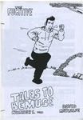</a></td><td>David Metcalfe</td><td>The Fugitive </td><td>1995</td><td>A5</td><td>UK</td></tr>
<tr><td></td><td>David Morris</td><td>Burp! 2</td><td></td><td></td><td>UK</td></tr>
<tr><td></td><td>David Potts</td><td>Inkling 9</td><td>1992</td><td>A5</td><td>UK</td></tr>
<tr><td></td><td>David Potts</td><td>Inkling Fish</td><td>1991</td><td>A5</td><td>UK</td></tr>
<tr><td><a href="../images/covers/100087_c.jpg">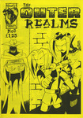</a></td><td>David Willacy</td><td>The Outer Realms 3</td><td>2004</td><td>A5</td><td></td></tr>
<tr><td></td><td>Debbie Moon</td><td>Contact 1</td><td>1997</td><td>A5</td><td>UK</td></tr>
<tr><td></td><td>Debbie Moon</td><td>Contact 2</td><td>1997</td><td>A5</td><td>UK</td></tr>
<tr><td></td><td>Deirde Ruane</td><td>Wasted Epiphanies </td><td></td><td>A5</td><td></td></tr>
<tr><td></td><td>Dejan Bogojevic</td><td>црни креч 45353</td><td>1997</td><td>A5</td><td>Serbia</td></tr>
<tr><td></td><td>Dek Baker</td><td>Wargods of Atlantis 6</td><td>1997</td><td>A5</td><td>UK</td></tr>
<tr><td></td><td>Denny Derbyshire</td><td>The Staring Eye 1</td><td>1994</td><td>A5</td><td>UK</td></tr>
<tr><td></td><td>Denny Derbyshire</td><td>The Staring Eye 3</td><td>1995</td><td>A5</td><td>UK</td></tr>
<tr><td></td><td>Derek Gray</td><td>Fish Wish </td><td>1993</td><td>A6</td><td></td></tr>
<tr><td></td><td>Diane DiMassa</td><td>Hothead Paisan 18</td><td>1995</td><td>A5</td><td>USA</td></tr>
<tr><td></td><td>Diane DiMassa</td><td>Hothead Pasian 19</td><td>1995</td><td>A5</td><td>USA</td></tr>
<tr><td></td><td>Douglas Nobel</td><td>SFM Roma </td><td>2002</td><td>A4</td><td>UK</td></tr>
<tr><td></td><td>Douglas Nobel</td><td>Strip For Me 11</td><td>2002</td><td>A5</td><td>UK</td></tr>
<tr><td><a href="../images/covers/100102_c.jpg">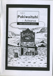</a></td><td>Dylan Horrocks</td><td>Nga Pakiwaituhi o Aotearoa - New Zealand Comics </td><td>1998</td><td>A5</td><td>NZ</td></tr>
<tr><td></td><td>Dylan Williams</td><td>Reporter 1</td><td></td><td>A5</td><td>USA</td></tr>
<tr><td></td><td>Dylan Williams</td><td>Reporter 2</td><td></td><td>A5</td><td>USA</td></tr>
<tr><td></td><td>Ed Hillyer</td><td>The End 4</td><td>1999</td><td>A5</td><td>UK</td></tr>
<tr><td></td><td>Ed Pinsent</td><td>Fast Fiction 27</td><td></td><td>A5</td><td>UK</td></tr>
<tr><td></td><td>Ed Pinsent</td><td>Fast Fiction 12</td><td>1984</td><td>A5</td><td>UK</td></tr>
<tr><td><a href="../images/covers/100307_c.jpg">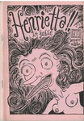</a></td><td>Ed Pinsent</td><td>Henrietta!! </td><td>1991</td><td>A5</td><td>UK</td></tr>
<tr><td></td><td>EL Press</td><td>Gloomy Delight </td><td>2001</td><td>A5</td><td></td></tr>
<tr><td></td><td>Factor Fiction Press</td><td>The Seven Faced Badger of Doom </td><td></td><td>A5</td><td>UK</td></tr>
<tr><td></td><td>Garen Ewing</td><td>Delirium 1</td><td>1996</td><td>A5</td><td>UK</td></tr>
<tr><td></td><td>Garen Ewing</td><td>The Captain Powerchord Special </td><td>1996</td><td>A5</td><td>UK</td></tr>
<tr><td></td><td>Gary Northfield</td><td>Great! 1</td><td>1999</td><td></td><td>UK</td></tr>
<tr><td></td><td>Gary Northfield</td><td>Stupidmonsters 2</td><td>2002</td><td>A6</td><td>UK</td></tr>
<tr><td></td><td>Gary Parkin</td><td>Fuzzball 4</td><td>1997</td><td>A5</td><td>UK</td></tr>
<tr><td></td><td>Gary Parkin</td><td>Fuzzball 5</td><td>1997</td><td>A5</td><td>UK</td></tr>
<tr><td></td><td>Gary Parkin</td><td>Fuzzball Summer Special </td><td>1997</td><td>A5</td><td>UK</td></tr>
<tr><td></td><td>Gary Parkin</td><td>Fuzzball Superhero Special </td><td>1998</td><td>A5</td><td>UK</td></tr>
<tr><td></td><td>Gary Parkin</td><td>Head Hunter 2</td><td>1997</td><td>A5</td><td>UK</td></tr>
<tr><td></td><td>Gary Parkin</td><td>Head Hunter 3</td><td>1997</td><td>A5</td><td>UK</td></tr>
<tr><td></td><td>Gary Parkin</td><td>Head Hunter 4</td><td>1997</td><td>A5</td><td>UK</td></tr>
<tr><td></td><td>Gary Parkin</td><td>Head Hunter 5</td><td>1997</td><td>A5</td><td>UK</td></tr>
<tr><td></td><td>Gary Parkin</td><td>Head Hunter: The Aftermath </td><td>1997</td><td>A5</td><td>UK</td></tr>
<tr><td><a href="../images/covers/100308_c.jpg">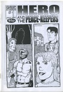</a></td><td>Gary Parkin</td><td>Hero and the Peace-keepers 1</td><td>1997</td><td>A5</td><td>UK</td></tr>
<tr><td></td><td>Gary Parkin</td><td>Psycho 1</td><td></td><td>A5</td><td>UK</td></tr>
<tr><td><a href="../images/covers/100251_c.jpg">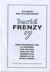</a></td><td>Gav Burrows</td><td>Lucid Frenzy 7</td><td>2006</td><td>A5</td><td>UK</td></tr>
<tr><td></td><td>Gav Burrows</td><td>Rocket Science </td><td>2003</td><td>A5</td><td>UK</td></tr>
<tr><td><a href="../images/covers/100311_c.jpg">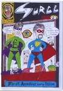</a></td><td>Ger Evans</td><td>Surge 10</td><td>1998</td><td>A5</td><td>Ireland</td></tr>
<tr><td></td><td>Ger Evans</td><td>Surge 9</td><td>1998</td><td>A5</td><td>Ireland</td></tr>
<tr><td></td><td>Giulia Brusco</td><td>Memories of a Murderer </td><td>2000</td><td>A5</td><td>UK</td></tr>
<tr><td></td><td>Goodman Bros</td><td>Aggadon </td><td>2004</td><td>A5</td><td>UK</td></tr>
<tr><td></td><td>Goodman Bros</td><td>Bahala Na! 3</td><td>2003</td><td>A5</td><td>UK</td></tr>
<tr><td></td><td>Goodman Bros</td><td>Zip Gun Presents - Chimera </td><td>2003</td><td>A5</td><td>UK</td></tr>
<tr><td></td><td>Goodman Bros</td><td>Zip Gun Presents - Japan </td><td>2001</td><td>A5</td><td>UK</td></tr>
<tr><td></td><td>Goodman Bros</td><td>Zip Gun Presents - Noir </td><td>2002</td><td>A5</td><td>UK</td></tr>
<tr><td></td><td>Graham Pearce</td><td>Sgt Mike Battle </td><td>2001</td><td>A5</td><td>UK</td></tr>
<tr><td></td><td>Graham Pearce</td><td>Watchblood </td><td></td><td>A5</td><td>UK</td></tr>
<tr><td></td><td>Ham & Knife</td><td>The Journal of Silly 10</td><td>1997</td><td>A5</td><td>UK</td></tr>
<tr><td></td><td>Hisae Arai</td><td>Cheeky Monkey's Fun Book </td><td></td><td>A5</td><td>UK</td></tr>
<tr><td></td><td>Into The Abyss</td><td>Fight Amnesia! 10</td><td>1996</td><td>A5</td><td>UK</td></tr>
<tr><td></td><td>Jack Turnbull</td><td>Apollo Astro 3</td><td>2000</td><td>A5</td><td>USA</td></tr>
<tr><td></td><td>Jack Turnbull</td><td>Apollo Astro 4</td><td>2001</td><td>A5</td><td>USA</td></tr>
<tr><td></td><td>James Parsons</td><td>Dr Parsons Strips and Boxes </td><td>2002</td><td>A5</td><td>UK</td></tr>
<tr><td></td><td>James Parsons</td><td>This is me by georg bush </td><td>2001</td><td>A5</td><td>UK</td></tr>
<tr><td></td><td>James Parsons</td><td>This is us by Mrs Becem </td><td>2002</td><td>A5</td><td>UK</td></tr>
<tr><td></td><td>Jason Cobley</td><td>Buldog Empire - preview </td><td></td><td>A5</td><td>UK</td></tr>
<tr><td></td><td>Jason Cobley</td><td>Bulldog Adventure Magazine 27</td><td>2005</td><td>A5</td><td>UK</td></tr>
<tr><td></td><td>Jason Whitley</td><td>Your Living Room </td><td>1996</td><td>A5</td><td></td></tr>
<tr><td></td><td>Jeffrey Lewis</td><td>Jeff's Austin Diary </td><td>2001</td><td>A5</td><td>USA</td></tr>
<tr><td></td><td>Jenny Zervakis</td><td>Bumbalo Above Ground </td><td></td><td>A5</td><td>USA</td></tr>
<tr><td></td><td>Jenny Zervakis</td><td>Strange Growths 13</td><td></td><td>A5</td><td>USA</td></tr>
<tr><td></td><td>Jenny Zervakis</td><td>Strange Growths 14.5</td><td></td><td>A5</td><td>USA</td></tr>
<tr><td></td><td>Jeremy Dennis</td><td>3inaBed 11</td><td>1995</td><td>A5</td><td>UK</td></tr>
<tr><td></td><td>Jeremy Dennis</td><td>3inaBed 13</td><td></td><td>A5</td><td>UK</td></tr>
<tr><td></td><td>Jeremy Dennis</td><td>3inaBed 15</td><td>1996</td><td>A5</td><td>UK</td></tr>
<tr><td></td><td>Jeremy Dennis</td><td>Cohabiting Cheapskates 6</td><td>1998</td><td>A5</td><td>UK</td></tr>
<tr><td></td><td>Jeremy Dennis</td><td>Feeding the Geese </td><td></td><td>A5</td><td>UK</td></tr>
<tr><td></td><td>Jeremy Dennis</td><td>Minute Steaks 22</td><td></td><td>A5</td><td>UK</td></tr>
<tr><td></td><td>Jeremy Dennis</td><td>The Little Blue Book Of Extraordinary Interiors </td><td>2004</td><td>A5</td><td>UK</td></tr>
<tr><td></td><td>Jeremy Dennis</td><td>The Weeky Strip </td><td>2001</td><td>A5</td><td>UK</td></tr>
<tr><td></td><td>Jeremy Dennis</td><td>Whatever Happed to Jeremy Dennis </td><td>2001</td><td>A5</td><td>UK</td></tr>
<tr><td></td><td>Jeremy Lewis</td><td>Kamandi </td><td>1997</td><td>A5</td><td>UK</td></tr>
<tr><td></td><td>Jerome Gaynor</td><td>Funkapotamus 5</td><td>1993</td><td>A5</td><td>USA</td></tr>
<tr><td></td><td>Jessica</td><td>Happy-Type Heroes 2</td><td>1997</td><td>A5</td><td>UK</td></tr>
<tr><td></td><td>Jessica</td><td>Lore 1</td><td></td><td>A5</td><td>UK</td></tr>
<tr><td></td><td>Jessica</td><td>Psychosense 1</td><td>1996</td><td>A5</td><td>UK</td></tr>
<tr><td></td><td>Jessica</td><td>Psychosense 9</td><td>1997</td><td>A5</td><td>UK</td></tr>
<tr><td></td><td>Jessica</td><td>Psychosense 10</td><td>1998</td><td>A5</td><td>UK</td></tr>
<tr><td></td><td>Jessica</td><td>Psychosense 5</td><td>1996</td><td>A5</td><td>UK</td></tr>
<tr><td></td><td>Jessica</td><td>Psychosense 4</td><td>1996</td><td>A5</td><td>UK</td></tr>
<tr><td><a href="../images/covers/100261_c.jpg">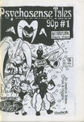</a></td><td>Jessica</td><td>Psychosense Tales 1</td><td>1997</td><td>A5</td><td>UK</td></tr>
<tr><td></td><td>Jez Higgins</td><td>Coffee Time 7</td><td>1993</td><td>A5</td><td>UK</td></tr>
<tr><td></td><td>Jez Higgins</td><td>Coffee Time 9</td><td>1994</td><td>A5</td><td>UK</td></tr>
<tr><td></td><td>Jez Higgins</td><td>Coffee Time 8</td><td>1994</td><td>A5</td><td>UK</td></tr>
<tr><td></td><td>Jez Higgins</td><td>TRS3 5-2002</td><td></td><td>A4</td><td>UK</td></tr>
<tr><td></td><td>Jim Cameron</td><td>Complicity </td><td>1997</td><td>A5</td><td>UK</td></tr>
<tr><td></td><td>Jim Cameron</td><td>Confused </td><td>1996</td><td>A5</td><td>UK</td></tr>
<tr><td></td><td>Jim Cameron</td><td>Disillusion </td><td>1996</td><td>A5</td><td>UK</td></tr>
<tr><td></td><td>Jim Cameron</td><td>Thou Art That </td><td></td><td>A5</td><td>UK</td></tr>
<tr><td></td><td>Jim Jones</td><td>Rider's Writes 5</td><td>1997</td><td>A5</td><td>UK</td></tr>
<tr><td></td><td>Jim Mcgee</td><td>RSI </td><td>2003</td><td>A5</td><td>UK</td></tr>
<tr><td></td><td>Jim Mcgee</td><td>Square Eyed Stories 16</td><td>2003</td><td>A5</td><td>UK</td></tr>
<tr><td></td><td>Jim Mcgee</td><td>Square Eyed Stories 17</td><td>2004</td><td>A5</td><td>UK</td></tr>
<tr><td></td><td>Jim Mcgee</td><td>Square Eyed Stories 15</td><td>2002</td><td>A5</td><td>UK</td></tr>
<tr><td></td><td>John Cake</td><td>The Bruising Pit </td><td>1998</td><td>A5</td><td>UK</td></tr>
<tr><td></td><td>John Edwards</td><td>Stop Making Sense 2</td><td></td><td>A5</td><td></td></tr>
<tr><td></td><td>John Hankiewicz</td><td>Tepid </td><td>1998</td><td>A5</td><td>USA</td></tr>
<tr><td><a href="../images/covers/100051_c.jpg">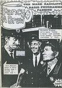</a></td><td>John Jaques</td><td>Fancy a Brew 1</td><td>1997</td><td>A5</td><td>UK</td></tr>
<tr><td></td><td>John Miller</td><td>Metaluna 1</td><td></td><td>A5</td><td>UK</td></tr>
<tr><td></td><td>John Porcellino</td><td>King Cat 38</td><td>1993</td><td>A5</td><td>USA</td></tr>
<tr><td></td><td>John Porcellino</td><td>King Cat 55</td><td>1999</td><td>A5</td><td>USA</td></tr>
<tr><td></td><td>John Welding</td><td>Goathland 7</td><td>1997</td><td>A5</td><td>UK</td></tr>
<tr><td></td><td>John Welding</td><td>Goathland 4</td><td>1997</td><td>A5</td><td>UK</td></tr>
<tr><td></td><td>Jone-Zee</td><td>Ain't Life A Blast 2</td><td></td><td>A5</td><td>UK</td></tr>
<tr><td></td><td>Ken Ives</td><td>Backwash 1</td><td>1998</td><td>A5</td><td>USA</td></tr>
<tr><td></td><td>Kevin Huizenga</td><td>Impossible 1</td><td>2001</td><td>A5</td><td>USA</td></tr>
<tr><td></td><td>Kevin Lousy</td><td>Rinky Dink 1</td><td>1998</td><td>A5</td><td>USA</td></tr>
<tr><td></td><td>La Cafetiere Editions</td><td>Worm 2</td><td>1998</td><td>A5</td><td>Belgium</td></tr>
<tr><td></td><td>Lark Pien</td><td>Stories from the Ward </td><td>1999</td><td>A5</td><td></td></tr>
<tr><td></td><td>Liliane</td><td>Euro Liliane 11</td><td>1996</td><td>A5</td><td>UK</td></tr>
<tr><td></td><td>Luella Jane Wright</td><td>Mitten Brain 2</td><td>1994</td><td>A5</td><td>UK</td></tr>
<tr><td></td><td>Luke Walsh</td><td>Weird Astral Detective Fiction </td><td>1992</td><td>A5</td><td>UK</td></tr>
<tr><td></td><td>Malcy Duff</td><td>A Lone Still </td><td>2005</td><td>A5</td><td>UK</td></tr>
<tr><td></td><td>Malcy Duff</td><td>Cute Yuck 1</td><td>2000</td><td>A5</td><td>UK</td></tr>
<tr><td></td><td>Malcy Duff</td><td>Hoofprints </td><td>2001</td><td>A5</td><td>UK</td></tr>
<tr><td><a href="../images/covers/100252_c.jpg">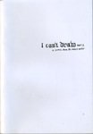</a></td><td>Malcy Duff</td><td>I Can't Draw 2</td><td>2005</td><td>A5</td><td>UK</td></tr>
<tr><td></td><td>Malcy Duff</td><td>Kerry </td><td>2002</td><td>A5</td><td>UK</td></tr>
<tr><td></td><td>Malcy Duff</td><td>The Cloud Dog Agency </td><td>1999</td><td>A5</td><td>UK</td></tr>
<tr><td></td><td>Malcy Duff</td><td>Zero Termite 4</td><td>1998</td><td>A5</td><td>UK</td></tr>
<tr><td></td><td>Malcy Duff</td><td>Zero Termite 7</td><td>1999</td><td>A5</td><td>UK</td></tr>
<tr><td></td><td>Mark Bickley</td><td>Sputnik 1</td><td>1999</td><td>A5</td><td>UK</td></tr>
<tr><td></td><td>Mark Pawson</td><td>Disinfotainment - Armchair Shopping </td><td>1996</td><td>A6</td><td>UK</td></tr>
<tr><td></td><td>Mark Pawson</td><td>Mapk Пaвcoн </td><td></td><td>A5</td><td>UK</td></tr>
<tr><td></td><td>Mark Saltveit</td><td>The Palindromist 2</td><td>1996</td><td>A5</td><td>USA</td></tr>
<tr><td></td><td>Martin Hand</td><td>Flimsy Monsterworks 2</td><td>1997</td><td>A5</td><td>UK</td></tr>
<tr><td></td><td>Matt Broersma</td><td>Les 9 cries du chat blanc </td><td>2004</td><td>A5</td><td>UK</td></tr>
<tr><td></td><td>Matthew Lawrenson</td><td>The Ant's Own Tram Wheel 3</td><td>1994</td><td>A5</td><td>UK</td></tr>
<tr><td><a href="../images/covers/100215_c.jpg">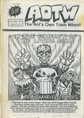</a></td><td>Matthew Lawrenson</td><td>The Ant's Own Tram Wheel 4</td><td>1994</td><td>A5</td><td>UK</td></tr>
<tr><td></td><td>Matthew Lawrenson</td><td>Thoughts and Words 2</td><td>2002</td><td>A5</td><td>UK</td></tr>
<tr><td></td><td>Maximum Traffic</td><td>Diary of Neo-Psychedelic Man 17</td><td></td><td>A5</td><td>USA</td></tr>
<tr><td></td><td>Maximum Traffic</td><td>Diary of Neo-Psychedelic Man 26</td><td></td><td>A5</td><td>USA</td></tr>
<tr><td></td><td>Megan Kelso</td><td>Unspoken </td><td>1996</td><td>A5</td><td>USA</td></tr>
<tr><td></td><td>Michael Perridge</td><td>Destronic News 2</td><td>1992</td><td>A5</td><td>UK</td></tr>
<tr><td></td><td>Michael Perridge</td><td>Destronic News 1</td><td>1991</td><td>A5</td><td>UK</td></tr>
<tr><td></td><td>Mike Tolento</td><td>Empty Life 10 [Filthy Shit flip] </td><td>1997</td><td>A5</td><td>USA</td></tr>
<tr><td></td><td>Mike Weller</td><td>The Sugar Paper Rebellion </td><td>1998</td><td>A5</td><td>UK</td></tr>
<tr><td></td><td>Mitch & Murray</td><td>Amateur demo edition </td><td>1997</td><td>A5</td><td>UK</td></tr>
<tr><td></td><td>Mr Biggers</td><td>Loose Screws 15</td><td>1998</td><td>A5</td><td>USA</td></tr>
<tr><td></td><td>Neil Fitzpatrick</td><td>Neil Jam 7</td><td>2001</td><td>A5</td><td>USA</td></tr>
<tr><td></td><td>Nigel Roberts</td><td>The Adventures of Hamish and Dwarf </td><td>1996</td><td>A5</td><td>UK</td></tr>
<tr><td></td><td>Paperrad</td><td>Muppet Babies </td><td></td><td>A5</td><td>USA</td></tr>
<tr><td></td><td>Patrick Brown</td><td>A Virtual Circle 4</td><td>1996</td><td>A5</td><td>UK</td></tr>
<tr><td></td><td>Patrick Brown</td><td>A Virtual Circle 1</td><td>1995</td><td>A5</td><td>UK</td></tr>
<tr><td></td><td>Patrick Brown</td><td>A Virtual Circle 2</td><td>1996</td><td>A5</td><td>UK</td></tr>
<tr><td></td><td>Patrick Brown</td><td>A Virtual Circle 5</td><td>1996</td><td>A5</td><td>UK</td></tr>
<tr><td></td><td>Patrick Brown</td><td>Under the Bed </td><td>1996</td><td>A5</td><td>UK</td></tr>
<tr><td></td><td>Paul & Neil Bristow</td><td>Holocron 0</td><td></td><td>A5</td><td>UK</td></tr>
<tr><td></td><td>Paul & Neil Bristow</td><td>Holocron 1</td><td>1995</td><td>A5</td><td>UK</td></tr>
<tr><td></td><td>Paul & Neil Bristow</td><td>Refractor 1</td><td></td><td>A5</td><td>UK</td></tr>
<tr><td></td><td>Paul & Neil Bristow</td><td>Refractor 2</td><td></td><td>A5</td><td>UK</td></tr>
<tr><td></td><td>Paul & Neil Bristow</td><td>Refractor 3</td><td></td><td>A5</td><td>UK</td></tr>
<tr><td><a href="../images/covers/100054_c.jpg">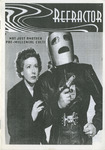</a></td><td>Paul & Neil Bristow</td><td>Refractor 4</td><td></td><td>A5</td><td>UK</td></tr>
<tr><td></td><td>Paul & Neil Bristow</td><td>The Whistleblowers </td><td>1995</td><td>A5</td><td>UK</td></tr>
<tr><td></td><td>Paul Lukas</td><td>Beer Frame 6</td><td>1996</td><td>A5</td><td>USA</td></tr>
<tr><td></td><td>Paul Lukas</td><td>Beer Frame 7</td><td>1997</td><td>A5</td><td>USA</td></tr>
<tr><td></td><td>Paul Lukas</td><td>Beer Frame 10</td><td>2000</td><td>A5</td><td>USA</td></tr>
<tr><td></td><td>Paul M Davies</td><td>Fun Comics 1</td><td>1995</td><td>A5</td><td>UK</td></tr>
<tr><td><a href="../images/covers/100073_c.jpg">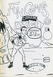</a></td><td>Paul M Davies</td><td>Fun Comics 2</td><td>1995</td><td>A5</td><td>UK</td></tr>
<tr><td></td><td>Paul M Davies</td><td>Fun Comics 5</td><td>1996</td><td>A5</td><td>UK</td></tr>
<tr><td></td><td>Paul Rainey</td><td>Dear Robert and Partner </td><td>2007</td><td>A5</td><td>UK</td></tr>
<tr><td></td><td>Peet Clack</td><td>Fume! </td><td>2002</td><td>A6</td><td></td></tr>
<tr><td></td><td>Pete Pavement</td><td>Pavement 1</td><td>1992</td><td>A5</td><td>UK</td></tr>
<tr><td></td><td>Peter Bangs</td><td>Round Midnight 2</td><td>1996</td><td>A5</td><td>UK</td></tr>
<tr><td></td><td>Peter Pavement</td><td>Pavement 2+3</td><td>1992</td><td>A5</td><td>UK</td></tr>
<tr><td></td><td>Peter Poole</td><td>The Information 4</td><td>1999</td><td>A5</td><td>UK</td></tr>
<tr><td></td><td>Phil Elliott</td><td>Jonni Star </td><td>1998</td><td>A5</td><td>UK</td></tr>
<tr><td></td><td>Rachel House</td><td>Art Students Stole My Vibrator </td><td>2000</td><td>A5</td><td>UK</td></tr>
<tr><td></td><td>Rachel House</td><td>Bumper Summer Fun </td><td>2003</td><td>A5</td><td>UK</td></tr>
<tr><td></td><td>Ralph Kidson</td><td>Captain Dolphin 5</td><td></td><td>A5</td><td>UK</td></tr>
<tr><td></td><td>Ralph Kidson</td><td>Two To Beam Up 2</td><td>2001</td><td>A5</td><td>UK</td></tr>
<tr><td></td><td>Reinder Dijkhuis</td><td>IK </td><td>1997</td><td>A5</td><td>Netherlands</td></tr>
<tr><td></td><td>Richard Z Starbuck</td><td>Automatic 6</td><td>1996</td><td>A5</td><td>UK</td></tr>
<tr><td></td><td>Rick Olsen</td><td>Tiddles the Wonder Cat's Super Silly Fun Book </td><td>1997</td><td>A5</td><td>UK</td></tr>
<tr><td><a href="../images/covers/100163_c.jpg">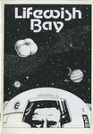</a></td><td>Ricky Douglas</td><td>Lifewish Bay </td><td></td><td>A5</td><td>UK</td></tr>
<tr><td></td><td>Rik Hoskin</td><td>American Ant 1</td><td>1993</td><td>A5</td><td>UK</td></tr>
<tr><td></td><td>Rik Hoskin</td><td>Broken Jeffrey </td><td>1996</td><td>A5</td><td>UK</td></tr>
<tr><td></td><td>Robert Martin</td><td>Pride of an Angel 1</td><td>2003</td><td>A5</td><td>UK</td></tr>
<tr><td></td><td>Robert Martin</td><td>Pride of an Angel 1</td><td>2001</td><td>A5</td><td>UK</td></tr>
<tr><td></td><td>Robert Martin</td><td>Pride of an Angel 2</td><td>2001</td><td>A5</td><td>UK</td></tr>
<tr><td></td><td>Robert Martin</td><td>Pride of an Angel One Shot</td><td>2002</td><td>A5</td><td>UK</td></tr>
<tr><td></td><td>Robin Bougie</td><td>Minds Eye Presents 10</td><td>2001</td><td>A5</td><td>USA</td></tr>
<tr><td></td><td>Robin Bougie</td><td>Minds Eye Presents 11</td><td>1999</td><td>A5</td><td>USA</td></tr>
<tr><td></td><td>Robin Bougie</td><td>The Incest Project 3</td><td>2005</td><td>A5</td><td>USA</td></tr>
<tr><td></td><td>Roger Mason</td><td>The Mice in RAID </td><td>2003</td><td>A5</td><td>UK</td></tr>
<tr><td></td><td>Rol Hirst</td><td>A Jock Gallery </td><td>1994</td><td>A5</td><td>UK</td></tr>
<tr><td><a href="../images/covers/100217_c.jpg">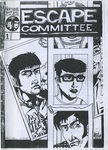</a></td><td>Rol Hirst</td><td>Escape Committee 1</td><td>1999</td><td>A5</td><td>UK</td></tr>
<tr><td></td><td>Rol Hirst</td><td>The Jock 1</td><td>1993</td><td>A5</td><td>UK</td></tr>
<tr><td></td><td>Rol Hirst</td><td>The Jock 5</td><td>1993</td><td>A5</td><td>UK</td></tr>
<tr><td></td><td>Rol Hirst</td><td>The Jock 6</td><td>1993</td><td>A5</td><td>UK</td></tr>
<tr><td><a href="../images/covers/100136_c.jpg">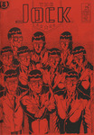</a></td><td>Rol Hirst</td><td>The Jock 8</td><td>1993</td><td>A5</td><td>UK</td></tr>
<tr><td></td><td>Rol Hirst</td><td>The Jock 9</td><td>1993</td><td>A5</td><td>UK</td></tr>
<tr><td></td><td>Rol Hirst</td><td>The Jock 10</td><td>1994</td><td>A5</td><td>UK</td></tr>
<tr><td></td><td>Rol Hirst</td><td>The Jock 11</td><td>1994</td><td>A5</td><td>UK</td></tr>
<tr><td></td><td>Rol Hirst</td><td>The Jock 12</td><td>1994</td><td>A5</td><td>UK</td></tr>
<tr><td></td><td>Rol Hirst</td><td>The Jock 14</td><td>1994</td><td>A5</td><td>UK</td></tr>
<tr><td></td><td>Rol Hirst</td><td>The Jock 15</td><td>1994</td><td>A5</td><td>UK</td></tr>
<tr><td></td><td>Rol Hirst</td><td>The Jock 16</td><td>1994</td><td>A5</td><td>UK</td></tr>
<tr><td><a href="../images/covers/100224_c.jpg">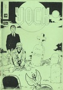</a></td><td>Rol Hirst</td><td>The Jock 18</td><td>1995</td><td>A5</td><td>UK</td></tr>
<tr><td></td><td>Rol Hirst</td><td>The Jock 20</td><td>1995</td><td>A5</td><td>UK</td></tr>
<tr><td></td><td>Rol Hirst</td><td>The Jock 21</td><td>1995</td><td>A5</td><td>UK</td></tr>
<tr><td></td><td>Ros Garbles</td><td>Garbles 7</td><td>1993</td><td>A5</td><td>UK</td></tr>
<tr><td></td><td>Ros Garbles</td><td>Garbles 9</td><td>1994</td><td>A5</td><td>UK</td></tr>
<tr><td></td><td>Ros Garbles</td><td>Garbles 10</td><td>1995</td><td>A5</td><td>UK</td></tr>
<tr><td></td><td>Ros Garbles</td><td>Garbles 11</td><td>1997</td><td>A5</td><td>UK</td></tr>
<tr><td></td><td>Rough Cut Comics</td><td>Rough Cut Presents Trailers 1</td><td>2001</td><td>A5</td><td>UK</td></tr>
<tr><td></td><td>Ruel Gaviola</td><td>Amusing Yourself To Death 15</td><td>1999</td><td>A5</td><td>USA</td></tr>
<tr><td></td><td>Sally Anne Hickman</td><td>My Daily Review 1</td><td>2001</td><td>A5</td><td>UK</td></tr>
<tr><td></td><td>Sammy Wammy</td><td>Phobias </td><td>2000</td><td>A5</td><td>UK</td></tr>
<tr><td></td><td>Sarah Gunn</td><td>Soft 1</td><td></td><td>A5</td><td>UK</td></tr>
<tr><td></td><td>Sarah Gunn</td><td>Soft 2</td><td></td><td>A5</td><td>UK</td></tr>
<tr><td></td><td>SchNEWS</td><td>AKTSN 6</td><td>1998</td><td>A4</td><td>UK</td></tr>
<tr><td></td><td>SchNEWS</td><td>SchNEWS 158</td><td>1998</td><td>A4</td><td>UK</td></tr>
<tr><td></td><td>SchNEWS</td><td>SchNEWS 159</td><td>1998</td><td>A4</td><td>UK</td></tr>
<tr><td><a href="../images/covers/100024_c.jpg">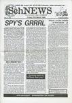</a></td><td>SchNEWS</td><td>SchNEWS 160</td><td>1998</td><td>A4</td><td>UK</td></tr>
<tr><td></td><td>SchNEWS</td><td>SchNEWS 161</td><td>1998</td><td>A5</td><td>UK</td></tr>
<tr><td></td><td>SchNEWS</td><td>SchNEWS 162</td><td>1998</td><td>A5</td><td>UK</td></tr>
<tr><td></td><td>Sean Azzopardi</td><td>Ed </td><td>2005</td><td>A5</td><td>UK</td></tr>
<tr><td></td><td>Sean Azzopardi</td><td>Twelve Hour Shift </td><td>2005</td><td>A5</td><td>UK</td></tr>
<tr><td></td><td>Sean Duffield</td><td>Paper Tiger Comix 1</td><td>2004</td><td>A5</td><td>UK</td></tr>
<tr><td></td><td>Sean Duffield</td><td>Paper Tiger Comix 2</td><td>2005</td><td>A5</td><td>UK</td></tr>
<tr><td></td><td>Selina Locke</td><td>The Girly Comic 1</td><td>2002</td><td>A5</td><td>UK</td></tr>
<tr><td></td><td>Shane Chesby</td><td>Imagineers 4</td><td>2001</td><td>A5</td><td>UK</td></tr>
<tr><td></td><td>Shawn Granton</td><td>Ten Foot Rule 5</td><td>2000</td><td>A5</td><td>USA</td></tr>
<tr><td></td><td>Shawn Granton & Mike Tolento</td><td>Ten Foot Rule 2.5 - Empty Life 10.5 flip </td><td>1998</td><td>A5</td><td>USA</td></tr>
<tr><td></td><td>Simon Mackie</td><td>Strimp </td><td>1996</td><td>A5</td><td>UK</td></tr>
<tr><td></td><td>Simon Perrins</td><td>Hope for the Future 3</td><td>2001</td><td>A5</td><td>UK</td></tr>
<tr><td></td><td>Simon Perrins</td><td>Hope for the Future 1</td><td>2000</td><td>A5</td><td>UK</td></tr>
<tr><td></td><td>Simon Perrins & Andrew Livesey</td><td>Flying Monkey 3</td><td>1998</td><td>A5</td><td>UK</td></tr>
<tr><td></td><td>Slab-o-Concrete</td><td>Anarchy in the UK... the Comic! </td><td>1994</td><td>A5</td><td>UK</td></tr>
<tr><td></td><td>Smoke</td><td>Smoke - A London Peculiar 4</td><td>2003</td><td>A5</td><td>UK</td></tr>
<tr><td></td><td>Smoke</td><td>Smoke - A London Peculiar 6</td><td></td><td>A5</td><td>UK</td></tr>
<tr><td></td><td>Steve Blincoe</td><td>Fat Knite 3</td><td>1988</td><td>A5</td><td>UK</td></tr>
<tr><td></td><td>Steve Blincoe</td><td>Fat Knite 4</td><td></td><td>A5</td><td>UK</td></tr>
<tr><td></td><td>Steve Blincoe</td><td>Fat Knite 5</td><td></td><td>A5</td><td>UK</td></tr>
<tr><td></td><td>Steve Blincoe</td><td>Fat Knite 6</td><td></td><td>A5</td><td>UK</td></tr>
<tr><td></td><td>Terracotta</td><td>Terracotta </td><td>1996</td><td>A5</td><td>UK</td></tr>
<tr><td></td><td>The Desyre Foundation</td><td>The Desyre Foundation Newsletter 1</td><td>1996</td><td>A5</td><td>UK</td></tr>
<tr><td><a href="../images/covers/100053_c.jpg">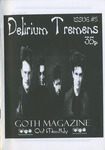</a></td><td>Three Drunken Goths</td><td>Delirium Tremens 5</td><td>1999</td><td>A5</td><td>UK</td></tr>
<tr><td></td><td>Tim Brown</td><td>Brin 2</td><td>1998</td><td>A5</td><td>UK</td></tr>
<tr><td></td><td>Tim Brown</td><td>Nightclub Nick 1</td><td>2000</td><td>A5</td><td>UK</td></tr>
<tr><td></td><td>Tim Brown</td><td>Nightclub Nick 2</td><td>2000</td><td>A5</td><td>UK</td></tr>
<tr><td><a href="../images/covers/100164_c.jpg">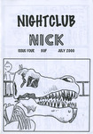</a></td><td>Tim Brown</td><td>Nightclub Nick 4</td><td>2000</td><td>A5</td><td>UK</td></tr>
<tr><td></td><td>Tim Brown</td><td>Nightclub Nick 6</td><td>2000</td><td>A5</td><td>UK</td></tr>
<tr><td></td><td>Tim Brown</td><td>The Mystic Stones 4</td><td>1996</td><td>A5</td><td>UK</td></tr>
<tr><td></td><td>Tim Brown</td><td>The Mystic Stones 5</td><td>1996</td><td>A5</td><td>UK</td></tr>
<tr><td></td><td>Tim Brown</td><td>The Mystic Stones 6</td><td>1996</td><td>A5</td><td>UK</td></tr>
<tr><td></td><td>Tim Brown</td><td>The Mystic Stones 7</td><td>1996</td><td>A5</td><td>UK</td></tr>
<tr><td></td><td>Toko</td><td>Japanize 3</td><td>1999</td><td>A5</td><td>UK</td></tr>
<tr><td></td><td>Toko</td><td>Japanize 2</td><td>1999</td><td>A5</td><td>UK</td></tr>
<tr><td></td><td>Toko</td><td>Japanize 10</td><td>2001</td><td>A5</td><td>UK</td></tr>
<tr><td><a href="../images/covers/100029_c.jpg">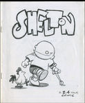</a></td><td>Tom Spurgeon</td><td>Shelton </td><td>1999</td><td>A5</td><td>USA</td></tr>
<tr><td></td><td>Tony McGee</td><td>Angel Nebula 9</td><td>2001</td><td>A5</td><td>UK</td></tr>
<tr><td></td><td>Tony McGee</td><td>Dark Weather 4</td><td>1997</td><td>A5</td><td>UK</td></tr>
<tr><td></td><td>Tony McGee</td><td>Dark Weather 5</td><td>1998</td><td>A5</td><td>UK</td></tr>
<tr><td></td><td>Tony McGee</td><td>Frontiers 7</td><td>2004</td><td>A5</td><td>UK</td></tr>
<tr><td></td><td>Tony McGee</td><td>Fun Bag </td><td></td><td>A5</td><td>UK</td></tr>
<tr><td></td><td>Tony McGee</td><td>True Stories 2</td><td>2005</td><td>A5</td><td>UK</td></tr>
<tr><td></td><td>Tracy B</td><td>Sharkpool 2</td><td>1998</td><td>A5</td><td>UK</td></tr>
<tr><td></td><td>Typewriter</td><td>Typewriter 4</td><td>2001</td><td>A5</td><td></td></tr>
<tr><td></td><td>Vincent Stall</td><td>Robot Investigator </td><td>2001</td><td>A5</td><td>USA</td></tr>
<tr><td></td><td>Wayne Clarke</td><td>The Smell of Napalm 2</td><td></td><td>A5</td><td>UK</td></tr>
<tr><td><a href="../images/covers/100174_c.jpg">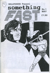</a></td><td>Will Pickering</td><td>Something Fast 1</td><td>1996</td><td>A5</td><td>UK</td></tr>
<tr><td></td><td>Will Pickering</td><td>Something Fast 2</td><td>1996</td><td>A5</td><td>UK</td></tr>
<tr><td></td><td>Will Pickering</td><td>Something Fast 3</td><td>1996</td><td>A5</td><td>UK</td></tr>
<tr><td></td><td>Wow Cool</td><td>Wow Cool Spring 97</td><td>1997</td><td>A5</td><td>USA</td></tr>
<tr><td></td><td>Yurt Barron</td><td>Wonky Fascination </td><td>2003</td><td>A5</td><td>UK</td></tr>
<tr><td></td><td></td><td> </td><td></td><td></td><td></td></tr>

</table>

---
end

