# The Zines

[< Back](../)

As of 7 August 2024 I've decided to pause scanning the contents of each zine and focus on scanning just the covers and adding them to the spreadsheet. This should only take a couple of months and then we'll have a real sense of what this archive comprises. 

This page has thumbnails of the covers of all the zines linked to more legible larger versions. 

Metadata is pretty basic - many zines have more than one creator but I've just entered the main or first listed person for now. This will be expenaded when it's a proper database. 

They're sorted by creator's first name (unless I forgot to sort before exporting). 

<table>
<tr><th>Cover</th><th>Title</th><th>Creator</th><th>Year</th><th>Format</th><th>Country</th></tr>

<tr><td></td><td>I Am The Corner </td><td>Akiko Tamura</td><td>2005</td><td>A5</td><td>UK</td></tr>
<tr><td></td><td>The Long Walk Nowhere </td><td>Al Burian</td><td></td><td>A5</td><td>USA</td></tr>
<tr><td></td><td>Spiral Dreams - Sobakz's Dream </td><td>Al Davison</td><td>2002</td><td>A5</td><td>UK</td></tr>
<tr><td></td><td>Urine </td><td>Alan Macintyre</td><td></td><td>A5</td><td>USA</td></tr>
<tr><td></td><td>Amusing Paper 1</td><td>Alastair Maceachern</td><td>2004</td><td>A5</td><td>UK</td></tr>
<tr><td></td><td>Alas Comica 6</td><td>Aleksandar Zograf</td><td>1996</td><td>A6</td><td>Serbia</td></tr>
<tr><td></td><td>AMP 0</td><td>AMP</td><td>1998</td><td>A5</td><td>UK</td></tr>
<tr><td></td><td>Vollmond 1</td><td>Andre Paine</td><td>1988</td><td>A5</td><td>UK</td></tr>
<tr><td></td><td>Top Notch Tosh 6</td><td>Andrew Lewis</td><td>2002</td><td>A5</td><td>UK</td></tr>
<tr><td></td><td>Andy's Konky Kru Picture Strips </td><td>Andy Konky Kru</td><td>1995</td><td>A5</td><td>UK</td></tr>
<tr><td></td><td>Magazine 2</td><td>Andy Konky Kru</td><td>1998</td><td>A5</td><td>UK</td></tr>
<tr><td></td><td>Magazine 6</td><td>Andy Konky Kru</td><td>2002</td><td>A5</td><td>UK</td></tr>
<tr><td></td><td>Max & Moritz </td><td>Andy Konky Kru</td><td></td><td>A5</td><td>UK</td></tr>
<tr><td></td><td>Realistische Zeichnungen 1</td><td>Andy Konky Kru</td><td></td><td>A5</td><td>UK</td></tr>
<tr><td><a href="../images/covers/100339_c.jpg">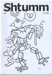</a></td><td>Shtumm 1</td><td>Andy Konky Kru</td><td>2002</td><td>A5</td><td>UK</td></tr>
<tr><td></td><td>Bob's  3</td><td>Andy Luke</td><td>1997</td><td>A5</td><td>UK</td></tr>
<tr><td></td><td>Bob's Annual 1</td><td>Andy Luke</td><td>1997</td><td>A5</td><td>UK</td></tr>
<tr><td></td><td>TRS2 - Comics 2001 edition </td><td>Andy Luke</td><td></td><td>A5</td><td>UK</td></tr>
<tr><td></td><td>Angel Dust Funnies 1</td><td>Andy Nixon</td><td>1989</td><td>A5</td><td>UK</td></tr>
<tr><td></td><td>Angel Dust Funnies 4</td><td>Andy Nixon</td><td>1989</td><td>A5</td><td>UK</td></tr>
<tr><td></td><td>Media Assassin 9</td><td>Andy Roberts</td><td>2005</td><td>A5</td><td>UK</td></tr>
<tr><td></td><td>Media Assassin 11</td><td>Andy Roberts</td><td>2006</td><td>A5</td><td>UK</td></tr>
<tr><td></td><td>X-Ray 1</td><td>Andy Roberts</td><td>1994</td><td>A5</td><td>UK</td></tr>
<tr><td></td><td>Circus of Deception </td><td>Anthony Setchell</td><td>2001</td><td>A5</td><td>UK</td></tr>
<tr><td></td><td>Atomic 9</td><td>Atomic</td><td>1990</td><td>A5</td><td>UK</td></tr>
<tr><td></td><td>Atomic 10</td><td>Atomic</td><td>1990</td><td>A5</td><td>UK</td></tr>
<tr><td></td><td>Atomic 11</td><td>Atomic</td><td>1991</td><td>A5</td><td>UK</td></tr>
<tr><td></td><td>The First Job </td><td>Ben Graham</td><td>2001</td><td>A5</td><td></td></tr>
<tr><td></td><td>Tales from the Midden 45606</td><td>Ben Hunt</td><td></td><td>A5</td><td>UK</td></tr>
<tr><td></td><td>Vogarth </td><td>Ben Hunt</td><td>2001</td><td>A5</td><td>UK</td></tr>
<tr><td></td><td>Classic Comics 2</td><td>Ben Hunt & Robyn Talbot</td><td>2001</td><td>A5</td><td>UK</td></tr>
<tr><td></td><td>Fifteen Nuns 4</td><td>Ben Oakes</td><td>1997</td><td>A5</td><td>UK</td></tr>
<tr><td></td><td>Fifteen Nuns 5</td><td>Ben Oakes</td><td>1997</td><td>A5</td><td>UK</td></tr>
<tr><td></td><td>Fifteen Nuns 6</td><td>Ben Oakes</td><td>1997</td><td>A5</td><td>UK</td></tr>
<tr><td></td><td>The Lupus 3</td><td>Ben Oakes</td><td>2001</td><td>A5</td><td>UK</td></tr>
<tr><td></td><td>The Miserable Tale Of Demeter & Sharky </td><td>Ben Oakes</td><td>2002</td><td>A5</td><td>UK</td></tr>
<tr><td></td><td>Braque's Love Dart </td><td>Bib Edwards</td><td>2001</td><td>A5</td><td>UK</td></tr>
<tr><td></td><td>Big Untidy - Flyer and Letter </td><td>Big Untidy</td><td></td><td>A5</td><td></td></tr>
<tr><td></td><td>Double Bill </td><td>Bob Lynch</td><td>1992</td><td>A5</td><td>UK</td></tr>
<tr><td><a href="../images/covers/100117_c.jpg">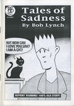</a></td><td>Tales of Sadness </td><td>Bob Lynch</td><td>1996</td><td>A5</td><td>UK</td></tr>
<tr><td></td><td>Anxiety Culture 1</td><td>Brian Dean</td><td>1995</td><td>A5</td><td>UK</td></tr>
<tr><td></td><td>Anxiety Culture 3</td><td>Brian Dean</td><td></td><td>A5</td><td>UK</td></tr>
<tr><td></td><td>Frank Fazakerly </td><td>Bryan Talbot</td><td>1991</td><td>A5</td><td>UK</td></tr>
<tr><td></td><td>Bugs & Drugs 1</td><td>Bugs & Drugs</td><td>1992</td><td>A5</td><td>UK</td></tr>
<tr><td></td><td>Bugs & Drugs 4</td><td>Bugs & Drugs</td><td></td><td>A5</td><td>UK</td></tr>
<tr><td></td><td>The Diplomat 3</td><td>C Cilla</td><td>1996</td><td>A5</td><td>USA</td></tr>
<tr><td></td><td>The Assassin and the Whiner 10</td><td>Carrie McNinch</td><td>1998</td><td>A5</td><td>USA</td></tr>
<tr><td></td><td>The Assassin and the Whiner 11</td><td>Carrie McNinch</td><td>1999</td><td>A5</td><td>USA</td></tr>
<tr><td></td><td>Color Right </td><td>Charise Mericle</td><td>1995</td><td>A6</td><td></td></tr>
<tr><td></td><td>Ally and the Big Man </td><td>Chris Askham</td><td>2001</td><td>A5</td><td>UK</td></tr>
<tr><td></td><td>Dr Sponge 1</td><td>Chris Askham</td><td>2001</td><td>A5</td><td>UK</td></tr>
<tr><td></td><td>Rockdrill </td><td>Chris Webster</td><td>2005</td><td>A5</td><td>UK</td></tr>
<tr><td></td><td>Buddah on the Road 2</td><td>Colin Upton</td><td></td><td>A5</td><td>USA</td></tr>
<tr><td></td><td>Toonadelic Times 2</td><td>Dal</td><td>2001</td><td>A5</td><td>UK</td></tr>
<tr><td></td><td>Percy Street </td><td>Damian Cugely</td><td>2004</td><td>A5</td><td>UK</td></tr>
<tr><td></td><td>Lickity Spit 2</td><td>Damian Cugley</td><td>1995</td><td>A5</td><td>UK</td></tr>
<tr><td><a href="../images/covers/100303_c.jpg">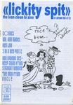</a></td><td>Lickity Spit 3</td><td>Damian Cugley</td><td>1996</td><td>A5</td><td>UK</td></tr>
<tr><td></td><td>Percy Street 2</td><td>Damian Cugley</td><td>2005</td><td>A5</td><td>UK</td></tr>
<tr><td></td><td>The Journal of Ride Theory 3</td><td>Dan Howland</td><td>1997</td><td>A5</td><td>USA</td></tr>
<tr><td><a href="../images/covers/100210_c.jpg">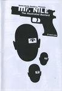</a></td><td>Mr Nile: The Illustrated Bastard </td><td>Daniel Merlin Goodbrey</td><td>2003</td><td>A5</td><td>UK</td></tr>
<tr><td></td><td>Sin 4</td><td>Darren Powel</td><td>1996</td><td>A5</td><td>UK</td></tr>
<tr><td></td><td>Theatre of Conceits 8</td><td>Darren Powel</td><td>1999</td><td>A5</td><td>UK</td></tr>
<tr><td></td><td>Going to Chapel </td><td>Darren Powell</td><td>1995</td><td>A5</td><td>UK</td></tr>
<tr><td></td><td>Sin 3</td><td>Darren Powell</td><td>1995</td><td>A5</td><td>UK</td></tr>
<tr><td></td><td>Sin 5</td><td>Darren Powell</td><td>1997</td><td>A5</td><td>UK</td></tr>
<tr><td></td><td>Theatre of Conceits 1</td><td>Darren Powell</td><td>1995</td><td>A5</td><td>UK</td></tr>
<tr><td></td><td>Theatre of Conceits 2</td><td>Darren Powell</td><td>1995</td><td>A5</td><td>UK</td></tr>
<tr><td></td><td>Theatre of Conceits 3</td><td>Darren Powell</td><td>1996</td><td>A5</td><td>UK</td></tr>
<tr><td></td><td>Theatre of Conceits 5</td><td>Darren Powell</td><td>1997</td><td>A5</td><td>UK</td></tr>
<tr><td></td><td>Blood Relatives </td><td>Darryl Cunningham</td><td>1989</td><td>A5</td><td>UK</td></tr>
<tr><td></td><td>The British Sketchbook 1</td><td>Darryl Cunningham</td><td>1997</td><td>A5</td><td>UK</td></tr>
<tr><td></td><td>The Marvel Sketchbook </td><td>Darryl Cunningham</td><td>1994</td><td>A5</td><td>UK</td></tr>
<tr><td></td><td>Got to live their life 1</td><td>Dave Metcalfe</td><td>1995</td><td>A5</td><td>UK</td></tr>
<tr><td></td><td>David Baillie's Awkward Fascination Compendium </td><td>David Baillie</td><td>2003</td><td>A5</td><td>UK</td></tr>
<tr><td><a href="../images/covers/100016_c.jpg">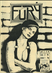</a></td><td>Fury 2</td><td>David Gordon</td><td>1991</td><td>A5</td><td>UK</td></tr>
<tr><td></td><td>Fury 3</td><td>David Gordon</td><td>1992</td><td>A5</td><td>UK</td></tr>
<tr><td><a href="../images/covers/100111_c.jpg">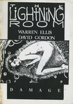</a></td><td>The Lightning Room [Damage 1] </td><td>David Gordon</td><td>1993</td><td>A5</td><td>UK</td></tr>
<tr><td></td><td>My Life Story 3</td><td>David Metcalfe</td><td>1995</td><td>A5</td><td>UK</td></tr>
<tr><td></td><td>The Fugitive </td><td>David Metcalfe</td><td>1995</td><td>A5</td><td>UK</td></tr>
<tr><td></td><td>Burp! 2</td><td>David Morris</td><td></td><td></td><td>UK</td></tr>
<tr><td></td><td>Inkling 9</td><td>David Potts</td><td>1992</td><td>A5</td><td>UK</td></tr>
<tr><td></td><td>Inkling Fish</td><td>David Potts</td><td>1991</td><td>A5</td><td>UK</td></tr>
<tr><td></td><td>The Outer Realms 3</td><td>David Willacy</td><td>2004</td><td>A5</td><td></td></tr>
<tr><td></td><td>Contact 1</td><td>Debbie Moon</td><td>1997</td><td>A5</td><td>UK</td></tr>
<tr><td></td><td>Contact 2</td><td>Debbie Moon</td><td>1997</td><td>A5</td><td>UK</td></tr>
<tr><td></td><td>Wasted Epiphanies </td><td>Deirde Ruane</td><td></td><td>A5</td><td></td></tr>
<tr><td><a href="../images/covers/100327_c.jpg">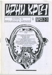</a></td><td>црни креч 45353</td><td>Dejan Bogojevic</td><td>1997</td><td>A5</td><td>Serbia</td></tr>
<tr><td></td><td>Wargods of Atlantis 6</td><td>Dek Baker</td><td>1997</td><td>A5</td><td>UK</td></tr>
<tr><td></td><td>The Staring Eye 1</td><td>Denny Derbyshire</td><td>1994</td><td>A5</td><td>UK</td></tr>
<tr><td></td><td>The Staring Eye 3</td><td>Denny Derbyshire</td><td>1995</td><td>A5</td><td>UK</td></tr>
<tr><td></td><td>Fish Wish </td><td>Derek Gray</td><td>1993</td><td>A6</td><td></td></tr>
<tr><td></td><td>Hothead Paisan 18</td><td>Diane DiMassa</td><td>1995</td><td>A5</td><td>USA</td></tr>
<tr><td></td><td>Hothead Pasian 19</td><td>Diane DiMassa</td><td>1995</td><td>A5</td><td>USA</td></tr>
<tr><td></td><td>SFM Roma </td><td>Douglas Nobel</td><td>2002</td><td>A4</td><td>UK</td></tr>
<tr><td><a href="../images/covers/100140_c.jpg">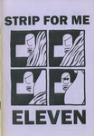</a></td><td>Strip For Me 11</td><td>Douglas Nobel</td><td>2002</td><td>A5</td><td>UK</td></tr>
<tr><td></td><td>Nga Pakiwaituhi o Aotearoa - New Zealand Comics </td><td>Dylan Horrocks</td><td>1998</td><td>A5</td><td>NZ</td></tr>
<tr><td></td><td>Reporter 1</td><td>Dylan Williams</td><td></td><td>A5</td><td>USA</td></tr>
<tr><td></td><td>Reporter 2</td><td>Dylan Williams</td><td></td><td>A5</td><td>USA</td></tr>
<tr><td></td><td>The End 4</td><td>Ed Hillyer</td><td>1999</td><td>A5</td><td>UK</td></tr>
<tr><td></td><td>Fast Fiction 27</td><td>Ed Pinsent</td><td></td><td>A5</td><td>UK</td></tr>
<tr><td><a href="../images/covers/100314_c.jpg">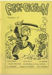</a></td><td>Fast Fiction 12</td><td>Ed Pinsent</td><td>1984</td><td>A5</td><td>UK</td></tr>
<tr><td></td><td>Henrietta!! </td><td>Ed Pinsent</td><td>1991</td><td>A5</td><td>UK</td></tr>
<tr><td></td><td>Gloomy Delight </td><td>EL Press</td><td>2001</td><td>A5</td><td></td></tr>
<tr><td></td><td>The Seven Faced Badger of Doom </td><td>Factor Fiction Press</td><td></td><td>A5</td><td>UK</td></tr>
<tr><td></td><td>Delirium 1</td><td>Garen Ewing</td><td>1996</td><td>A5</td><td>UK</td></tr>
<tr><td></td><td>The Captain Powerchord Special </td><td>Garen Ewing</td><td>1996</td><td>A5</td><td>UK</td></tr>
<tr><td></td><td>Great! 1</td><td>Gary Northfield</td><td>1999</td><td></td><td>UK</td></tr>
<tr><td></td><td>Stupidmonsters 2</td><td>Gary Northfield</td><td>2002</td><td>A6</td><td>UK</td></tr>
<tr><td></td><td>Fuzzball 4</td><td>Gary Parkin</td><td>1997</td><td>A5</td><td>UK</td></tr>
<tr><td></td><td>Fuzzball 5</td><td>Gary Parkin</td><td>1997</td><td>A5</td><td>UK</td></tr>
<tr><td></td><td>Fuzzball Summer Special </td><td>Gary Parkin</td><td>1997</td><td>A5</td><td>UK</td></tr>
<tr><td></td><td>Fuzzball Superhero Special </td><td>Gary Parkin</td><td>1998</td><td>A5</td><td>UK</td></tr>
<tr><td></td><td>Head Hunter 2</td><td>Gary Parkin</td><td>1997</td><td>A5</td><td>UK</td></tr>
<tr><td></td><td>Head Hunter 3</td><td>Gary Parkin</td><td>1997</td><td>A5</td><td>UK</td></tr>
<tr><td></td><td>Head Hunter 4</td><td>Gary Parkin</td><td>1997</td><td>A5</td><td>UK</td></tr>
<tr><td><a href="../images/covers/100241_c.jpg">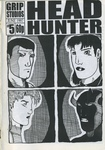</a></td><td>Head Hunter 5</td><td>Gary Parkin</td><td>1997</td><td>A5</td><td>UK</td></tr>
<tr><td></td><td>Head Hunter: The Aftermath </td><td>Gary Parkin</td><td>1997</td><td>A5</td><td>UK</td></tr>
<tr><td></td><td>Hero and the Peace-keepers 1</td><td>Gary Parkin</td><td>1997</td><td>A5</td><td>UK</td></tr>
<tr><td></td><td>Psycho 1</td><td>Gary Parkin</td><td></td><td>A5</td><td>UK</td></tr>
<tr><td></td><td>Lucid Frenzy 7</td><td>Gav Burrows</td><td>2006</td><td>A5</td><td>UK</td></tr>
<tr><td></td><td>Rocket Science </td><td>Gav Burrows</td><td>2003</td><td>A5</td><td>UK</td></tr>
<tr><td></td><td>Surge 10</td><td>Ger Evans</td><td>1998</td><td>A5</td><td>Ireland</td></tr>
<tr><td></td><td>Surge 9</td><td>Ger Evans</td><td>1998</td><td>A5</td><td>Ireland</td></tr>
<tr><td></td><td>Memories of a Murderer </td><td>Giulia Brusco</td><td>2000</td><td>A5</td><td>UK</td></tr>
<tr><td></td><td>Aggadon </td><td>Goodman Bros</td><td>2004</td><td>A5</td><td>UK</td></tr>
<tr><td></td><td>Bahala Na! 3</td><td>Goodman Bros</td><td>2003</td><td>A5</td><td>UK</td></tr>
<tr><td></td><td>Zip Gun Presents - Chimera </td><td>Goodman Bros</td><td>2003</td><td>A5</td><td>UK</td></tr>
<tr><td></td><td>Zip Gun Presents - Japan </td><td>Goodman Bros</td><td>2001</td><td>A5</td><td>UK</td></tr>
<tr><td></td><td>Zip Gun Presents - Noir </td><td>Goodman Bros</td><td>2002</td><td>A5</td><td>UK</td></tr>
<tr><td></td><td>Sgt Mike Battle </td><td>Graham Pearce</td><td>2001</td><td>A5</td><td>UK</td></tr>
<tr><td></td><td>Watchblood </td><td>Graham Pearce</td><td></td><td>A5</td><td>UK</td></tr>
<tr><td></td><td>The Journal of Silly 10</td><td>Ham & Knife</td><td>1997</td><td>A5</td><td>UK</td></tr>
<tr><td><a href="../images/covers/100059_c.jpg">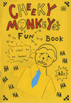</a></td><td>Cheeky Monkey's Fun Book </td><td>Hisae Arai</td><td></td><td>A5</td><td>UK</td></tr>
<tr><td></td><td>Fight Amnesia! 10</td><td>Into The Abyss</td><td>1996</td><td>A5</td><td>UK</td></tr>
<tr><td></td><td>Apollo Astro 3</td><td>Jack Turnbull</td><td>2000</td><td>A5</td><td>USA</td></tr>
<tr><td></td><td>Apollo Astro 4</td><td>Jack Turnbull</td><td>2001</td><td>A5</td><td>USA</td></tr>
<tr><td></td><td>Dr Parsons Strips and Boxes </td><td>James Parsons</td><td>2002</td><td>A5</td><td>UK</td></tr>
<tr><td></td><td>This is me by georg bush </td><td>James Parsons</td><td>2001</td><td>A5</td><td>UK</td></tr>
<tr><td></td><td>This is us by Mrs Becem </td><td>James Parsons</td><td>2002</td><td>A5</td><td>UK</td></tr>
<tr><td></td><td>Buldog Empire - preview </td><td>Jason Cobley</td><td></td><td>A5</td><td>UK</td></tr>
<tr><td></td><td>Bulldog Adventure Magazine 27</td><td>Jason Cobley</td><td>2005</td><td>A5</td><td>UK</td></tr>
<tr><td></td><td>Your Living Room </td><td>Jason Whitley</td><td>1996</td><td>A5</td><td></td></tr>
<tr><td></td><td>Jeff's Austin Diary </td><td>Jeffrey Lewis</td><td>2001</td><td>A5</td><td>USA</td></tr>
<tr><td></td><td>Bumbalo Above Ground </td><td>Jenny Zervakis</td><td></td><td>A5</td><td>USA</td></tr>
<tr><td></td><td>Strange Growths 13</td><td>Jenny Zervakis</td><td></td><td>A5</td><td>USA</td></tr>
<tr><td></td><td>Strange Growths 14.5</td><td>Jenny Zervakis</td><td></td><td>A5</td><td>USA</td></tr>
<tr><td></td><td>3inaBed 11</td><td>Jeremy Dennis</td><td>1995</td><td>A5</td><td>UK</td></tr>
<tr><td></td><td>3inaBed 13</td><td>Jeremy Dennis</td><td></td><td>A5</td><td>UK</td></tr>
<tr><td></td><td>3inaBed 15</td><td>Jeremy Dennis</td><td>1996</td><td>A5</td><td>UK</td></tr>
<tr><td></td><td>Cohabiting Cheapskates 6</td><td>Jeremy Dennis</td><td>1998</td><td>A5</td><td>UK</td></tr>
<tr><td></td><td>Feeding the Geese </td><td>Jeremy Dennis</td><td></td><td>A5</td><td>UK</td></tr>
<tr><td><a href="../images/covers/100038_c.jpg">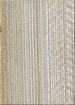</a></td><td>Minute Steaks 22</td><td>Jeremy Dennis</td><td></td><td>A5</td><td>UK</td></tr>
<tr><td></td><td>The Little Blue Book Of Extraordinary Interiors </td><td>Jeremy Dennis</td><td>2004</td><td>A5</td><td>UK</td></tr>
<tr><td><a href="../images/covers/100146_c.jpg">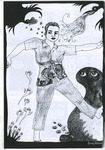</a></td><td>The Weeky Strip </td><td>Jeremy Dennis</td><td>2001</td><td>A5</td><td>UK</td></tr>
<tr><td></td><td>Whatever Happed to Jeremy Dennis </td><td>Jeremy Dennis</td><td>2001</td><td>A5</td><td>UK</td></tr>
<tr><td></td><td>Kamandi </td><td>Jeremy Lewis</td><td>1997</td><td>A5</td><td>UK</td></tr>
<tr><td></td><td>Funkapotamus 5</td><td>Jerome Gaynor</td><td>1993</td><td>A5</td><td>USA</td></tr>
<tr><td></td><td>Happy-Type Heroes 2</td><td>Jessica</td><td>1997</td><td>A5</td><td>UK</td></tr>
<tr><td></td><td>Lore 1</td><td>Jessica</td><td></td><td>A5</td><td>UK</td></tr>
<tr><td></td><td>Psychosense 1</td><td>Jessica</td><td>1996</td><td>A5</td><td>UK</td></tr>
<tr><td></td><td>Psychosense 9</td><td>Jessica</td><td>1997</td><td>A5</td><td>UK</td></tr>
<tr><td></td><td>Psychosense 10</td><td>Jessica</td><td>1998</td><td>A5</td><td>UK</td></tr>
<tr><td></td><td>Psychosense 5</td><td>Jessica</td><td>1996</td><td>A5</td><td>UK</td></tr>
<tr><td></td><td>Psychosense 4</td><td>Jessica</td><td>1996</td><td>A5</td><td>UK</td></tr>
<tr><td></td><td>Psychosense Tales 1</td><td>Jessica</td><td>1997</td><td>A5</td><td>UK</td></tr>
<tr><td></td><td>Coffee Time 7</td><td>Jez Higgins</td><td>1993</td><td>A5</td><td>UK</td></tr>
<tr><td></td><td>Coffee Time 9</td><td>Jez Higgins</td><td>1994</td><td>A5</td><td>UK</td></tr>
<tr><td></td><td>Coffee Time 8</td><td>Jez Higgins</td><td>1994</td><td>A5</td><td>UK</td></tr>
<tr><td><a href="../images/covers/100036_c.jpg">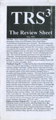</a></td><td>TRS3 5-2002</td><td>Jez Higgins</td><td></td><td>A4</td><td>UK</td></tr>
<tr><td></td><td>Complicity </td><td>Jim Cameron</td><td>1997</td><td>A5</td><td>UK</td></tr>
<tr><td></td><td>Confused </td><td>Jim Cameron</td><td>1996</td><td>A5</td><td>UK</td></tr>
<tr><td></td><td>Disillusion </td><td>Jim Cameron</td><td>1996</td><td>A5</td><td>UK</td></tr>
<tr><td></td><td>Thou Art That </td><td>Jim Cameron</td><td></td><td>A5</td><td>UK</td></tr>
<tr><td><a href="../images/covers/100068_c.jpg">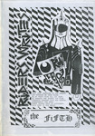</a></td><td>Rider's Writes 5</td><td>Jim Jones</td><td>1997</td><td>A5</td><td>UK</td></tr>
<tr><td></td><td>RSI </td><td>Jim Mcgee</td><td>2003</td><td>A5</td><td>UK</td></tr>
<tr><td></td><td>Square Eyed Stories 16</td><td>Jim Mcgee</td><td>2003</td><td>A5</td><td>UK</td></tr>
<tr><td></td><td>Square Eyed Stories 17</td><td>Jim Mcgee</td><td>2004</td><td>A5</td><td>UK</td></tr>
<tr><td></td><td>Square Eyed Stories 15</td><td>Jim Mcgee</td><td>2002</td><td>A5</td><td>UK</td></tr>
<tr><td><a href="../images/covers/100109_c.jpg">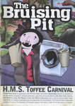</a></td><td>The Bruising Pit </td><td>John Cake</td><td>1998</td><td>A5</td><td>UK</td></tr>
<tr><td></td><td>Stop Making Sense 2</td><td>John Edwards</td><td></td><td>A5</td><td></td></tr>
<tr><td></td><td>Tepid </td><td>John Hankiewicz</td><td>1998</td><td>A5</td><td>USA</td></tr>
<tr><td></td><td>Fancy a Brew 1</td><td>John Jaques</td><td>1997</td><td>A5</td><td>UK</td></tr>
<tr><td></td><td>Metaluna 1</td><td>John Miller</td><td></td><td>A5</td><td>UK</td></tr>
<tr><td></td><td>King Cat 38</td><td>John Porcellino</td><td>1993</td><td>A5</td><td>USA</td></tr>
<tr><td></td><td>King Cat 55</td><td>John Porcellino</td><td>1999</td><td>A5</td><td>USA</td></tr>
<tr><td></td><td>Goathland 7</td><td>John Welding</td><td>1997</td><td>A5</td><td>UK</td></tr>
<tr><td></td><td>Goathland 4</td><td>John Welding</td><td>1997</td><td>A5</td><td>UK</td></tr>
<tr><td></td><td>Ain't Life A Blast 2</td><td>Jone-Zee</td><td></td><td>A5</td><td>UK</td></tr>
<tr><td></td><td>Backwash 1</td><td>Ken Ives</td><td>1998</td><td>A5</td><td>USA</td></tr>
<tr><td></td><td>Impossible 1</td><td>Kevin Huizenga</td><td>2001</td><td>A5</td><td>USA</td></tr>
<tr><td></td><td>Rinky Dink 1</td><td>Kevin Lousy</td><td>1998</td><td>A5</td><td>USA</td></tr>
<tr><td></td><td>Worm 2</td><td>La Cafetiere Editions</td><td>1998</td><td>A5</td><td>Belgium</td></tr>
<tr><td></td><td>Stories from the Ward </td><td>Lark Pien</td><td>1999</td><td>A5</td><td></td></tr>
<tr><td><a href="../images/covers/100004_c.jpg">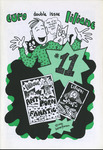</a></td><td>Euro Liliane 11</td><td>Liliane</td><td>1996</td><td>A5</td><td>UK</td></tr>
<tr><td></td><td>Mitten Brain 2</td><td>Luella Jane Wright</td><td>1994</td><td>A5</td><td>UK</td></tr>
<tr><td></td><td>Weird Astral Detective Fiction </td><td>Luke Walsh</td><td>1992</td><td>A5</td><td>UK</td></tr>
<tr><td></td><td>A Lone Still </td><td>Malcy Duff</td><td>2005</td><td>A5</td><td>UK</td></tr>
<tr><td></td><td>Cute Yuck 1</td><td>Malcy Duff</td><td>2000</td><td>A5</td><td>UK</td></tr>
<tr><td></td><td>Hoofprints </td><td>Malcy Duff</td><td>2001</td><td>A5</td><td>UK</td></tr>
<tr><td></td><td>I Can't Draw 2</td><td>Malcy Duff</td><td>2005</td><td>A5</td><td>UK</td></tr>
<tr><td></td><td>Kerry </td><td>Malcy Duff</td><td>2002</td><td>A5</td><td>UK</td></tr>
<tr><td></td><td>The Cloud Dog Agency </td><td>Malcy Duff</td><td>1999</td><td>A5</td><td>UK</td></tr>
<tr><td></td><td>Zero Termite 4</td><td>Malcy Duff</td><td>1998</td><td>A5</td><td>UK</td></tr>
<tr><td></td><td>Zero Termite 7</td><td>Malcy Duff</td><td>1999</td><td>A5</td><td>UK</td></tr>
<tr><td></td><td>Sputnik 1</td><td>Mark Bickley</td><td>1999</td><td>A5</td><td>UK</td></tr>
<tr><td></td><td>Disinfotainment - Armchair Shopping </td><td>Mark Pawson</td><td>1996</td><td>A6</td><td>UK</td></tr>
<tr><td></td><td>Mapk Пaвcoн </td><td>Mark Pawson</td><td></td><td>A5</td><td>UK</td></tr>
<tr><td></td><td>The Palindromist 2</td><td>Mark Saltveit</td><td>1996</td><td>A5</td><td>USA</td></tr>
<tr><td></td><td>Flimsy Monsterworks 2</td><td>Martin Hand</td><td>1997</td><td>A5</td><td>UK</td></tr>
<tr><td></td><td>Les 9 cries du chat blanc </td><td>Matt Broersma</td><td>2004</td><td>A5</td><td>UK</td></tr>
<tr><td></td><td>The Ant's Own Tram Wheel 3</td><td>Matthew Lawrenson</td><td>1994</td><td>A5</td><td>UK</td></tr>
<tr><td></td><td>The Ant's Own Tram Wheel 4</td><td>Matthew Lawrenson</td><td>1994</td><td>A5</td><td>UK</td></tr>
<tr><td></td><td>Thoughts and Words 2</td><td>Matthew Lawrenson</td><td>2002</td><td>A5</td><td>UK</td></tr>
<tr><td></td><td>Diary of Neo-Psychedelic Man 17</td><td>Maximum Traffic</td><td></td><td>A5</td><td>USA</td></tr>
<tr><td></td><td>Diary of Neo-Psychedelic Man 26</td><td>Maximum Traffic</td><td></td><td>A5</td><td>USA</td></tr>
<tr><td></td><td>Unspoken </td><td>Megan Kelso</td><td>1996</td><td>A5</td><td>USA</td></tr>
<tr><td></td><td>Destronic News 2</td><td>Michael Perridge</td><td>1992</td><td>A5</td><td>UK</td></tr>
<tr><td></td><td>Destronic News 1</td><td>Michael Perridge</td><td>1991</td><td>A5</td><td>UK</td></tr>
<tr><td></td><td>Empty Life 10 [Filthy Shit flip] </td><td>Mike Tolento</td><td>1997</td><td>A5</td><td>USA</td></tr>
<tr><td></td><td>The Sugar Paper Rebellion </td><td>Mike Weller</td><td>1998</td><td>A5</td><td>UK</td></tr>
<tr><td></td><td>Amateur demo edition </td><td>Mitch & Murray</td><td>1997</td><td>A5</td><td>UK</td></tr>
<tr><td></td><td>Loose Screws 15</td><td>Mr Biggers</td><td>1998</td><td>A5</td><td>USA</td></tr>
<tr><td></td><td>Neil Jam 7</td><td>Neil Fitzpatrick</td><td>2001</td><td>A5</td><td>USA</td></tr>
<tr><td></td><td>The Adventures of Hamish and Dwarf </td><td>Nigel Roberts</td><td>1996</td><td>A5</td><td>UK</td></tr>
<tr><td></td><td>Muppet Babies </td><td>Paperrad</td><td></td><td>A5</td><td>USA</td></tr>
<tr><td></td><td>A Virtual Circle 4</td><td>Patrick Brown</td><td>1996</td><td>A5</td><td>UK</td></tr>
<tr><td></td><td>A Virtual Circle 1</td><td>Patrick Brown</td><td>1995</td><td>A5</td><td>UK</td></tr>
<tr><td></td><td>A Virtual Circle 2</td><td>Patrick Brown</td><td>1996</td><td>A5</td><td>UK</td></tr>
<tr><td></td><td>A Virtual Circle 5</td><td>Patrick Brown</td><td>1996</td><td>A5</td><td>UK</td></tr>
<tr><td></td><td>Under the Bed </td><td>Patrick Brown</td><td>1996</td><td>A5</td><td>UK</td></tr>
<tr><td></td><td>Holocron 0</td><td>Paul & Neil Bristow</td><td></td><td>A5</td><td>UK</td></tr>
<tr><td></td><td>Holocron 1</td><td>Paul & Neil Bristow</td><td>1995</td><td>A5</td><td>UK</td></tr>
<tr><td></td><td>Refractor 1</td><td>Paul & Neil Bristow</td><td></td><td>A5</td><td>UK</td></tr>
<tr><td></td><td>Refractor 2</td><td>Paul & Neil Bristow</td><td></td><td>A5</td><td>UK</td></tr>
<tr><td></td><td>Refractor 3</td><td>Paul & Neil Bristow</td><td></td><td>A5</td><td>UK</td></tr>
<tr><td></td><td>Refractor 4</td><td>Paul & Neil Bristow</td><td></td><td>A5</td><td>UK</td></tr>
<tr><td><a href="../images/covers/100027_c.jpg">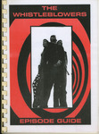</a></td><td>The Whistleblowers </td><td>Paul & Neil Bristow</td><td>1995</td><td>A5</td><td>UK</td></tr>
<tr><td></td><td>Beer Frame 6</td><td>Paul Lukas</td><td>1996</td><td>A5</td><td>USA</td></tr>
<tr><td></td><td>Beer Frame 7</td><td>Paul Lukas</td><td>1997</td><td>A5</td><td>USA</td></tr>
<tr><td></td><td>Beer Frame 10</td><td>Paul Lukas</td><td>2000</td><td>A5</td><td>USA</td></tr>
<tr><td></td><td>Fun Comics 1</td><td>Paul M Davies</td><td>1995</td><td>A5</td><td>UK</td></tr>
<tr><td></td><td>Fun Comics 2</td><td>Paul M Davies</td><td>1995</td><td>A5</td><td>UK</td></tr>
<tr><td></td><td>Fun Comics 5</td><td>Paul M Davies</td><td>1996</td><td>A5</td><td>UK</td></tr>
<tr><td></td><td>Dear Robert and Partner </td><td>Paul Rainey</td><td>2007</td><td>A5</td><td>UK</td></tr>
<tr><td></td><td>Fume! </td><td>Peet Clack</td><td>2002</td><td>A6</td><td></td></tr>
<tr><td></td><td>Pavement 1</td><td>Pete Pavement</td><td>1992</td><td>A5</td><td>UK</td></tr>
<tr><td></td><td>Round Midnight 2</td><td>Peter Bangs</td><td>1996</td><td>A5</td><td>UK</td></tr>
<tr><td></td><td>Pavement 2+3</td><td>Peter Pavement</td><td>1992</td><td>A5</td><td>UK</td></tr>
<tr><td></td><td>The Information 4</td><td>Peter Poole</td><td>1999</td><td>A5</td><td>UK</td></tr>
<tr><td></td><td>Jonni Star </td><td>Phil Elliott</td><td>1998</td><td>A5</td><td>UK</td></tr>
<tr><td></td><td>Art Students Stole My Vibrator </td><td>Rachel House</td><td>2000</td><td>A5</td><td>UK</td></tr>
<tr><td></td><td>Bumper Summer Fun </td><td>Rachel House</td><td>2003</td><td>A5</td><td>UK</td></tr>
<tr><td><a href="../images/covers/100067_c.jpg">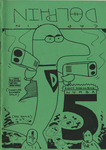</a></td><td>Captain Dolphin 5</td><td>Ralph Kidson</td><td></td><td>A5</td><td>UK</td></tr>
<tr><td><a href="../images/covers/100305_c.jpg">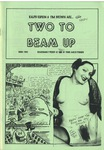</a></td><td>Two To Beam Up 2</td><td>Ralph Kidson</td><td>2001</td><td>A5</td><td>UK</td></tr>
<tr><td></td><td>IK </td><td>Reinder Dijkhuis</td><td>1997</td><td>A5</td><td>Netherlands</td></tr>
<tr><td></td><td>Automatic 6</td><td>Richard Z Starbuck</td><td>1996</td><td>A5</td><td>UK</td></tr>
<tr><td></td><td>Tiddles the Wonder Cat's Super Silly Fun Book </td><td>Rick Olsen</td><td>1997</td><td>A5</td><td>UK</td></tr>
<tr><td></td><td>Lifewish Bay </td><td>Ricky Douglas</td><td></td><td>A5</td><td>UK</td></tr>
<tr><td></td><td>American Ant 1</td><td>Rik Hoskin</td><td>1993</td><td>A5</td><td>UK</td></tr>
<tr><td></td><td>Broken Jeffrey </td><td>Rik Hoskin</td><td>1996</td><td>A5</td><td>UK</td></tr>
<tr><td></td><td>Pride of an Angel 1</td><td>Robert Martin</td><td>2003</td><td>A5</td><td>UK</td></tr>
<tr><td></td><td>Pride of an Angel 1</td><td>Robert Martin</td><td>2001</td><td>A5</td><td>UK</td></tr>
<tr><td></td><td>Pride of an Angel 2</td><td>Robert Martin</td><td>2001</td><td>A5</td><td>UK</td></tr>
<tr><td></td><td>Pride of an Angel One Shot</td><td>Robert Martin</td><td>2002</td><td>A5</td><td>UK</td></tr>
<tr><td></td><td>Minds Eye Presents 10</td><td>Robin Bougie</td><td>2001</td><td>A5</td><td>USA</td></tr>
<tr><td></td><td>Minds Eye Presents 11</td><td>Robin Bougie</td><td>1999</td><td>A5</td><td>USA</td></tr>
<tr><td></td><td>The Incest Project 3</td><td>Robin Bougie</td><td>2005</td><td>A5</td><td>USA</td></tr>
<tr><td></td><td>The Mice in RAID </td><td>Roger Mason</td><td>2003</td><td>A5</td><td>UK</td></tr>
<tr><td></td><td>A Jock Gallery </td><td>Rol Hirst</td><td>1994</td><td>A5</td><td>UK</td></tr>
<tr><td></td><td>Escape Committee 1</td><td>Rol Hirst</td><td>1999</td><td>A5</td><td>UK</td></tr>
<tr><td></td><td>The Jock 1</td><td>Rol Hirst</td><td>1993</td><td>A5</td><td>UK</td></tr>
<tr><td></td><td>The Jock 5</td><td>Rol Hirst</td><td>1993</td><td>A5</td><td>UK</td></tr>
<tr><td></td><td>The Jock 6</td><td>Rol Hirst</td><td>1993</td><td>A5</td><td>UK</td></tr>
<tr><td></td><td>The Jock 8</td><td>Rol Hirst</td><td>1993</td><td>A5</td><td>UK</td></tr>
<tr><td></td><td>The Jock 9</td><td>Rol Hirst</td><td>1993</td><td>A5</td><td>UK</td></tr>
<tr><td></td><td>The Jock 10</td><td>Rol Hirst</td><td>1994</td><td>A5</td><td>UK</td></tr>
<tr><td></td><td>The Jock 11</td><td>Rol Hirst</td><td>1994</td><td>A5</td><td>UK</td></tr>
<tr><td></td><td>The Jock 12</td><td>Rol Hirst</td><td>1994</td><td>A5</td><td>UK</td></tr>
<tr><td></td><td>The Jock 14</td><td>Rol Hirst</td><td>1994</td><td>A5</td><td>UK</td></tr>
<tr><td><a href="../images/covers/100139_c.jpg">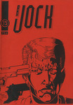</a></td><td>The Jock 15</td><td>Rol Hirst</td><td>1994</td><td>A5</td><td>UK</td></tr>
<tr><td></td><td>The Jock 16</td><td>Rol Hirst</td><td>1994</td><td>A5</td><td>UK</td></tr>
<tr><td></td><td>The Jock 18</td><td>Rol Hirst</td><td>1995</td><td>A5</td><td>UK</td></tr>
<tr><td></td><td>The Jock 20</td><td>Rol Hirst</td><td>1995</td><td>A5</td><td>UK</td></tr>
<tr><td></td><td>The Jock 21</td><td>Rol Hirst</td><td>1995</td><td>A5</td><td>UK</td></tr>
<tr><td></td><td>Garbles 7</td><td>Ros Garbles</td><td>1993</td><td>A5</td><td>UK</td></tr>
<tr><td></td><td>Garbles 9</td><td>Ros Garbles</td><td>1994</td><td>A5</td><td>UK</td></tr>
<tr><td></td><td>Garbles 10</td><td>Ros Garbles</td><td>1995</td><td>A5</td><td>UK</td></tr>
<tr><td></td><td>Garbles 11</td><td>Ros Garbles</td><td>1997</td><td>A5</td><td>UK</td></tr>
<tr><td></td><td>Rough Cut Presents Trailers 1</td><td>Rough Cut Comics</td><td>2001</td><td>A5</td><td>UK</td></tr>
<tr><td></td><td>Amusing Yourself To Death 15</td><td>Ruel Gaviola</td><td>1999</td><td>A5</td><td>USA</td></tr>
<tr><td></td><td>My Daily Review 1</td><td>Sally Anne Hickman</td><td>2001</td><td>A5</td><td>UK</td></tr>
<tr><td></td><td>Phobias </td><td>Sammy Wammy</td><td>2000</td><td>A5</td><td>UK</td></tr>
<tr><td></td><td>Soft 1</td><td>Sarah Gunn</td><td></td><td>A5</td><td>UK</td></tr>
<tr><td></td><td>Soft 2</td><td>Sarah Gunn</td><td></td><td>A5</td><td>UK</td></tr>
<tr><td></td><td>AKTSN 6</td><td>SchNEWS</td><td>1998</td><td>A4</td><td>UK</td></tr>
<tr><td></td><td>SchNEWS 158</td><td>SchNEWS</td><td>1998</td><td>A4</td><td>UK</td></tr>
<tr><td></td><td>SchNEWS 159</td><td>SchNEWS</td><td>1998</td><td>A4</td><td>UK</td></tr>
<tr><td></td><td>SchNEWS 160</td><td>SchNEWS</td><td>1998</td><td>A4</td><td>UK</td></tr>
<tr><td></td><td>SchNEWS 161</td><td>SchNEWS</td><td>1998</td><td>A5</td><td>UK</td></tr>
<tr><td></td><td>SchNEWS 162</td><td>SchNEWS</td><td>1998</td><td>A5</td><td>UK</td></tr>
<tr><td></td><td>Ed </td><td>Sean Azzopardi</td><td>2005</td><td>A5</td><td>UK</td></tr>
<tr><td></td><td>Twelve Hour Shift </td><td>Sean Azzopardi</td><td>2005</td><td>A5</td><td>UK</td></tr>
<tr><td></td><td>Paper Tiger Comix 1</td><td>Sean Duffield</td><td>2004</td><td>A5</td><td>UK</td></tr>
<tr><td></td><td>Paper Tiger Comix 2</td><td>Sean Duffield</td><td>2005</td><td>A5</td><td>UK</td></tr>
<tr><td><a href="../images/covers/100343_c.jpg">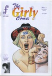</a></td><td>The Girly Comic 1</td><td>Selina Locke</td><td>2002</td><td>A5</td><td>UK</td></tr>
<tr><td></td><td>Imagineers 4</td><td>Shane Chesby</td><td>2001</td><td>A5</td><td>UK</td></tr>
<tr><td></td><td>Ten Foot Rule 5</td><td>Shawn Granton</td><td>2000</td><td>A5</td><td>USA</td></tr>
<tr><td></td><td>Ten Foot Rule 2.5 - Empty Life 10.5 flip </td><td>Shawn Granton & Mike Tolento</td><td>1998</td><td>A5</td><td>USA</td></tr>
<tr><td></td><td>Strimp </td><td>Simon Mackie</td><td>1996</td><td>A5</td><td>UK</td></tr>
<tr><td><a href="../images/covers/100154_c.jpg">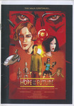</a></td><td>Hope for the Future 3</td><td>Simon Perrins</td><td>2001</td><td>A5</td><td>UK</td></tr>
<tr><td></td><td>Hope for the Future 1</td><td>Simon Perrins</td><td>2000</td><td>A5</td><td>UK</td></tr>
<tr><td></td><td>Flying Monkey 3</td><td>Simon Perrins & Andrew Livesey</td><td>1998</td><td>A5</td><td>UK</td></tr>
<tr><td></td><td>Anarchy in the UK... the Comic! </td><td>Slab-o-Concrete</td><td>1994</td><td>A5</td><td>UK</td></tr>
<tr><td></td><td>Smoke - A London Peculiar 4</td><td>Smoke</td><td>2003</td><td>A5</td><td>UK</td></tr>
<tr><td></td><td>Smoke - A London Peculiar 6</td><td>Smoke</td><td></td><td>A5</td><td>UK</td></tr>
<tr><td></td><td>Fat Knite 3</td><td>Steve Blincoe</td><td>1988</td><td>A5</td><td>UK</td></tr>
<tr><td></td><td>Fat Knite 4</td><td>Steve Blincoe</td><td></td><td>A5</td><td>UK</td></tr>
<tr><td></td><td>Fat Knite 5</td><td>Steve Blincoe</td><td></td><td>A5</td><td>UK</td></tr>
<tr><td></td><td>Fat Knite 6</td><td>Steve Blincoe</td><td></td><td>A5</td><td>UK</td></tr>
<tr><td></td><td>Terracotta </td><td>Terracotta</td><td>1996</td><td>A5</td><td>UK</td></tr>
<tr><td></td><td>The Desyre Foundation Newsletter 1</td><td>The Desyre Foundation</td><td>1996</td><td>A5</td><td>UK</td></tr>
<tr><td></td><td>Delirium Tremens 5</td><td>Three Drunken Goths</td><td>1999</td><td>A5</td><td>UK</td></tr>
<tr><td><a href="../images/covers/100131_c.jpg">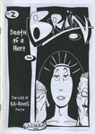</a></td><td>Brin 2</td><td>Tim Brown</td><td>1998</td><td>A5</td><td>UK</td></tr>
<tr><td></td><td>Nightclub Nick 1</td><td>Tim Brown</td><td>2000</td><td>A5</td><td>UK</td></tr>
<tr><td></td><td>Nightclub Nick 2</td><td>Tim Brown</td><td>2000</td><td>A5</td><td>UK</td></tr>
<tr><td></td><td>Nightclub Nick 4</td><td>Tim Brown</td><td>2000</td><td>A5</td><td>UK</td></tr>
<tr><td></td><td>Nightclub Nick 6</td><td>Tim Brown</td><td>2000</td><td>A5</td><td>UK</td></tr>
<tr><td></td><td>The Mystic Stones 4</td><td>Tim Brown</td><td>1996</td><td>A5</td><td>UK</td></tr>
<tr><td></td><td>The Mystic Stones 5</td><td>Tim Brown</td><td>1996</td><td>A5</td><td>UK</td></tr>
<tr><td></td><td>The Mystic Stones 6</td><td>Tim Brown</td><td>1996</td><td>A5</td><td>UK</td></tr>
<tr><td></td><td>The Mystic Stones 7</td><td>Tim Brown</td><td>1996</td><td>A5</td><td>UK</td></tr>
<tr><td></td><td>Japanize 3</td><td>Toko</td><td>1999</td><td>A5</td><td>UK</td></tr>
<tr><td></td><td>Japanize 2</td><td>Toko</td><td>1999</td><td>A5</td><td>UK</td></tr>
<tr><td></td><td>Japanize 10</td><td>Toko</td><td>2001</td><td>A5</td><td>UK</td></tr>
<tr><td></td><td>Shelton </td><td>Tom Spurgeon</td><td>1999</td><td>A5</td><td>USA</td></tr>
<tr><td></td><td>Angel Nebula 9</td><td>Tony McGee</td><td>2001</td><td>A5</td><td>UK</td></tr>
<tr><td></td><td>Dark Weather 4</td><td>Tony McGee</td><td>1997</td><td>A5</td><td>UK</td></tr>
<tr><td></td><td>Dark Weather 5</td><td>Tony McGee</td><td>1998</td><td>A5</td><td>UK</td></tr>
<tr><td></td><td>Frontiers 7</td><td>Tony McGee</td><td>2004</td><td>A5</td><td>UK</td></tr>
<tr><td></td><td>Fun Bag </td><td>Tony McGee</td><td></td><td>A5</td><td>UK</td></tr>
<tr><td></td><td>True Stories 2</td><td>Tony McGee</td><td>2005</td><td>A5</td><td>UK</td></tr>
<tr><td></td><td>Sharkpool 2</td><td>Tracy B</td><td>1998</td><td>A5</td><td>UK</td></tr>
<tr><td></td><td>Typewriter 4</td><td>Typewriter</td><td>2001</td><td>A5</td><td></td></tr>
<tr><td></td><td>Robot Investigator </td><td>Vincent Stall</td><td>2001</td><td>A5</td><td>USA</td></tr>
<tr><td></td><td>The Smell of Napalm 2</td><td>Wayne Clarke</td><td></td><td>A5</td><td>UK</td></tr>
<tr><td></td><td>Something Fast 1</td><td>Will Pickering</td><td>1996</td><td>A5</td><td>UK</td></tr>
<tr><td><a href="../images/covers/100208_c.jpg">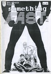</a></td><td>Something Fast 2</td><td>Will Pickering</td><td>1996</td><td>A5</td><td>UK</td></tr>
<tr><td><a href="../images/covers/100173_c.jpg">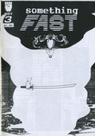</a></td><td>Something Fast 3</td><td>Will Pickering</td><td>1996</td><td>A5</td><td>UK</td></tr>
<tr><td></td><td>Wow Cool Spring 97</td><td>Wow Cool</td><td>1997</td><td>A5</td><td>USA</td></tr>
<tr><td></td><td>Wonky Fascination </td><td>Yurt Barron</td><td>2003</td><td>A5</td><td>UK</td></tr>

</table>

---
end

