# The Zines

[< Back](../)

**This is a work in progress. More zines are being added every few days.**

As of 7 August 2024 I've decided to pause scanning the contents of each zine and focus on scanning just the covers and adding them to the spreadsheet. It should take a couple of months to go through the 3-4,000 in the archive, and then I'll have a better sense of what I've got here. 

This page has thumbnails of the covers of all the zines linked to more legible larger versions. 

Metadata is pretty basic - many zines have more than one creator but I've just entered the main or first listed person for now, and "type" is very broad. This will all be expanded once the first pass is done. 

They're sorted by creator's first name (unless I forgot to sort before exporting). 

<table>
<tr><th>Cover</th><th>Title  Creator</th><th>Format  Type   Year  Country</th></tr>

<tr><td></td><td><strong>I Am The Corner</strong>   Akiko Tamura</td><td>A5 Comic 2005 UK</td></tr>
<tr><td></td><td><strong>The Long Walk Nowhere</strong>   Al Burian</td><td>A5 Comic  USA</td></tr>
<tr><td></td><td><strong>Spiral Dreams - Sobakz's Dream</strong>   Al Davison</td><td>A5 Comic 2002 UK</td></tr>
<tr><td></td><td><strong>Urine</strong>   Alan Macintyre</td><td>A5 Comic  USA</td></tr>
<tr><td></td><td><strong>Amusing Paper</strong> 1  Alastair Maceachern</td><td>A5 Comic 2004 UK</td></tr>
<tr><td></td><td><strong>Alas Comica</strong> 6  Aleksandar Zograf</td><td>A6 Comic 1996 Serbia</td></tr>
<tr><td></td><td><strong>AMP</strong> 0  AMP</td><td>A5 Zine 1998 UK</td></tr>
<tr><td></td><td><strong>Vollmond</strong> 1  Andre Paine</td><td>A5 Zine 1988 UK</td></tr>
<tr><td></td><td><strong>Top Notch Tosh</strong> 6  Andrew Lewis</td><td>A5 Comic 2002 UK</td></tr>
<tr><td></td><td><strong>Andy's Konky Kru Picture Strips</strong>   Andy Konky Kru</td><td>A5 Comic 1995 UK</td></tr>
<tr><td></td><td><strong>Magazine</strong> 2  Andy Konky Kru</td><td>A5 Zine 1998 UK</td></tr>
<tr><td></td><td><strong>Magazine</strong> 6  Andy Konky Kru</td><td>A5 Zine 2002 UK</td></tr>
<tr><td></td><td><strong>Max & Moritz</strong>   Andy Konky Kru</td><td>A5 Comic  UK</td></tr>
<tr><td></td><td><strong>Realistische Zeichnungen</strong> 1  Andy Konky Kru</td><td>A5 Art Book  UK</td></tr>
<tr><td></td><td><strong>Shtumm</strong> 1  Andy Konky Kru</td><td>A5 Anthology Comic 2002 UK</td></tr>
<tr><td></td><td><strong>Shtumm</strong> 2  Andy Konky Kru</td><td>A5 Anthology Comic 2002 UK</td></tr>
<tr><td></td><td><strong>Bob's</strong> 3  Andy Luke</td><td>A5 Comic 1997 UK</td></tr>
<tr><td></td><td><strong>Bob's</strong> 4  Andy Luke</td><td>A5 Comic 1998 UK</td></tr>
<tr><td></td><td><strong>Bob's</strong> 5  Andy Luke</td><td>A5 Comic 1998 UK</td></tr>
<tr><td></td><td><strong>Bob's - Can I have your autograph, Mr Hooker?</strong>   Andy Luke</td><td>A5 Comic  UK</td></tr>
<tr><td></td><td><strong>Bob's Annual</strong> 1  Andy Luke</td><td>A5 Comic 1997 UK</td></tr>
<tr><td></td><td><strong>Brookside: The Comic</strong> 86  Andy Luke</td><td>A5 Comic  UK</td></tr>
<tr><td></td><td><strong>Good Vibrations</strong>   Andy Luke</td><td>A5 Anthology Comic 1997 UK</td></tr>
<tr><td></td><td><strong>TRS2 - Comics 2001 edition</strong>   Andy Luke</td><td>A5 Review Zine 2001 UK</td></tr>
<tr><td></td><td><strong>Angel Dust Funnies</strong> 1  Andy Nixon</td><td>A5 Anthology Comic 1989 UK</td></tr>
<tr><td></td><td><strong>Angel Dust Funnies</strong> 4  Andy Nixon</td><td>A5 Anthology Comic 1989 UK</td></tr>
<tr><td></td><td><strong>Media Assassin</strong> 9  Andy Roberts</td><td>A5 Zine 2005 UK</td></tr>
<tr><td></td><td><strong>Media Assassin</strong> 11  Andy Roberts</td><td>A5 Zine 2006 UK</td></tr>
<tr><td></td><td><strong>X-Ray</strong> 1  Andy Roberts</td><td>A5 Zine 1994 UK</td></tr>
<tr><td></td><td><strong>Circus of Deception</strong>   Anthony Setchell</td><td>A5 Comic 2001 UK</td></tr>
<tr><td></td><td><strong>Atomic</strong> 9  Atomic</td><td>A5 Anthology Comic 1990 UK</td></tr>
<tr><td></td><td><strong>Atomic</strong> 10  Atomic</td><td>A5 Anthology Comic 1990 UK</td></tr>
<tr><td></td><td><strong>Atomic</strong> 11  Atomic</td><td>A5 Anthology Comic 1991 UK</td></tr>
<tr><td><a href="../images/covers/100124_c.jpg">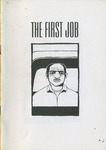</a></td><td><strong>The First Job</strong>   Ben Graham</td><td>A5 Comic 2001 </td></tr>
<tr><td></td><td><strong>Tales from the Midden</strong> 10-11  Ben Hunt</td><td>A5 Comic  UK</td></tr>
<tr><td></td><td><strong>Vogarth</strong>   Ben Hunt</td><td>A5 Comic 2001 UK</td></tr>
<tr><td></td><td><strong>Classic Comics</strong> 2  Ben Hunt & Robyn Talbot</td><td>A5 Comic 2001 UK</td></tr>
<tr><td></td><td><strong>Fifteen Nuns</strong> 4  Ben Oakes</td><td>A5 Comic 1997 UK</td></tr>
<tr><td></td><td><strong>Fifteen Nuns</strong> 5  Ben Oakes</td><td>A5 Comic 1997 UK</td></tr>
<tr><td></td><td><strong>Fifteen Nuns</strong> 6  Ben Oakes</td><td>A5 Comic 1997 UK</td></tr>
<tr><td></td><td><strong>The Lupus</strong> 3  Ben Oakes</td><td>A5 Comic 2001 UK</td></tr>
<tr><td></td><td><strong>The Miserable Tale Of Demeter & Sharky</strong>   Ben Oakes</td><td>A5 Comic 2002 UK</td></tr>
<tr><td></td><td><strong>Braque's Love Dart</strong>   Bib Edwards</td><td>A5 Comic 2001 UK</td></tr>
<tr><td></td><td><strong>Temptress of Triton</strong>   Bib Edwards</td><td>A5 Comic  UK</td></tr>
<tr><td></td><td><strong>Big Untidy - Flyer and Letter</strong>   Big Untidy</td><td>A5 Other  </td></tr>
<tr><td></td><td><strong>Behold the Hamster</strong>   Bob Lynch</td><td>A5 Comic 1991 UK</td></tr>
<tr><td></td><td><strong>Double Bill</strong>   Bob Lynch</td><td>A5 Comic 1992 UK</td></tr>
<tr><td></td><td><strong>Tales of Sadness</strong>   Bob Lynch</td><td>A5 Comic 1996 UK</td></tr>
<tr><td></td><td><strong>Anxiety Culture</strong> 1  Brian Dean</td><td>A5 Zine 1995 UK</td></tr>
<tr><td></td><td><strong>Anxiety Culture</strong> 3  Brian Dean</td><td>A5 Zine  UK</td></tr>
<tr><td></td><td><strong>Frank Fazakerly</strong>   Bryan Talbot</td><td>A5 Comic 1991 UK</td></tr>
<tr><td></td><td><strong>Bugs & Drugs</strong> 1  Bugs & Drugs</td><td>A5 Zine 1992 UK</td></tr>
<tr><td></td><td><strong>Bugs & Drugs</strong> 4  Bugs & Drugs</td><td>A5 Zine  UK</td></tr>
<tr><td></td><td><strong>The Diplomat</strong> 2  C Cilla</td><td>A5 Comic 1995 USA</td></tr>
<tr><td></td><td><strong>The Diplomat</strong> 3  C Cilla</td><td>A5 Comic 1996 USA</td></tr>
<tr><td></td><td><strong>The Assassin and the Whiner</strong> 4  Carrie McNinch</td><td>A5 Comic 1996 USA</td></tr>
<tr><td></td><td><strong>The Assassin and the Whiner</strong> 10  Carrie McNinch</td><td>A5 Comic 1998 USA</td></tr>
<tr><td></td><td><strong>The Assassin and the Whiner</strong> 11  Carrie McNinch</td><td>A5 Comic 1999 USA</td></tr>
<tr><td></td><td><strong>The Assassin and the Whiner</strong> 14  Carrie McNinch</td><td>A5 Comic 2000 USA</td></tr>
<tr><td></td><td><strong>Color Right</strong>   Charise Mericle</td><td>A6 Comic 1995 </td></tr>
<tr><td></td><td><strong>Ally and the Big Man</strong>   Chris Askham</td><td>A5 Comic 2001 UK</td></tr>
<tr><td></td><td><strong>Dr Sponge</strong> 1  Chris Askham</td><td>A5 Comic 2001 UK</td></tr>
<tr><td></td><td><strong>Tales from the Mortuary</strong>   Chris Askham</td><td>A5 Comic  UK</td></tr>
<tr><td></td><td><strong>Goose Weekly</strong> 1  Chris Butler</td><td>A5 Zine 1997 UK</td></tr>
<tr><td></td><td><strong>Microwave Monthly</strong>   Chris Butler</td><td>A5 Comic  UK</td></tr>
<tr><td><a href="../images/covers/100394_c.jpg">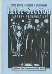</a></td><td><strong>Inter-Section</strong> 1  Chris Harper</td><td>A5 Zine 1997 UK</td></tr>
<tr><td></td><td><strong>Rockdrill</strong>   Chris Webster</td><td>A5 Comic 2005 UK</td></tr>
<tr><td><a href="../images/covers/100402_c.jpg">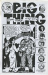</a></td><td><strong>Big Thing - Collected Comic Stories 1990-1993</strong>   Colin Upton</td><td>A5 Comic 1993 USA</td></tr>
<tr><td></td><td><strong>Buddah on the Road</strong> 2  Colin Upton</td><td>A5 Comic  USA</td></tr>
<tr><td><a href="../images/covers/100065_c.jpg">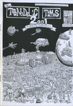</a></td><td><strong>Toonadelic Times</strong> 2  Dal</td><td>A5 Comic 2001 UK</td></tr>
<tr><td></td><td><strong>Lickity Spit</strong> 2  Damian Cugley</td><td>A5 Comic 1995 UK</td></tr>
<tr><td></td><td><strong>Lickity Spit</strong> 3  Damian Cugley</td><td>A5 Comic 1996 UK</td></tr>
<tr><td></td><td><strong>Percy Street</strong> 1  Damian Cugley</td><td>A5 Comic 2004 UK</td></tr>
<tr><td></td><td><strong>Percy Street</strong> 2  Damian Cugley</td><td>A5 Comic 2005 UK</td></tr>
<tr><td></td><td><strong>The Journal of Ride Theory</strong> 3  Dan Howland</td><td>A5 Zine 1997 USA</td></tr>
<tr><td></td><td><strong>Mr Nile: The Illustrated Bastard</strong>   Daniel Merlin Goodbrey</td><td>A5 Comic 2003 UK</td></tr>
<tr><td></td><td><strong>45326</strong> 1  Darren Powell</td><td>A5 Comic 1995 UK</td></tr>
<tr><td></td><td><strong>Going to Chapel</strong>   Darren Powell</td><td>A5 Comic 1995 UK</td></tr>
<tr><td></td><td><strong>Sin</strong> 1  Darren Powell</td><td>A5 Comic 1994 UK</td></tr>
<tr><td></td><td><strong>Sin</strong> 2  Darren Powell</td><td>A5 Comic 1994 UK</td></tr>
<tr><td></td><td><strong>Sin</strong> 3  Darren Powell</td><td>A5 Comic 1995 UK</td></tr>
<tr><td></td><td><strong>Sin</strong> 4  Darren Powell</td><td>A5 Comic 1996 UK</td></tr>
<tr><td></td><td><strong>Sin</strong> 5  Darren Powell</td><td>A5 Comic 1997 UK</td></tr>
<tr><td><a href="../images/covers/100393_c.jpg">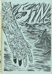</a></td><td><strong>Sin</strong> 6  Darren Powell</td><td>A5 Comic 1998 UK</td></tr>
<tr><td></td><td><strong>Sin</strong> 7  Darren Powell</td><td>A5 Comic 2004 UK</td></tr>
<tr><td></td><td><strong>Theatre of Conceits</strong> 1  Darren Powell</td><td>A5 Comic 1995 UK</td></tr>
<tr><td></td><td><strong>Theatre of Conceits</strong> 2  Darren Powell</td><td>A5 Comic 1995 UK</td></tr>
<tr><td></td><td><strong>Theatre of Conceits</strong> 3  Darren Powell</td><td>A5 Comic 1996 UK</td></tr>
<tr><td><a href="../images/covers/100383_c.jpg">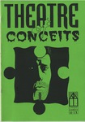</a></td><td><strong>Theatre of Conceits</strong> 4  Darren Powell</td><td>A5 Comic 1996 UK</td></tr>
<tr><td><a href="../images/covers/100291_c.jpg">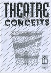</a></td><td><strong>Theatre of Conceits</strong> 5  Darren Powell</td><td>A5 Comic 1997 UK</td></tr>
<tr><td></td><td><strong>Theatre of Conceits</strong> 8  Darren Powell</td><td>A5 Comic 1999 UK</td></tr>
<tr><td><a href="../images/covers/100121_c.jpg">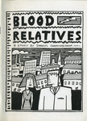</a></td><td><strong>Blood Relatives</strong>   Darryl Cunningham</td><td>A5 Comic 1989 UK</td></tr>
<tr><td></td><td><strong>The British Sketchbook</strong> 1  Darryl Cunningham</td><td>A5 Anthology Comic 1997 UK</td></tr>
<tr><td></td><td><strong>The Marvel Sketchbook</strong>   Darryl Cunningham</td><td>A5 Anthology Comic 1994 UK</td></tr>
<tr><td><a href="../images/covers/100413_c.jpg">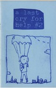</a></td><td><strong>A Last Cry For Help</strong> 2  Dave Kiersh</td><td>A5 Comic  USA</td></tr>
<tr><td></td><td><strong>David Baillie's Awkward Fascination Compendium</strong>   David Baillie</td><td>A5 Comic 2003 UK</td></tr>
<tr><td></td><td><strong>Fury</strong> 2  David Gordon</td><td>A5 Comic 1991 UK</td></tr>
<tr><td></td><td><strong>Fury</strong> 3  David Gordon</td><td>A5 Comic 1992 UK</td></tr>
<tr><td></td><td><strong>The Lightning Room [Damage 1]</strong>   David Gordon</td><td>A5 Comic 1993 UK</td></tr>
<tr><td></td><td><strong>Got to live their life</strong> 1  David Metcalfe</td><td>A5 Comic 1995 UK</td></tr>
<tr><td></td><td><strong>My Life Story</strong> 3  David Metcalfe</td><td>A5 Comic 1995 UK</td></tr>
<tr><td></td><td><strong>My Life Story</strong> 4  David Metcalfe</td><td>A5 Comic 1995 UK</td></tr>
<tr><td></td><td><strong>The Fugitive</strong>   David Metcalfe</td><td>A5 Comic 1995 UK</td></tr>
<tr><td></td><td><strong>Burp!</strong> 2  David Morris</td><td> Comic  UK</td></tr>
<tr><td></td><td><strong>Inkling</strong> 9  David Potts</td><td>A5 Anthology Comic 1992 UK</td></tr>
<tr><td></td><td><strong>Inkling</strong> Fish  David Potts</td><td>A5 Anthology Comic 1991 UK</td></tr>
<tr><td></td><td><strong>The Outer Realms</strong> 3  David Willacy</td><td>A5 Comic 2004 </td></tr>
<tr><td></td><td><strong>Contact</strong> 1  Debbie Moon</td><td>A5 Comic 1997 UK</td></tr>
<tr><td></td><td><strong>Contact</strong> 2  Debbie Moon</td><td>A5 Comic 1997 UK</td></tr>
<tr><td></td><td><strong>Wasted Epiphanies</strong>   Deirde Ruane</td><td>A5 Comic  </td></tr>
<tr><td></td><td><strong>црни креч</strong> 2-3  Dejan Bogojevic</td><td>A5 Zine 1997 Serbia</td></tr>
<tr><td></td><td><strong>Wargods of Atlantis</strong> 6  Dek Baker</td><td>A5 Comic 1997 UK</td></tr>
<tr><td></td><td><strong>The Staring Eye</strong> 1  Denny Derbyshire</td><td>A5 Comic 1994 UK</td></tr>
<tr><td></td><td><strong>The Staring Eye</strong> 2  Denny Derbyshire</td><td>A5 Comic 1994 UK</td></tr>
<tr><td></td><td><strong>The Staring Eye</strong> 3  Denny Derbyshire</td><td>A5 Comic 1995 UK</td></tr>
<tr><td></td><td><strong>The Staring Eye</strong> 5  Denny Derbyshire</td><td>A5 Comic 1997 UK</td></tr>
<tr><td></td><td><strong>Fish Wish</strong>   Derek Gray</td><td>A6 Comic 1993 </td></tr>
<tr><td><a href="../images/covers/100272_c.jpg">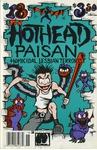</a></td><td><strong>Hothead Paisan</strong> 18  Diane DiMassa</td><td>A5 Comic 1995 USA</td></tr>
<tr><td></td><td><strong>Hothead Pasian</strong> 19  Diane DiMassa</td><td>A5 Comic 1995 USA</td></tr>
<tr><td></td><td><strong>Hong Kong Pussy</strong>   Dirtbag Comix</td><td>A5 Comic 2003 UK</td></tr>
<tr><td></td><td><strong>SFM Roma</strong>   Douglas Nobel</td><td>A4 Comic 2002 UK</td></tr>
<tr><td></td><td><strong>Strip For Me</strong> 9  Douglas Nobel</td><td>A5 Comic 2002 UK</td></tr>
<tr><td></td><td><strong>Strip For Me</strong> 11  Douglas Nobel</td><td>A5 Comic 2002 UK</td></tr>
<tr><td></td><td><strong>Strip For Me</strong> 13  Douglas Nobel</td><td>A5 Comic 2003 UK</td></tr>
<tr><td></td><td><strong>Nga Pakiwaituhi o Aotearoa - New Zealand Comics</strong>   Dylan Horrocks</td><td>A5 Review Zine 1998 NZ</td></tr>
<tr><td></td><td><strong>Reporter</strong> 1  Dylan Williams</td><td>A5 Comic 1999 USA</td></tr>
<tr><td></td><td><strong>Reporter</strong> 2  Dylan Williams</td><td>A5 Comic 1999 USA</td></tr>
<tr><td></td><td><strong>The End</strong> 4  Ed Hillyer</td><td>A5 Comic 1999 UK</td></tr>
<tr><td></td><td><strong>Fast Fiction</strong> 12  Ed Pinsent</td><td>A5 Anthology Comic 1984 UK</td></tr>
<tr><td></td><td><strong>Fast Fiction</strong> 27  Ed Pinsent</td><td>A5 Anthology Comic 1989 UK</td></tr>
<tr><td></td><td><strong>Henrietta!!</strong>   Ed Pinsent</td><td>A5 Comic 1991 UK</td></tr>
<tr><td></td><td><strong>It's Not Satin</strong>   Ed Pinsent</td><td>A5 Comic 1990 UK</td></tr>
<tr><td></td><td><strong>Gloomy Delight</strong>   EL Press</td><td>A5 Zine 2001 </td></tr>
<tr><td></td><td><strong>Dope Fiends</strong> 1  Emmett Tayor</td><td>A5 Comic  Ireland</td></tr>
<tr><td></td><td><strong>The Seven Faced Badger of Doom</strong>   Factor Fiction Press</td><td>A5 Anthology Comic  UK</td></tr>
<tr><td></td><td><strong>Peops</strong>   Fly</td><td>A5 Zine 2001 USA</td></tr>
<tr><td></td><td><strong>Delirium</strong> 1  Garen Ewing</td><td>A5 Comic 1996 UK</td></tr>
<tr><td><a href="../images/covers/100293_c.jpg">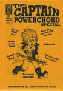</a></td><td><strong>The Captain Powerchord Special</strong>   Garen Ewing</td><td>A5 Comic 1996 UK</td></tr>
<tr><td><a href="../images/covers/100315_c.jpg">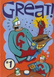</a></td><td><strong>Great!</strong> 1  Gary Northfield</td><td> Comic 1999 UK</td></tr>
<tr><td></td><td><strong>Stupidmonsters</strong> 2  Gary Northfield</td><td>A6 Comic 2002 UK</td></tr>
<tr><td></td><td><strong>Fuzzball</strong> 4  Gary Parkin</td><td>A5 Comic 1997 UK</td></tr>
<tr><td></td><td><strong>Fuzzball</strong> 5  Gary Parkin</td><td>A5 Comic 1997 UK</td></tr>
<tr><td></td><td><strong>Fuzzball Summer Special</strong>   Gary Parkin</td><td>A5 Comic 1997 UK</td></tr>
<tr><td></td><td><strong>Fuzzball Superhero Special</strong>   Gary Parkin</td><td>A5 Comic 1998 UK</td></tr>
<tr><td></td><td><strong>Head Hunter</strong> 2  Gary Parkin</td><td>A5 Comic 1997 UK</td></tr>
<tr><td></td><td><strong>Head Hunter</strong> 3  Gary Parkin</td><td>A5 Comic 1997 UK</td></tr>
<tr><td><a href="../images/covers/100240_c.jpg">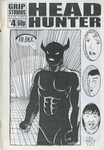</a></td><td><strong>Head Hunter</strong> 4  Gary Parkin</td><td>A5 Comic 1997 UK</td></tr>
<tr><td></td><td><strong>Head Hunter</strong> 5  Gary Parkin</td><td>A5 Comic 1997 UK</td></tr>
<tr><td></td><td><strong>Head Hunter: The Aftermath</strong>   Gary Parkin</td><td>A5 Comic 1997 UK</td></tr>
<tr><td></td><td><strong>Hero and the Peace-keepers</strong> 1  Gary Parkin</td><td>A5 Comic 1997 UK</td></tr>
<tr><td></td><td><strong>Psycho</strong> 1  Gary Parkin</td><td>A5 Zine  UK</td></tr>
<tr><td></td><td><strong>A Brief History of Small Press Comics</strong>   Gav Burrows</td><td>A5 Zine 2004 UK</td></tr>
<tr><td></td><td><strong>Lucid Frenzy</strong> 1  Gav Burrows</td><td>A5 Zine 2002 UK</td></tr>
<tr><td></td><td><strong>Lucid Frenzy</strong> 2  Gav Burrows</td><td>A5 Zine 2003 UK</td></tr>
<tr><td></td><td><strong>Lucid Frenzy</strong> 7  Gav Burrows</td><td>A5 Comic 2006 UK</td></tr>
<tr><td></td><td><strong>Rocket Science</strong>   Gav Burrows</td><td>A5 Comic 2003 UK</td></tr>
<tr><td></td><td><strong>Surge</strong> 9  Ger Evans</td><td>A5 Anthology Comic 1998 Ireland</td></tr>
<tr><td></td><td><strong>Surge</strong> 10  Ger Evans</td><td>A5 Anthology Comic 1998 Ireland</td></tr>
<tr><td></td><td><strong>Memories of a Murderer</strong>   Giulia Brusco</td><td>A5 Comic 2000 UK</td></tr>
<tr><td></td><td><strong>Aggadon</strong>   Goodman Bros</td><td>A5 Comic 2004 UK</td></tr>
<tr><td></td><td><strong>Bahala Na!</strong> 3  Goodman Bros</td><td>A5 Comic 2003 UK</td></tr>
<tr><td></td><td><strong>Zip Gun Presents - Chimera</strong>   Goodman Bros</td><td>A5 Anthology Comic 2003 UK</td></tr>
<tr><td></td><td><strong>Zip Gun Presents - Japan</strong>   Goodman Bros</td><td>A5 Anthology Comic 2001 UK</td></tr>
<tr><td></td><td><strong>Zip Gun Presents - Noir</strong>   Goodman Bros</td><td>A5 Anthology Comic 2002 UK</td></tr>
<tr><td></td><td><strong>Sgt Mike Battle</strong>   Graham Pearce</td><td>A5 Comic 2001 UK</td></tr>
<tr><td></td><td><strong>Watchblood</strong>   Graham Pearce</td><td>A5 Comic  UK</td></tr>
<tr><td></td><td><strong>The Journal of Silly</strong> 10  Ham & Knife</td><td>A5 Anthology Comic 1997 UK</td></tr>
<tr><td></td><td><strong>The Journal of Silly</strong> 12b  Ham & Knife</td><td>A5 Anthology Comic  UK</td></tr>
<tr><td></td><td><strong>Cheeky Monkey's Fun Book</strong>   Hisae Arai</td><td>A5 Comic  UK</td></tr>
<tr><td><a href="../images/covers/100454_c.jpg">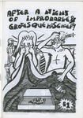</a></td><td><strong>After a Night of Improbable and Grotesque Mischief</strong>   Ian Thomas</td><td>A5 Comic 2003 UK</td></tr>
<tr><td></td><td><strong>Fight Amnesia!</strong> 10  Into The Abyss</td><td>A5 Zine 1996 UK</td></tr>
<tr><td></td><td><strong>Apollo Astro</strong> 3  Jack Turnbull</td><td>A5 Comic 2000 USA</td></tr>
<tr><td></td><td><strong>Apollo Astro</strong> 4  Jack Turnbull</td><td>A5 Comic 2001 USA</td></tr>
<tr><td></td><td><strong>Magic Boy Wins The Moon</strong>   James Kochalka</td><td>A5 Comic 1996 USA</td></tr>
<tr><td></td><td><strong>Dr Parsons Strips and Boxes</strong>   James Parsons</td><td>A5 Comic 2002 UK</td></tr>
<tr><td></td><td><strong>This is me by georg bush</strong>   James Parsons</td><td>A5 Comic 2001 UK</td></tr>
<tr><td></td><td><strong>This is us by Mrs Becem</strong>   James Parsons</td><td>A5 Comic 2002 UK</td></tr>
<tr><td></td><td><strong>Buldog Empire - preview</strong>   Jason Cobley</td><td>A5 Comic  UK</td></tr>
<tr><td></td><td><strong>Bulldog Adventure Magazine</strong> 27  Jason Cobley</td><td>A5 Comic 2005 UK</td></tr>
<tr><td></td><td><strong>Your Living Room</strong>   Jason Whitley</td><td>A5 Comic 1996 </td></tr>
<tr><td></td><td><strong>French Small Press Guide</strong>   Jean-Paul Jennequin</td><td>A5 Zine 1997 France</td></tr>
<tr><td></td><td><strong>Jeff's Austin Diary</strong>   Jeffrey Lewis</td><td>A5 Comic 2001 USA</td></tr>
<tr><td></td><td><strong>Bumbalo Above Ground</strong>   Jenny Zervakis</td><td>A5 Comic  USA</td></tr>
<tr><td></td><td><strong>Strange Growths</strong> 12  Jenny Zervakis</td><td>A5 Comic 1991 USA</td></tr>
<tr><td></td><td><strong>Strange Growths</strong> 13  Jenny Zervakis</td><td>A5 Comic  USA</td></tr>
<tr><td></td><td><strong>Strange Growths</strong> 14.5  Jenny Zervakis</td><td>A5 Comic  USA</td></tr>
<tr><td></td><td><strong>3inaBed</strong> 11  Jeremy Dennis</td><td>A5 Comic 1995 UK</td></tr>
<tr><td></td><td><strong>3inaBed</strong> 13  Jeremy Dennis</td><td>A5 Comic  UK</td></tr>
<tr><td></td><td><strong>3inaBed</strong> 15  Jeremy Dennis</td><td>A5 Comic 1996 UK</td></tr>
<tr><td></td><td><strong>Cohabiting Cheapskates</strong> 6  Jeremy Dennis</td><td>A5 Comic 1998 UK</td></tr>
<tr><td></td><td><strong>Feeding the Geese</strong>   Jeremy Dennis</td><td>A5 Comic  UK</td></tr>
<tr><td></td><td><strong>Minute Steaks</strong> 22  Jeremy Dennis</td><td>A5 Comic  UK</td></tr>
<tr><td></td><td><strong>The Little Blue Book Of Extraordinary Interiors</strong>   Jeremy Dennis</td><td>A5 Comic 2004 UK</td></tr>
<tr><td></td><td><strong>The Weeky Strip</strong>   Jeremy Dennis</td><td>A5 Comic 2001 UK</td></tr>
<tr><td></td><td><strong>Whatever Happed to Jeremy Dennis</strong>   Jeremy Dennis</td><td>A5 Comic 2001 UK</td></tr>
<tr><td></td><td><strong>Kamandi</strong>   Jeremy Lewis</td><td>A5 Comic 1997 UK</td></tr>
<tr><td></td><td><strong>Odetta</strong> 3  Jeremy Lewis</td><td>A5 Comic 1997 UK</td></tr>
<tr><td></td><td><strong>Funkapotamus</strong> 5  Jerome Gaynor</td><td>A5 Comic 1993 USA</td></tr>
<tr><td><a href="../images/covers/100381_c.jpg">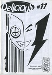</a></td><td><strong>Delicious</strong> 11  Jessica</td><td>A5 Comic  UK</td></tr>
<tr><td></td><td><strong>Happy-Type Heroes</strong> 2  Jessica</td><td>A5 Comic 1997 UK</td></tr>
<tr><td></td><td><strong>Lore</strong> 1  Jessica</td><td>A5 Comic  UK</td></tr>
<tr><td></td><td><strong>Psychosense</strong> 1  Jessica</td><td>A5 Comic 1996 UK</td></tr>
<tr><td></td><td><strong>Psychosense</strong> 4  Jessica</td><td>A5 Comic 1996 UK</td></tr>
<tr><td></td><td><strong>Psychosense</strong> 5  Jessica</td><td>A5 Comic 1996 UK</td></tr>
<tr><td></td><td><strong>Psychosense</strong> 9  Jessica</td><td>A5 Comic 1997 UK</td></tr>
<tr><td><a href="../images/covers/100265_c.jpg">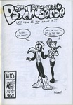</a></td><td><strong>Psychosense</strong> 10  Jessica</td><td>A5 Comic 1998 UK</td></tr>
<tr><td></td><td><strong>Psychosense Tales</strong> 1  Jessica</td><td>A5 Comic 1997 UK</td></tr>
<tr><td></td><td><strong>Coffee Time</strong> 7  Jez Higgins</td><td>A5 Comic 1993 UK</td></tr>
<tr><td></td><td><strong>Coffee Time</strong> 8  Jez Higgins</td><td>A5 Comic 1994 UK</td></tr>
<tr><td><a href="../images/covers/100298_c.jpg">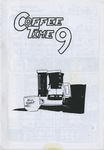</a></td><td><strong>Coffee Time</strong> 9  Jez Higgins</td><td>A5 Comic 1994 UK</td></tr>
<tr><td></td><td><strong>TRS3</strong> May 2002  Jez Higgins</td><td>A4 Review Zine  UK</td></tr>
<tr><td></td><td><strong>Complicity</strong>   Jim Cameron</td><td>A5 Comic 1997 UK</td></tr>
<tr><td><a href="../images/covers/100128_c.jpg">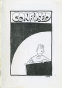</a></td><td><strong>Confused</strong>   Jim Cameron</td><td>A5 Comic 1996 UK</td></tr>
<tr><td></td><td><strong>Disillusion</strong>   Jim Cameron</td><td>A5 Comic 1996 UK</td></tr>
<tr><td><a href="../images/covers/100313_c.jpg">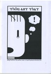</a></td><td><strong>Thou Art That</strong>   Jim Cameron</td><td>A5 Comic  UK</td></tr>
<tr><td></td><td><strong>Rider's Writes</strong> 5  Jim Jones</td><td>A5 Zine 1997 UK</td></tr>
<tr><td></td><td><strong>Bad Attitude Boy</strong> 1  Jim Mcgee</td><td>A5 Comic 2002 UK</td></tr>
<tr><td><a href="../images/covers/100346_c.jpg">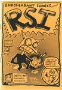</a></td><td><strong>RSI</strong>   Jim Mcgee</td><td>A5 Comic 2003 UK</td></tr>
<tr><td></td><td><strong>Square Eyed Stories</strong> 11  Jim Mcgee</td><td>A5 Anthology Comic 1999 UK</td></tr>
<tr><td></td><td><strong>Square Eyed Stories</strong> 13  Jim Mcgee</td><td>A5 Anthology Comic 2001 UK</td></tr>
<tr><td></td><td><strong>Square Eyed Stories</strong> 15  Jim Mcgee</td><td>A5 Anthology Comic 2002 UK</td></tr>
<tr><td></td><td><strong>Square Eyed Stories</strong> 16  Jim Mcgee</td><td>A5 Anthology Comic 2003 UK</td></tr>
<tr><td></td><td><strong>Square Eyed Stories</strong> 17  Jim Mcgee</td><td>A5 Anthology Comic 2004 UK</td></tr>
<tr><td></td><td><strong>The Bruising Pit</strong>   John Cake</td><td>A5 Comic 1998 UK</td></tr>
<tr><td></td><td><strong>Stop Making Sense</strong> 2  John Edwards</td><td>A5 Comic  </td></tr>
<tr><td></td><td><strong>Tepid</strong>   John Hankiewicz</td><td>A5 Comic 1998 USA</td></tr>
<tr><td></td><td><strong>Fancy a Brew</strong> 1  John Jaques</td><td>A5 Zine 1997 UK</td></tr>
<tr><td></td><td><strong>Metaluna</strong> 1  John Miller</td><td>A5 Zine  UK</td></tr>
<tr><td></td><td><strong>Metaluna</strong> 2  John Miller</td><td>A5 Zine  UK</td></tr>
<tr><td></td><td><strong>King Cat</strong> 38  John Porcellino</td><td>A5 Comic 1993 USA</td></tr>
<tr><td></td><td><strong>King Cat</strong> 50  John Porcellino</td><td>A5 Comic 1996 USA</td></tr>
<tr><td><a href="../images/covers/100418_c.jpg">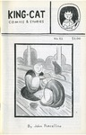</a></td><td><strong>King Cat</strong> 52  John Porcellino</td><td>A5 Comic 1997 USA</td></tr>
<tr><td></td><td><strong>King Cat</strong> 55  John Porcellino</td><td>A5 Comic 1999 USA</td></tr>
<tr><td></td><td><strong>King Cat</strong> 57  John Porcellino</td><td>A5 Comic 2000 USA</td></tr>
<tr><td></td><td><strong>King Cat</strong> 59  John Porcellino</td><td>A5 Comic 2001 USA</td></tr>
<tr><td></td><td><strong>Goathland</strong> 1  John Welding</td><td>A5 Comic 1997 UK</td></tr>
<tr><td></td><td><strong>Goathland</strong> 4  John Welding</td><td>A5 Comic 1997 UK</td></tr>
<tr><td><a href="../images/covers/100436_c.jpg">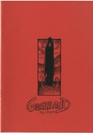</a></td><td><strong>Goathland</strong> 6  John Welding</td><td>A5  1997 UK</td></tr>
<tr><td><a href="../images/covers/100341_c.jpg">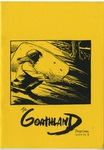</a></td><td><strong>Goathland</strong> 7  John Welding</td><td>A5 Comic 1997 UK</td></tr>
<tr><td></td><td><strong>Goathland</strong> 9  John Welding</td><td>A5 Comic 1998 UK</td></tr>
<tr><td></td><td><strong>Ain't Life A Blast</strong> 2  Jone-Zee</td><td>A5 Comic  UK</td></tr>
<tr><td></td><td><strong>Noe-Fie</strong> 7  K Wolfgang</td><td>A5 Comic 1998 USA</td></tr>
<tr><td></td><td><strong>Mysterious Tea Party</strong>   Kalah Allen</td><td>A5 Comic  USA</td></tr>
<tr><td></td><td><strong>Slurpy Sweet</strong> 1  Ken Grobe</td><td>A5 Comic 1999 USA</td></tr>
<tr><td></td><td><strong>Backwash</strong> 1  Ken Ives</td><td>A5 Comic 1998 USA</td></tr>
<tr><td></td><td><strong>Impossible</strong> 1  Kevin Huizenga</td><td>A5 Anthology Comic 2001 USA</td></tr>
<tr><td></td><td><strong>Rinky Dink</strong> 1  Kevin Lousy</td><td>A5 Zine 1998 USA</td></tr>
<tr><td></td><td><strong>Stories from the Ward</strong>   Lark Pien</td><td>A5 Comic 1999 </td></tr>
<tr><td></td><td><strong>AshCom</strong> 1  Laura Watton</td><td>A5 Comic 2002 UK</td></tr>
<tr><td></td><td><strong>Mistakes and Regrets</strong>   Leonie O'Moore</td><td>A5 Comic 2004 UK</td></tr>
<tr><td></td><td><strong>Monstrum Horrendum</strong> 2  Leonie O'Moore</td><td>A5 Comic  UK</td></tr>
<tr><td></td><td><strong>Euro Liliane</strong> 11  Liliane</td><td>A5 Comic 1996 UK</td></tr>
<tr><td></td><td><strong>Mitten Brain</strong> 2  Luella Jane Wright</td><td>A5 Comic 1994 UK</td></tr>
<tr><td></td><td><strong>Weird Astral Detective Fiction</strong>   Luke Walsh</td><td>A5 Comic 1992 UK</td></tr>
<tr><td></td><td><strong>A Lone Still</strong>   Malcy Duff</td><td>A5 Comic 2005 UK</td></tr>
<tr><td></td><td><strong>Cute Yuck</strong> 1  Malcy Duff</td><td>A5 Comic 2000 UK</td></tr>
<tr><td></td><td><strong>Gunk</strong>   Malcy Duff</td><td>A5 Comic 2000 UK</td></tr>
<tr><td></td><td><strong>Hoofprints</strong>   Malcy Duff</td><td>A5 Comic 2001 UK</td></tr>
<tr><td></td><td><strong>I Can't Draw</strong> 2  Malcy Duff</td><td>A5 Comic 2005 UK</td></tr>
<tr><td><a href="../images/covers/100260_c.jpg">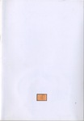</a></td><td><strong>Kerry</strong>   Malcy Duff</td><td>A5 Comic 2002 UK</td></tr>
<tr><td></td><td><strong>The Cloud Dog Agency</strong>   Malcy Duff</td><td>A5 Comic 1999 UK</td></tr>
<tr><td></td><td><strong>Zero Termite</strong> 3  Malcy Duff</td><td>A5 Comic 1998 UK</td></tr>
<tr><td></td><td><strong>Zero Termite</strong> 4  Malcy Duff</td><td>A5 Comic 1998 UK</td></tr>
<tr><td><a href="../images/covers/100081_c.jpg">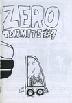</a></td><td><strong>Zero Termite</strong> 7  Malcy Duff</td><td>A5 Comic 1999 UK</td></tr>
<tr><td></td><td><strong>Amzacourt</strong> 2  Marc Parker</td><td>A5 Zine 1998 USA</td></tr>
<tr><td></td><td><strong>Azmacourt</strong> 3  Marc Parker</td><td>A5 Zine 1998 USA</td></tr>
<tr><td></td><td><strong>Stiro</strong> 2  Mardou</td><td>A5 Comic 2002 UK</td></tr>
<tr><td></td><td><strong>Sputnik</strong> 1  Mark Bickley</td><td>A5 Comic 1999 UK</td></tr>
<tr><td></td><td><strong>Disinfotainment - Armchair Shopping</strong>   Mark Pawson</td><td>A6 Other 1996 UK</td></tr>
<tr><td></td><td><strong>Mapk Пaвcoн</strong>   Mark Pawson</td><td>A5 Art Book  UK</td></tr>
<tr><td></td><td><strong>The Palindromist</strong> 2  Mark Saltveit</td><td>A5 Zine 1996 USA</td></tr>
<tr><td></td><td><strong>Flimsy Monsterworks</strong> 2  Martin Hand</td><td>A5 Comic 1997 UK</td></tr>
<tr><td></td><td><strong>Hawaii</strong>   Matt Broersma</td><td>A5 Comic 2004 UK</td></tr>
<tr><td></td><td><strong>Les 9 cries du chat blanc</strong>   Matt Broersma</td><td>A5 Comic 2004 UK</td></tr>
<tr><td></td><td><strong>The Ant's Own Tram Wheel</strong> 1  Matthew Lawrenson</td><td>A5 Zine 1993 UK</td></tr>
<tr><td></td><td><strong>The Ant's Own Tram Wheel</strong> 3  Matthew Lawrenson</td><td>A5 Zine 1994 UK</td></tr>
<tr><td></td><td><strong>The Ant's Own Tram Wheel</strong> 4  Matthew Lawrenson</td><td>A5 Zine 1994 UK</td></tr>
<tr><td></td><td><strong>Thoughts and Words</strong> 2  Matthew Lawrenson</td><td>A5 Zine 2002 UK</td></tr>
<tr><td></td><td><strong>Diary of Neo-Psychedelic Man</strong> 17  Maximum Traffic</td><td>A5 Comic  USA</td></tr>
<tr><td></td><td><strong>Diary of Neo-Psychedelic Man</strong> 26  Maximum Traffic</td><td>A5 Comic  USA</td></tr>
<tr><td></td><td><strong>White Buffalo Gazette</strong> Apr 96  Maximum Traffic</td><td>A5 Mail Art 1996 USA</td></tr>
<tr><td></td><td><strong>Unspoken</strong>   Megan Kelso</td><td>A5 Comic 1996 USA</td></tr>
<tr><td></td><td><strong>Destronic News</strong> 1  Michael Perridge</td><td>A5 Zine 1991 UK</td></tr>
<tr><td></td><td><strong>Destronic News</strong> 2  Michael Perridge</td><td>A5 Anthology Comic 1992 UK</td></tr>
<tr><td></td><td><strong>Empty Life [Filthy Shit flip]</strong> 10  Mike Tolento</td><td>A5 Comic 1997 USA</td></tr>
<tr><td></td><td><strong>The Sugar Paper Rebellion</strong>   Mike Weller</td><td>A5 Comic 1998 UK</td></tr>
<tr><td></td><td><strong>Amateur demo edition</strong>   Mitch & Murray</td><td>A5 Comic 1997 UK</td></tr>
<tr><td></td><td><strong>Mooncat's very own comic</strong>   Mooncat</td><td>A5 Comic 1993 UK</td></tr>
<tr><td></td><td><strong>Loose Screws</strong> 15  Mr Biggers</td><td>A5 Zine 1998 USA</td></tr>
<tr><td></td><td><strong>Grinning Like Fathers Puppet</strong>   n/a</td><td>A5 Comic 2002 UK</td></tr>
<tr><td></td><td><strong>Neil Jam</strong> 7  Neil Fitzpatrick</td><td>A5 Comic 2001 USA</td></tr>
<tr><td></td><td><strong>Sunspots</strong>   Nick Abadzis</td><td>A5 Comic 2001 UK</td></tr>
<tr><td></td><td><strong>The Adventures of Hamish and Dwarf</strong>   Nigel Roberts</td><td>A5 Comic 1996 UK</td></tr>
<tr><td></td><td><strong>Nightfall</strong> 2  Noel K Hannan</td><td>A5 Anthology Comic 1990 UK</td></tr>
<tr><td></td><td><strong>Muppet Babies</strong>   Paper Rad</td><td>A5 Art Book  USA</td></tr>
<tr><td></td><td><strong>A Virtual Circle</strong> 1  Patrick Brown</td><td>A5 Comic 1995 UK</td></tr>
<tr><td></td><td><strong>A Virtual Circle</strong> 2  Patrick Brown</td><td>A5 Comic 1996 UK</td></tr>
<tr><td></td><td><strong>A Virtual Circle</strong> 4  Patrick Brown</td><td>A5 Comic 1996 UK</td></tr>
<tr><td></td><td><strong>A Virtual Circle</strong> 5  Patrick Brown</td><td>A5 Comic 1996 UK</td></tr>
<tr><td></td><td><strong>Tamara Knight</strong>   Patrick Brown</td><td>A5 Comic 1996 UK</td></tr>
<tr><td></td><td><strong>Under the Bed</strong>   Patrick Brown</td><td>A5 Comic 1996 UK</td></tr>
<tr><td></td><td><strong>Holocron</strong> 0  Paul & Neil Bristow</td><td>A5 Zine  UK</td></tr>
<tr><td></td><td><strong>Holocron</strong> 1  Paul & Neil Bristow</td><td>A5 Zine 1995 UK</td></tr>
<tr><td></td><td><strong>Refractor</strong> 1  Paul & Neil Bristow</td><td>A5 Zine  UK</td></tr>
<tr><td></td><td><strong>Refractor</strong> 2  Paul & Neil Bristow</td><td>A5 Zine  UK</td></tr>
<tr><td></td><td><strong>Refractor</strong> 3  Paul & Neil Bristow</td><td>A5 Zine  UK</td></tr>
<tr><td></td><td><strong>Refractor</strong> 4  Paul & Neil Bristow</td><td>A5 Zine  UK</td></tr>
<tr><td></td><td><strong>The Whistleblowers</strong>   Paul & Neil Bristow</td><td>A5 Zine 1995 UK</td></tr>
<tr><td><a href="../images/covers/100378_c.jpg">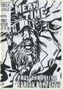</a></td><td><strong>Mean Time</strong>   Paul Carstairs</td><td>A5 Comic 1995 UK</td></tr>
<tr><td></td><td><strong>Beer Frame</strong> 6  Paul Lukas</td><td>A5 Zine 1996 USA</td></tr>
<tr><td></td><td><strong>Beer Frame</strong> 7  Paul Lukas</td><td>A5 Zine 1997 USA</td></tr>
<tr><td></td><td><strong>Beer Frame</strong> 10  Paul Lukas</td><td>A5 Zine 2000 USA</td></tr>
<tr><td></td><td><strong>Fun Comics</strong> 1  Paul M Davies</td><td>A5 Comic 1995 UK</td></tr>
<tr><td></td><td><strong>Fun Comics</strong> 2  Paul M Davies</td><td>A5 Comic 1995 UK</td></tr>
<tr><td></td><td><strong>Fun Comics</strong> 3  Paul M Davies</td><td>A5 Comic 1996 UK</td></tr>
<tr><td></td><td><strong>Fun Comics</strong> 5  Paul M Davies</td><td>A5 Comic 1996 UK</td></tr>
<tr><td></td><td><strong>Dear Robert and Partner</strong>   Paul Rainey</td><td>A5 Comic 2007 UK</td></tr>
<tr><td></td><td><strong>Fume!</strong>   Peet Clack</td><td>A6 Comic 2002 </td></tr>
<tr><td></td><td><strong>Round Midnight</strong> 2  Peter Bangs</td><td>A5 Comic 1996 UK</td></tr>
<tr><td></td><td><strong>Pavement</strong> 1  Peter Pavement</td><td>A5 Comic 1992 UK</td></tr>
<tr><td></td><td><strong>Pavement</strong> 2+3  Peter Pavement</td><td>A5 Anthology Comic 1992 UK</td></tr>
<tr><td></td><td><strong>The Information</strong> 4  Peter Poole</td><td>A5 Zine 1999 UK</td></tr>
<tr><td></td><td><strong>Worm</strong> 1998 - 2  Peter Van Laarhoven</td><td>A5 Review Zine 1998 Belgium</td></tr>
<tr><td></td><td><strong>Worm</strong> 1998 - 3  Peter Van Laarhoven</td><td>A5 Review Zine 1998 Belgium</td></tr>
<tr><td></td><td><strong>Jonni Star</strong>   Phil Elliott</td><td>A5 Comic 1998 UK</td></tr>
<tr><td></td><td><strong>Art Students Stole My Vibrator</strong>   Rachel House</td><td>A5 Comic 2000 UK</td></tr>
<tr><td></td><td><strong>Bumper Summer Fun</strong>   Rachel House</td><td>A5 Comic 2003 UK</td></tr>
<tr><td></td><td><strong>Captain Dolphin</strong> 5  Ralph Kidson</td><td>A5 Comic  UK</td></tr>
<tr><td></td><td><strong>Two To Beam Up</strong> 2  Ralph Kidson</td><td>A5 Comic 2001 UK</td></tr>
<tr><td></td><td><strong>Zeen</strong>   Ray Man</td><td>A5 Comic 2000 Belgium</td></tr>
<tr><td></td><td><strong>IK</strong> 3  Reinder Dijkhuis</td><td>A5 Comic 1997 Netherlands</td></tr>
<tr><td></td><td><strong>IK</strong> 5  Reinder Dijkhuis</td><td>A5 Comic 1997 Netherlands</td></tr>
<tr><td><a href="../images/covers/100363_c.jpg">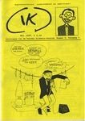</a></td><td><strong>IK</strong> 6  Reinder Dijkhuis</td><td>A5 Comic 1998 Netherlands</td></tr>
<tr><td></td><td><strong>Sub Rosa</strong> 1  Richard Argent</td><td>A5 Comic 1993 UK</td></tr>
<tr><td></td><td><strong>Automatic</strong> 6  Richard Z Starbuck</td><td>A5 Anthology Comic 1996 UK</td></tr>
<tr><td></td><td><strong>Chain Mesh</strong> 4  Richard Z Starbuck</td><td>A5 Anthology Comic 1992 UK</td></tr>
<tr><td></td><td><strong>Tiddles the Wonder Cat's Super Silly Fun Book</strong>   Rick Olsen</td><td>A5 Comic 1997 UK</td></tr>
<tr><td></td><td><strong>Lifewish Bay</strong>   Ricky Douglas</td><td>A5 Comic  UK</td></tr>
<tr><td></td><td><strong>American Ant</strong> 1  Rik Hoskin</td><td>A5 Comic 1993 UK</td></tr>
<tr><td></td><td><strong>Broken Jeffrey</strong>   Rik Hoskin</td><td>A5 Comic 1996 UK</td></tr>
<tr><td></td><td><strong>Shrapnel Kiss</strong>   Rik Rawling</td><td>A5 Comic 1995 UK</td></tr>
<tr><td></td><td><strong>Pride of an Angel</strong> 1  Robert Martin</td><td>A5 Comic 2003 UK</td></tr>
<tr><td></td><td><strong>Pride of an Angel</strong> 1  Robert Martin</td><td>A5 Comic 2001 UK</td></tr>
<tr><td></td><td><strong>Pride of an Angel</strong> 2  Robert Martin</td><td>A5 Comic 2001 UK</td></tr>
<tr><td></td><td><strong>Pride of an Angel</strong> One Shot  Robert Martin</td><td>A5 Comic 2002 UK</td></tr>
<tr><td></td><td><strong>Minds Eye Presents</strong> 10  Robin Bougie</td><td>A5 Anthology Comic 2001 USA</td></tr>
<tr><td></td><td><strong>Minds Eye Presents</strong> 11  Robin Bougie</td><td>A5 Comic 1999 USA</td></tr>
<tr><td></td><td><strong>The Incest Project</strong> 3  Robin Bougie</td><td>A5 Zine 2005 USA</td></tr>
<tr><td></td><td><strong>The Mice in RAID</strong>   Roger Mason</td><td>A5 Comic 2003 UK</td></tr>
<tr><td></td><td><strong>A Jock Gallery</strong>   Rol Hirst</td><td>A5 Comic 1994 UK</td></tr>
<tr><td></td><td><strong>Escape Committee</strong> 1  Rol Hirst</td><td>A5 Comic 1999 UK</td></tr>
<tr><td></td><td><strong>Escape Committee</strong> 2  Rol Hirst</td><td>A5 Comic  UK</td></tr>
<tr><td></td><td><strong>The Jock</strong> 1  Rol Hirst</td><td>A5 Comic 1993 UK</td></tr>
<tr><td></td><td><strong>The Jock</strong> 2  Rol Hirst</td><td>A5 Comic 1993 UK</td></tr>
<tr><td></td><td><strong>The Jock</strong> 3  Rol Hirst</td><td>A5 Comic 1993 UK</td></tr>
<tr><td></td><td><strong>The Jock</strong> 4  Rol Hirst</td><td>A5 Comic 1993 UK</td></tr>
<tr><td></td><td><strong>The Jock</strong> 5  Rol Hirst</td><td>A5 Comic 1993 UK</td></tr>
<tr><td></td><td><strong>The Jock</strong> 6  Rol Hirst</td><td>A5 Comic 1993 UK</td></tr>
<tr><td></td><td><strong>The Jock</strong> 8  Rol Hirst</td><td>A5 Comic 1993 UK</td></tr>
<tr><td></td><td><strong>The Jock</strong> 9  Rol Hirst</td><td>A5 Comic 1993 UK</td></tr>
<tr><td></td><td><strong>The Jock</strong> 10  Rol Hirst</td><td>A5 Comic 1994 UK</td></tr>
<tr><td></td><td><strong>The Jock</strong> 11  Rol Hirst</td><td>A5 Comic 1994 UK</td></tr>
<tr><td><a href="../images/covers/100138_c.jpg">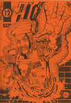</a></td><td><strong>The Jock</strong> 12  Rol Hirst</td><td>A5 Comic 1994 UK</td></tr>
<tr><td></td><td><strong>The Jock</strong> 13  Rol Hirst</td><td>A5 Comic 1994 UK</td></tr>
<tr><td></td><td><strong>The Jock</strong> 14  Rol Hirst</td><td>A5 Comic 1994 UK</td></tr>
<tr><td></td><td><strong>The Jock</strong> 15  Rol Hirst</td><td>A5 Comic 1994 UK</td></tr>
<tr><td></td><td><strong>The Jock</strong> 16  Rol Hirst</td><td>A5 Comic 1994 UK</td></tr>
<tr><td></td><td><strong>The Jock</strong> 18  Rol Hirst</td><td>A5 Comic 1995 UK</td></tr>
<tr><td></td><td><strong>The Jock</strong> 19  Rol Hirst</td><td>A5 Comic 1995 UK</td></tr>
<tr><td></td><td><strong>The Jock</strong> 20  Rol Hirst</td><td>A5 Comic 1995 UK</td></tr>
<tr><td></td><td><strong>The Jock</strong> 21  Rol Hirst</td><td>A5 Comic 1995 UK</td></tr>
<tr><td></td><td><strong>The Jock</strong> 22  Rol Hirst</td><td>A5 Comic 1995 UK</td></tr>
<tr><td></td><td><strong>The Jock</strong> 23  Rol Hirst</td><td>A5 Comic 1995 UK</td></tr>
<tr><td></td><td><strong>The Jock</strong> 24  Rol Hirst</td><td>A5 Comic 1996 UK</td></tr>
<tr><td></td><td><strong>Garbles</strong> 6  Ros Garbles</td><td>A5 Comic 1993 UK</td></tr>
<tr><td><a href="../images/covers/100091_c.jpg">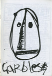</a></td><td><strong>Garbles</strong> 7  Ros Garbles</td><td>A5 Comic 1993 UK</td></tr>
<tr><td></td><td><strong>Garbles</strong> 9  Ros Garbles</td><td>A5 Comic 1994 UK</td></tr>
<tr><td></td><td><strong>Garbles</strong> 10  Ros Garbles</td><td>A5 Comic 1995 UK</td></tr>
<tr><td></td><td><strong>Garbles</strong> 11  Ros Garbles</td><td>A5 Comic 1997 UK</td></tr>
<tr><td></td><td><strong>Rough Cut Presents Trailers</strong> 1  Rough Cut Comics</td><td>A5 Comic 2001 UK</td></tr>
<tr><td></td><td><strong>Amusing Yourself To Death</strong> 15  Ruel Gaviola</td><td>A5 Zine 1999 USA</td></tr>
<tr><td></td><td><strong>My Daily Review</strong> 1  Sally Anne Hickman</td><td>A5 Comic 2001 UK</td></tr>
<tr><td></td><td><strong>Phobias</strong>   Sammy Wammy</td><td>A5 Zine 2000 UK</td></tr>
<tr><td></td><td><strong>Me and Edith Head</strong>   Sara Ryan</td><td>A5 Comic 2002 USA</td></tr>
<tr><td><a href="../images/covers/100226_c.jpg">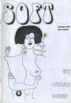</a></td><td><strong>Soft</strong> 1  Sarah Gunn</td><td>A5 Comic  UK</td></tr>
<tr><td></td><td><strong>Soft</strong> 2  Sarah Gunn</td><td>A5 Comic  UK</td></tr>
<tr><td></td><td><strong>AKTSN</strong> 6  SchNEWS</td><td>A4 Zine 1998 UK</td></tr>
<tr><td></td><td><strong>SchNEWS</strong> 158  SchNEWS</td><td>A4 Zine 1998 UK</td></tr>
<tr><td></td><td><strong>SchNEWS</strong> 159  SchNEWS</td><td>A4 Zine 1998 UK</td></tr>
<tr><td></td><td><strong>SchNEWS</strong> 160  SchNEWS</td><td>A4 Zine 1998 UK</td></tr>
<tr><td></td><td><strong>SchNEWS</strong> 161  SchNEWS</td><td>A5 Zine 1998 UK</td></tr>
<tr><td></td><td><strong>SchNEWS</strong> 162  SchNEWS</td><td>A5 Zine 1998 UK</td></tr>
<tr><td></td><td><strong>Ed</strong>   Sean Azzopardi</td><td>A5 Comic 2005 UK</td></tr>
<tr><td></td><td><strong>Twelve Hour Shift</strong>   Sean Azzopardi</td><td>A5 Comic 2005 UK</td></tr>
<tr><td></td><td><strong>Paper Tiger Comix</strong> 1  Sean Duffield</td><td>A5 Anthology Comic 2004 UK</td></tr>
<tr><td></td><td><strong>Paper Tiger Comix</strong> 2  Sean Duffield</td><td>A5 Anthology Comic 2005 UK</td></tr>
<tr><td></td><td><strong>The Girly Comic</strong> 1  Selina Locke</td><td>A5 Anthology Comic 2002 UK</td></tr>
<tr><td></td><td><strong>Imagineers</strong> 4  Shane Chesby</td><td>A5 Zine 2001 UK</td></tr>
<tr><td></td><td><strong>Ten Foot Rule</strong> 2  Shawn Granton</td><td>A5 Comic 1997 USA</td></tr>
<tr><td></td><td><strong>Ten Foot Rule</strong> 3  Shawn Granton</td><td>A5 Comic 2000 USA</td></tr>
<tr><td></td><td><strong>Ten Foot Rule</strong> 5  Shawn Granton</td><td>A5 Anthology Comic 2000 USA</td></tr>
<tr><td><a href="../images/covers/100170_c.jpg">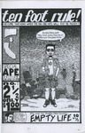</a></td><td><strong>Ten Foot Rule 2.5 - Empty Life 10.5 flip</strong>   Shawn Granton & Mike Tolento</td><td>A5 Comic 1998 USA</td></tr>
<tr><td></td><td><strong>The Comics Reviewer</strong> 2  Simon Baker</td><td>A5 Review Zine 1996 UK</td></tr>
<tr><td></td><td><strong>Strimp</strong>   Simon Mackie</td><td>A5 Comic 1996 UK</td></tr>
<tr><td></td><td><strong>Flying Monkey</strong> 3  Simon Perrins</td><td>A5 Comic 1998 UK</td></tr>
<tr><td></td><td><strong>Hope for the Future</strong> 1  Simon Perrins</td><td>A5 Comic 2000 UK</td></tr>
<tr><td></td><td><strong>Hope for the Future</strong> 3  Simon Perrins</td><td>A5 Comic 2001 UK</td></tr>
<tr><td></td><td><strong>Anarchy in the UK... the Comic!</strong>   Slab-o-Concrete</td><td>A5 Anthology Comic 1994 UK</td></tr>
<tr><td></td><td><strong>Smoke - A London Peculiar</strong> 4  Smoke</td><td>A5 Zine 2003 UK</td></tr>
<tr><td></td><td><strong>Smoke - A London Peculiar</strong> 6  Smoke</td><td>A5 Zine  UK</td></tr>
<tr><td></td><td><strong>Fat Knite</strong> 3  Steve Blincoe</td><td>A5 Zine 1988 UK</td></tr>
<tr><td></td><td><strong>Fat Knite</strong> 4  Steve Blincoe</td><td>A5 Zine  UK</td></tr>
<tr><td></td><td><strong>Fat Knite</strong> 5  Steve Blincoe</td><td>A5 Zine  UK</td></tr>
<tr><td></td><td><strong>Fat Knite</strong> 6  Steve Blincoe</td><td>A5 Zine  UK</td></tr>
<tr><td></td><td><strong>Terracotta</strong>   Terracotta</td><td>A5 Zine 1996 UK</td></tr>
<tr><td></td><td><strong>The Desyre Foundation Newsletter</strong> 1  The Desyre Foundation</td><td>A5 Zine 1996 UK</td></tr>
<tr><td></td><td><strong>Delirium Tremens</strong> 5  Three Drunken Goths</td><td>A5 Zine 1999 UK</td></tr>
<tr><td></td><td><strong>Brin</strong> 2  Tim Brown</td><td>A5 Comic 1998 UK</td></tr>
<tr><td><a href="../images/covers/100433_c.jpg">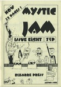</a></td><td><strong>Mystic Jam</strong> 8  Tim Brown</td><td>A5 Comic 1996 UK</td></tr>
<tr><td></td><td><strong>Nightclub Nick</strong> 1  Tim Brown</td><td>A5 Comic 2000 UK</td></tr>
<tr><td></td><td><strong>Nightclub Nick</strong> 2  Tim Brown</td><td>A5 Comic 2000 UK</td></tr>
<tr><td></td><td><strong>Nightclub Nick</strong> 4  Tim Brown</td><td>A5 Comic 2000 UK</td></tr>
<tr><td></td><td><strong>Nightclub Nick</strong> 6  Tim Brown</td><td>A5 Comic 2000 UK</td></tr>
<tr><td><a href="../images/covers/100437_c.jpg">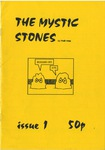</a></td><td><strong>The Mystic Stones</strong> 1  Tim Brown</td><td>A5 Comic 1996 UK</td></tr>
<tr><td></td><td><strong>The Mystic Stones</strong> 4  Tim Brown</td><td>A5 Comic 1996 UK</td></tr>
<tr><td><a href="../images/covers/100227_c.jpg">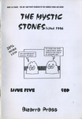</a></td><td><strong>The Mystic Stones</strong> 5  Tim Brown</td><td>A5 Comic 1996 UK</td></tr>
<tr><td></td><td><strong>The Mystic Stones</strong> 6  Tim Brown</td><td>A5 Comic 1996 UK</td></tr>
<tr><td><a href="../images/covers/100263_c.jpg">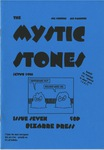</a></td><td><strong>The Mystic Stones</strong> 7  Tim Brown</td><td>A5 Comic 1996 UK</td></tr>
<tr><td></td><td><strong>Struggle</strong> v14 n1  Tim Hall</td><td>A5 Zine 1998 USA</td></tr>
<tr><td></td><td><strong>Japanize</strong> 2  Toko</td><td>A5 Comic 1999 UK</td></tr>
<tr><td></td><td><strong>Japanize</strong> 3  Toko</td><td>A5 Comic 1999 UK</td></tr>
<tr><td></td><td><strong>Japanize</strong> 10  Toko</td><td>A5 Comic 2001 UK</td></tr>
<tr><td></td><td><strong>Shelton</strong>   Tom Spurgeon</td><td>A5 Comic 1999 USA</td></tr>
<tr><td></td><td><strong>Angel Nebula</strong> 4  Tony McGee</td><td>A5 Comic 1999 UK</td></tr>
<tr><td></td><td><strong>Angel Nebula</strong> 9  Tony McGee</td><td>A5 Comic 2001 UK</td></tr>
<tr><td></td><td><strong>Dark Weather</strong> 4  Tony McGee</td><td>A5 Comic 1997 UK</td></tr>
<tr><td></td><td><strong>Dark Weather</strong> 5  Tony McGee</td><td>A5 Comic 1998 UK</td></tr>
<tr><td></td><td><strong>Dark Weather Special</strong> 1  Tony McGee</td><td>A5 Comic 1998 UK</td></tr>
<tr><td></td><td><strong>Dark Weather Special</strong> 2  Tony McGee</td><td>A5 Comic 1998 UK</td></tr>
<tr><td></td><td><strong>Frontiers</strong> 2  Tony McGee</td><td>A5 Comic 2002 UK</td></tr>
<tr><td></td><td><strong>Frontiers</strong> 6  Tony McGee</td><td>A5 Comic 2003 UK</td></tr>
<tr><td></td><td><strong>Frontiers</strong> 7  Tony McGee</td><td>A5 Comic 2004 UK</td></tr>
<tr><td></td><td><strong>Fun Bag</strong>   Tony McGee</td><td>A5 Comic  UK</td></tr>
<tr><td></td><td><strong>Gimp City</strong> 1/2  Tony McGee</td><td>A5 Comic  UK</td></tr>
<tr><td></td><td><strong>True Stories</strong> 2  Tony McGee</td><td>A5 Comic 2005 UK</td></tr>
<tr><td></td><td><strong>Sharkpool</strong> 2  Tracy B</td><td>A5 Zine 1998 UK</td></tr>
<tr><td></td><td><strong>Typewriter</strong> 4  Typewriter</td><td>A5 Anthology Comic 2001 </td></tr>
<tr><td></td><td><strong>Robot Investigator</strong>   Vincent Stall</td><td>A5 Comic 2001 USA</td></tr>
<tr><td></td><td><strong>The Smell of Napalm</strong> 1  Wayne Clarke</td><td>A5 Zine  UK</td></tr>
<tr><td></td><td><strong>The Smell of Napalm</strong> 2  Wayne Clarke</td><td>A5 Zine  UK</td></tr>
<tr><td></td><td><strong>Something Fast</strong> 1  Will Pickering</td><td>A5 Comic 1996 UK</td></tr>
<tr><td></td><td><strong>Something Fast</strong> 2  Will Pickering</td><td>A5 Comic 1996 UK</td></tr>
<tr><td></td><td><strong>Something Fast</strong> 3  Will Pickering</td><td>A5 Comic 1996 UK</td></tr>
<tr><td></td><td><strong>Wow Cool</strong> Spring 97  Wow Cool</td><td>A5 Catalogue 1997 USA</td></tr>
<tr><td></td><td><strong>Wonky Fascination</strong>   Yurt Barron</td><td>A5 Comic 2003 UK</td></tr>

</table>

---
end

