# The Zines

[< Back](../)

**This is a work in progress. More zines are being added every few days.**

As of 7 August 2024 I've decided to pause scanning the contents of each zine and focus on scanning just the covers and adding them to the spreadsheet. It should take a couple of months to go through the 3-4,000 in the archive, and then I'll have a better sense of what I've got here. 

This page has thumbnails of the covers of all the zines linked to more legible larger versions. 

Metadata is pretty basic - many zines have more than one creator but I've just entered the main or first listed person for now, and "type" is very broad. This will all be expanded once the first pass is done. 

They're sorted by creator's first name (unless I forgot to sort before exporting). 

<table>
<tr><th>Cover</th><th>Title</th><th>Creator</th><th>Type</th><th>Year</th><th>Format</th><th>Country</th></tr>

<tr><td></td><td><strong>I Am The Corner</strong> </td><td>Akiko Tamura</td><td>Comic</td><td>2005</td><td>A5</td><td>UK</td></tr>
<tr><td></td><td><strong>The Long Walk Nowhere</strong> </td><td>Al Burian</td><td>Comic</td><td></td><td>A5</td><td>USA</td></tr>
<tr><td></td><td><strong>Spiral Dreams - Sobakz's Dream</strong> </td><td>Al Davison</td><td>Comic</td><td>2002</td><td>A5</td><td>UK</td></tr>
<tr><td></td><td><strong>Urine</strong> </td><td>Alan Macintyre</td><td>Comic</td><td></td><td>A5</td><td>USA</td></tr>
<tr><td></td><td><strong>Amusing Paper</strong> 1</td><td>Alastair Maceachern</td><td>Comic</td><td>2004</td><td>A5</td><td>UK</td></tr>
<tr><td><a href="../images/covers/100009_c.jpg">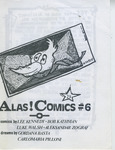</a></td><td><strong>Alas Comica</strong> 6</td><td>Aleksandar Zograf</td><td>Comic</td><td>1996</td><td>A6</td><td>Serbia</td></tr>
<tr><td></td><td><strong>AMP</strong> 0</td><td>AMP</td><td>Zine</td><td>1998</td><td>A5</td><td>UK</td></tr>
<tr><td></td><td><strong>Vollmond</strong> 1</td><td>Andre Paine</td><td>Zine</td><td>1988</td><td>A5</td><td>UK</td></tr>
<tr><td></td><td><strong>Top Notch Tosh</strong> 6</td><td>Andrew Lewis</td><td>Comic</td><td>2002</td><td>A5</td><td>UK</td></tr>
<tr><td><a href="../images/covers/100095_c.jpg">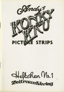</a></td><td><strong>Andy's Konky Kru Picture Strips</strong> </td><td>Andy Konky Kru</td><td>Comic</td><td>1995</td><td>A5</td><td>UK</td></tr>
<tr><td></td><td><strong>Magazine</strong> 2</td><td>Andy Konky Kru</td><td>Zine</td><td>1998</td><td>A5</td><td>UK</td></tr>
<tr><td></td><td><strong>Magazine</strong> 6</td><td>Andy Konky Kru</td><td>Zine</td><td>2002</td><td>A5</td><td>UK</td></tr>
<tr><td><a href="../images/covers/100247_c.jpg">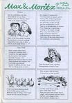</a></td><td><strong>Max & Moritz</strong> </td><td>Andy Konky Kru</td><td>Comic</td><td></td><td>A5</td><td>UK</td></tr>
<tr><td></td><td><strong>Realistische Zeichnungen</strong> 1</td><td>Andy Konky Kru</td><td>Art Book</td><td></td><td>A5</td><td>UK</td></tr>
<tr><td></td><td><strong>Shtumm</strong> 1</td><td>Andy Konky Kru</td><td>Anthology Comic</td><td>2002</td><td>A5</td><td>UK</td></tr>
<tr><td></td><td><strong>Shtumm</strong> 2</td><td>Andy Konky Kru</td><td>Anthology Comic</td><td>2002</td><td>A5</td><td>UK</td></tr>
<tr><td></td><td><strong>Bob's</strong> 3</td><td>Andy Luke</td><td>Comic</td><td>1997</td><td>A5</td><td>UK</td></tr>
<tr><td></td><td><strong>Bob's</strong> 4</td><td>Andy Luke</td><td>Comic</td><td>1998</td><td>A5</td><td>UK</td></tr>
<tr><td></td><td><strong>Bob's</strong> 5</td><td>Andy Luke</td><td>Comic</td><td>1998</td><td>A5</td><td>UK</td></tr>
<tr><td></td><td><strong>Bob's - Can I have your autograph, Mr Hooker?</strong> </td><td>Andy Luke</td><td>Comic</td><td></td><td>A5</td><td>UK</td></tr>
<tr><td></td><td><strong>Bob's Annual</strong> 1</td><td>Andy Luke</td><td>Comic</td><td>1997</td><td>A5</td><td>UK</td></tr>
<tr><td></td><td><strong>Brookside: The Comic</strong> 86</td><td>Andy Luke</td><td>Comic</td><td></td><td>A5</td><td>UK</td></tr>
<tr><td></td><td><strong>Good Vibrations</strong> </td><td>Andy Luke</td><td>Anthology Comic</td><td>1997</td><td>A5</td><td>UK</td></tr>
<tr><td></td><td><strong>TRS2 - Comics 2001 edition</strong> </td><td>Andy Luke</td><td>Review Zine</td><td>2001</td><td>A5</td><td>UK</td></tr>
<tr><td></td><td><strong>Angel Dust Funnies</strong> 1</td><td>Andy Nixon</td><td>Anthology Comic</td><td>1989</td><td>A5</td><td>UK</td></tr>
<tr><td></td><td><strong>Angel Dust Funnies</strong> 4</td><td>Andy Nixon</td><td>Anthology Comic</td><td>1989</td><td>A5</td><td>UK</td></tr>
<tr><td></td><td><strong>Media Assassin</strong> 9</td><td>Andy Roberts</td><td>Zine</td><td>2005</td><td>A5</td><td>UK</td></tr>
<tr><td></td><td><strong>Media Assassin</strong> 11</td><td>Andy Roberts</td><td>Zine</td><td>2006</td><td>A5</td><td>UK</td></tr>
<tr><td></td><td><strong>X-Ray</strong> 1</td><td>Andy Roberts</td><td>Zine</td><td>1994</td><td>A5</td><td>UK</td></tr>
<tr><td></td><td><strong>Circus of Deception</strong> </td><td>Anthony Setchell</td><td>Comic</td><td>2001</td><td>A5</td><td>UK</td></tr>
<tr><td></td><td><strong>Atomic</strong> 9</td><td>Atomic</td><td>Anthology Comic</td><td>1990</td><td>A5</td><td>UK</td></tr>
<tr><td></td><td><strong>Atomic</strong> 10</td><td>Atomic</td><td>Anthology Comic</td><td>1990</td><td>A5</td><td>UK</td></tr>
<tr><td></td><td><strong>Atomic</strong> 11</td><td>Atomic</td><td>Anthology Comic</td><td>1991</td><td>A5</td><td>UK</td></tr>
<tr><td></td><td><strong>The First Job</strong> </td><td>Ben Graham</td><td>Comic</td><td>2001</td><td>A5</td><td></td></tr>
<tr><td></td><td><strong>Tales from the Midden</strong> 10-11</td><td>Ben Hunt</td><td>Comic</td><td></td><td>A5</td><td>UK</td></tr>
<tr><td></td><td><strong>Vogarth</strong> </td><td>Ben Hunt</td><td>Comic</td><td>2001</td><td>A5</td><td>UK</td></tr>
<tr><td></td><td><strong>Classic Comics</strong> 2</td><td>Ben Hunt & Robyn Talbot</td><td>Comic</td><td>2001</td><td>A5</td><td>UK</td></tr>
<tr><td></td><td><strong>Fifteen Nuns</strong> 4</td><td>Ben Oakes</td><td>Comic</td><td>1997</td><td>A5</td><td>UK</td></tr>
<tr><td></td><td><strong>Fifteen Nuns</strong> 5</td><td>Ben Oakes</td><td>Comic</td><td>1997</td><td>A5</td><td>UK</td></tr>
<tr><td></td><td><strong>Fifteen Nuns</strong> 6</td><td>Ben Oakes</td><td>Comic</td><td>1997</td><td>A5</td><td>UK</td></tr>
<tr><td></td><td><strong>The Lupus</strong> 3</td><td>Ben Oakes</td><td>Comic</td><td>2001</td><td>A5</td><td>UK</td></tr>
<tr><td></td><td><strong>The Miserable Tale Of Demeter & Sharky</strong> </td><td>Ben Oakes</td><td>Comic</td><td>2002</td><td>A5</td><td>UK</td></tr>
<tr><td></td><td><strong>Braque's Love Dart</strong> </td><td>Bib Edwards</td><td>Comic</td><td>2001</td><td>A5</td><td>UK</td></tr>
<tr><td></td><td><strong>Temptress of Triton</strong> </td><td>Bib Edwards</td><td>Comic</td><td></td><td>A5</td><td>UK</td></tr>
<tr><td></td><td><strong>Big Untidy - Flyer and Letter</strong> </td><td>Big Untidy</td><td>Other</td><td></td><td>A5</td><td></td></tr>
<tr><td></td><td><strong>Behold the Hamster</strong> </td><td>Bob Lynch</td><td>Comic</td><td>1991</td><td>A5</td><td>UK</td></tr>
<tr><td></td><td><strong>Double Bill</strong> </td><td>Bob Lynch</td><td>Comic</td><td>1992</td><td>A5</td><td>UK</td></tr>
<tr><td></td><td><strong>Tales of Sadness</strong> </td><td>Bob Lynch</td><td>Comic</td><td>1996</td><td>A5</td><td>UK</td></tr>
<tr><td></td><td><strong>Anxiety Culture</strong> 1</td><td>Brian Dean</td><td>Zine</td><td>1995</td><td>A5</td><td>UK</td></tr>
<tr><td></td><td><strong>Anxiety Culture</strong> 3</td><td>Brian Dean</td><td>Zine</td><td></td><td>A5</td><td>UK</td></tr>
<tr><td></td><td><strong>Frank Fazakerly</strong> </td><td>Bryan Talbot</td><td>Comic</td><td>1991</td><td>A5</td><td>UK</td></tr>
<tr><td></td><td><strong>Bugs & Drugs</strong> 1</td><td>Bugs & Drugs</td><td>Zine</td><td>1992</td><td>A5</td><td>UK</td></tr>
<tr><td></td><td><strong>Bugs & Drugs</strong> 4</td><td>Bugs & Drugs</td><td>Zine</td><td></td><td>A5</td><td>UK</td></tr>
<tr><td><a href="../images/covers/100401_c.jpg">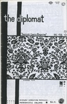</a></td><td><strong>The Diplomat</strong> 2</td><td>C Cilla</td><td>Comic</td><td>1995</td><td>A5</td><td>USA</td></tr>
<tr><td></td><td><strong>The Diplomat</strong> 3</td><td>C Cilla</td><td>Comic</td><td>1996</td><td>A5</td><td>USA</td></tr>
<tr><td></td><td><strong>The Assassin and the Whiner</strong> 4</td><td>Carrie McNinch</td><td>Comic</td><td>1996</td><td>A5</td><td>USA</td></tr>
<tr><td></td><td><strong>The Assassin and the Whiner</strong> 10</td><td>Carrie McNinch</td><td>Comic</td><td>1998</td><td>A5</td><td>USA</td></tr>
<tr><td><a href="../images/covers/100104_c.jpg">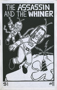</a></td><td><strong>The Assassin and the Whiner</strong> 11</td><td>Carrie McNinch</td><td>Comic</td><td>1999</td><td>A5</td><td>USA</td></tr>
<tr><td></td><td><strong>The Assassin and the Whiner</strong> 14</td><td>Carrie McNinch</td><td>Comic</td><td>2000</td><td>A5</td><td>USA</td></tr>
<tr><td></td><td><strong>Color Right</strong> </td><td>Charise Mericle</td><td>Comic</td><td>1995</td><td>A6</td><td></td></tr>
<tr><td></td><td><strong>Ally and the Big Man</strong> </td><td>Chris Askham</td><td>Comic</td><td>2001</td><td>A5</td><td>UK</td></tr>
<tr><td></td><td><strong>Dr Sponge</strong> 1</td><td>Chris Askham</td><td>Comic</td><td>2001</td><td>A5</td><td>UK</td></tr>
<tr><td></td><td><strong>Tales from the Mortuary</strong> </td><td>Chris Askham</td><td>Comic</td><td></td><td>A5</td><td>UK</td></tr>
<tr><td></td><td><strong>Goose Weekly</strong> 1</td><td>Chris Butler</td><td>Zine</td><td>1997</td><td>A5</td><td>UK</td></tr>
<tr><td></td><td><strong>Microwave Monthly</strong> </td><td>Chris Butler</td><td>Comic</td><td></td><td>A5</td><td>UK</td></tr>
<tr><td></td><td><strong>Inter-Section</strong> 1</td><td>Chris Harper</td><td>Zine</td><td>1997</td><td>A5</td><td>UK</td></tr>
<tr><td></td><td><strong>Rockdrill</strong> </td><td>Chris Webster</td><td>Comic</td><td>2005</td><td>A5</td><td>UK</td></tr>
<tr><td></td><td><strong>Big Thing - Collected Comic Stories 1990-1993</strong> </td><td>Colin Upton</td><td>Comic</td><td>1993</td><td>A5</td><td>USA</td></tr>
<tr><td></td><td><strong>Buddah on the Road</strong> 2</td><td>Colin Upton</td><td>Comic</td><td></td><td>A5</td><td>USA</td></tr>
<tr><td></td><td><strong>Toonadelic Times</strong> 2</td><td>Dal</td><td>Comic</td><td>2001</td><td>A5</td><td>UK</td></tr>
<tr><td></td><td><strong>Lickity Spit</strong> 2</td><td>Damian Cugley</td><td>Comic</td><td>1995</td><td>A5</td><td>UK</td></tr>
<tr><td></td><td><strong>Lickity Spit</strong> 3</td><td>Damian Cugley</td><td>Comic</td><td>1996</td><td>A5</td><td>UK</td></tr>
<tr><td></td><td><strong>Percy Street</strong> 1</td><td>Damian Cugley</td><td>Comic</td><td>2004</td><td>A5</td><td>UK</td></tr>
<tr><td></td><td><strong>Percy Street</strong> 2</td><td>Damian Cugley</td><td>Comic</td><td>2005</td><td>A5</td><td>UK</td></tr>
<tr><td></td><td><strong>The Journal of Ride Theory</strong> 3</td><td>Dan Howland</td><td>Zine</td><td>1997</td><td>A5</td><td>USA</td></tr>
<tr><td></td><td><strong>Mr Nile: The Illustrated Bastard</strong> </td><td>Daniel Merlin Goodbrey</td><td>Comic</td><td>2003</td><td>A5</td><td>UK</td></tr>
<tr><td></td><td><strong>45326</strong> 1</td><td>Darren Powell</td><td>Comic</td><td>1995</td><td>A5</td><td>UK</td></tr>
<tr><td></td><td><strong>Going to Chapel</strong> </td><td>Darren Powell</td><td>Comic</td><td>1995</td><td>A5</td><td>UK</td></tr>
<tr><td></td><td><strong>Sin</strong> 1</td><td>Darren Powell</td><td>Comic</td><td>1994</td><td>A5</td><td>UK</td></tr>
<tr><td></td><td><strong>Sin</strong> 2</td><td>Darren Powell</td><td>Comic</td><td>1994</td><td>A5</td><td>UK</td></tr>
<tr><td></td><td><strong>Sin</strong> 3</td><td>Darren Powell</td><td>Comic</td><td>1995</td><td>A5</td><td>UK</td></tr>
<tr><td></td><td><strong>Sin</strong> 4</td><td>Darren Powell</td><td>Comic</td><td>1996</td><td>A5</td><td>UK</td></tr>
<tr><td><a href="../images/covers/100297_c.jpg">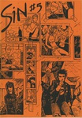</a></td><td><strong>Sin</strong> 5</td><td>Darren Powell</td><td>Comic</td><td>1997</td><td>A5</td><td>UK</td></tr>
<tr><td></td><td><strong>Sin</strong> 6</td><td>Darren Powell</td><td>Comic</td><td>1998</td><td>A5</td><td>UK</td></tr>
<tr><td></td><td><strong>Sin</strong> 7</td><td>Darren Powell</td><td>Comic</td><td>2004</td><td>A5</td><td>UK</td></tr>
<tr><td></td><td><strong>Theatre of Conceits</strong> 1</td><td>Darren Powell</td><td>Comic</td><td>1995</td><td>A5</td><td>UK</td></tr>
<tr><td><a href="../images/covers/100035_c.jpg">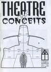</a></td><td><strong>Theatre of Conceits</strong> 2</td><td>Darren Powell</td><td>Comic</td><td>1995</td><td>A5</td><td>UK</td></tr>
<tr><td></td><td><strong>Theatre of Conceits</strong> 3</td><td>Darren Powell</td><td>Comic</td><td>1996</td><td>A5</td><td>UK</td></tr>
<tr><td></td><td><strong>Theatre of Conceits</strong> 4</td><td>Darren Powell</td><td>Comic</td><td>1996</td><td>A5</td><td>UK</td></tr>
<tr><td></td><td><strong>Theatre of Conceits</strong> 5</td><td>Darren Powell</td><td>Comic</td><td>1997</td><td>A5</td><td>UK</td></tr>
<tr><td></td><td><strong>Theatre of Conceits</strong> 8</td><td>Darren Powell</td><td>Comic</td><td>1999</td><td>A5</td><td>UK</td></tr>
<tr><td></td><td><strong>Blood Relatives</strong> </td><td>Darryl Cunningham</td><td>Comic</td><td>1989</td><td>A5</td><td>UK</td></tr>
<tr><td></td><td><strong>The British Sketchbook</strong> 1</td><td>Darryl Cunningham</td><td>Anthology Comic</td><td>1997</td><td>A5</td><td>UK</td></tr>
<tr><td></td><td><strong>The Marvel Sketchbook</strong> </td><td>Darryl Cunningham</td><td>Anthology Comic</td><td>1994</td><td>A5</td><td>UK</td></tr>
<tr><td></td><td><strong>A Last Cry For Help</strong> 2</td><td>Dave Kiersh</td><td>Comic</td><td></td><td>A5</td><td>USA</td></tr>
<tr><td></td><td><strong>David Baillie's Awkward Fascination Compendium</strong> </td><td>David Baillie</td><td>Comic</td><td>2003</td><td>A5</td><td>UK</td></tr>
<tr><td></td><td><strong>Fury</strong> 2</td><td>David Gordon</td><td>Comic</td><td>1991</td><td>A5</td><td>UK</td></tr>
<tr><td></td><td><strong>Fury</strong> 3</td><td>David Gordon</td><td>Comic</td><td>1992</td><td>A5</td><td>UK</td></tr>
<tr><td></td><td><strong>The Lightning Room [Damage 1]</strong> </td><td>David Gordon</td><td>Comic</td><td>1993</td><td>A5</td><td>UK</td></tr>
<tr><td></td><td><strong>Got to live their life</strong> 1</td><td>David Metcalfe</td><td>Comic</td><td>1995</td><td>A5</td><td>UK</td></tr>
<tr><td></td><td><strong>My Life Story</strong> 3</td><td>David Metcalfe</td><td>Comic</td><td>1995</td><td>A5</td><td>UK</td></tr>
<tr><td></td><td><strong>My Life Story</strong> 4</td><td>David Metcalfe</td><td>Comic</td><td>1995</td><td>A5</td><td>UK</td></tr>
<tr><td></td><td><strong>The Fugitive</strong> </td><td>David Metcalfe</td><td>Comic</td><td>1995</td><td>A5</td><td>UK</td></tr>
<tr><td></td><td><strong>Burp!</strong> 2</td><td>David Morris</td><td>Comic</td><td></td><td></td><td>UK</td></tr>
<tr><td></td><td><strong>Inkling</strong> 9</td><td>David Potts</td><td>Anthology Comic</td><td>1992</td><td>A5</td><td>UK</td></tr>
<tr><td></td><td><strong>Inkling</strong> Fish</td><td>David Potts</td><td>Anthology Comic</td><td>1991</td><td>A5</td><td>UK</td></tr>
<tr><td></td><td><strong>The Outer Realms</strong> 3</td><td>David Willacy</td><td>Comic</td><td>2004</td><td>A5</td><td></td></tr>
<tr><td></td><td><strong>Contact</strong> 1</td><td>Debbie Moon</td><td>Comic</td><td>1997</td><td>A5</td><td>UK</td></tr>
<tr><td></td><td><strong>Contact</strong> 2</td><td>Debbie Moon</td><td>Comic</td><td>1997</td><td>A5</td><td>UK</td></tr>
<tr><td></td><td><strong>Wasted Epiphanies</strong> </td><td>Deirde Ruane</td><td>Comic</td><td></td><td>A5</td><td></td></tr>
<tr><td></td><td><strong>црни креч</strong> 2-3</td><td>Dejan Bogojevic</td><td>Zine</td><td>1997</td><td>A5</td><td>Serbia</td></tr>
<tr><td></td><td><strong>Wargods of Atlantis</strong> 6</td><td>Dek Baker</td><td>Comic</td><td>1997</td><td>A5</td><td>UK</td></tr>
<tr><td></td><td><strong>The Staring Eye</strong> 1</td><td>Denny Derbyshire</td><td>Comic</td><td>1994</td><td>A5</td><td>UK</td></tr>
<tr><td></td><td><strong>The Staring Eye</strong> 2</td><td>Denny Derbyshire</td><td>Comic</td><td>1994</td><td>A5</td><td>UK</td></tr>
<tr><td></td><td><strong>The Staring Eye</strong> 3</td><td>Denny Derbyshire</td><td>Comic</td><td>1995</td><td>A5</td><td>UK</td></tr>
<tr><td><a href="../images/covers/100374_c.jpg">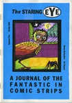</a></td><td><strong>The Staring Eye</strong> 5</td><td>Denny Derbyshire</td><td>Comic</td><td>1997</td><td>A5</td><td>UK</td></tr>
<tr><td></td><td><strong>Fish Wish</strong> </td><td>Derek Gray</td><td>Comic</td><td>1993</td><td>A6</td><td></td></tr>
<tr><td></td><td><strong>Hothead Paisan</strong> 18</td><td>Diane DiMassa</td><td>Comic</td><td>1995</td><td>A5</td><td>USA</td></tr>
<tr><td><a href="../images/covers/100231_c.jpg">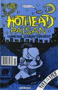</a></td><td><strong>Hothead Pasian</strong> 19</td><td>Diane DiMassa</td><td>Comic</td><td>1995</td><td>A5</td><td>USA</td></tr>
<tr><td><a href="../images/covers/100449_c.jpg">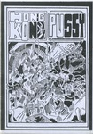</a></td><td><strong>Hong Kong Pussy</strong> </td><td>Dirtbag Comix</td><td>Comic</td><td>2003</td><td>A5</td><td>UK</td></tr>
<tr><td></td><td><strong>SFM Roma</strong> </td><td>Douglas Nobel</td><td>Comic</td><td>2002</td><td>A4</td><td>UK</td></tr>
<tr><td></td><td><strong>Strip For Me</strong> 9</td><td>Douglas Nobel</td><td>Comic</td><td>2002</td><td>A5</td><td>UK</td></tr>
<tr><td></td><td><strong>Strip For Me</strong> 11</td><td>Douglas Nobel</td><td>Comic</td><td>2002</td><td>A5</td><td>UK</td></tr>
<tr><td></td><td><strong>Strip For Me</strong> 13</td><td>Douglas Nobel</td><td>Comic</td><td>2003</td><td>A5</td><td>UK</td></tr>
<tr><td></td><td><strong>Nga Pakiwaituhi o Aotearoa - New Zealand Comics</strong> </td><td>Dylan Horrocks</td><td>Review Zine</td><td>1998</td><td>A5</td><td>NZ</td></tr>
<tr><td></td><td><strong>Reporter</strong> 1</td><td>Dylan Williams</td><td>Comic</td><td>1999</td><td>A5</td><td>USA</td></tr>
<tr><td></td><td><strong>Reporter</strong> 2</td><td>Dylan Williams</td><td>Comic</td><td>1999</td><td>A5</td><td>USA</td></tr>
<tr><td></td><td><strong>The End</strong> 4</td><td>Ed Hillyer</td><td>Comic</td><td>1999</td><td>A5</td><td>UK</td></tr>
<tr><td></td><td><strong>Fast Fiction</strong> 12</td><td>Ed Pinsent</td><td>Anthology Comic</td><td>1984</td><td>A5</td><td>UK</td></tr>
<tr><td></td><td><strong>Fast Fiction</strong> 27</td><td>Ed Pinsent</td><td>Anthology Comic</td><td>1989</td><td>A5</td><td>UK</td></tr>
<tr><td></td><td><strong>Henrietta!!</strong> </td><td>Ed Pinsent</td><td>Comic</td><td>1991</td><td>A5</td><td>UK</td></tr>
<tr><td><a href="../images/covers/100444_c.jpg">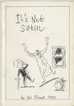</a></td><td><strong>It's Not Satin</strong> </td><td>Ed Pinsent</td><td>Comic</td><td>1990</td><td>A5</td><td>UK</td></tr>
<tr><td></td><td><strong>Gloomy Delight</strong> </td><td>EL Press</td><td>Zine</td><td>2001</td><td>A5</td><td></td></tr>
<tr><td></td><td><strong>Dope Fiends</strong> 1</td><td>Emmett Tayor</td><td>Comic</td><td></td><td>A5</td><td>Ireland</td></tr>
<tr><td></td><td><strong>The Seven Faced Badger of Doom</strong> </td><td>Factor Fiction Press</td><td>Anthology Comic</td><td></td><td>A5</td><td>UK</td></tr>
<tr><td></td><td><strong>Peops</strong> </td><td>Fly</td><td>Zine</td><td>2001</td><td>A5</td><td>USA</td></tr>
<tr><td></td><td><strong>Delirium</strong> 1</td><td>Garen Ewing</td><td>Comic</td><td>1996</td><td>A5</td><td>UK</td></tr>
<tr><td></td><td><strong>The Captain Powerchord Special</strong> </td><td>Garen Ewing</td><td>Comic</td><td>1996</td><td>A5</td><td>UK</td></tr>
<tr><td></td><td><strong>Great!</strong> 1</td><td>Gary Northfield</td><td>Comic</td><td>1999</td><td></td><td>UK</td></tr>
<tr><td></td><td><strong>Stupidmonsters</strong> 2</td><td>Gary Northfield</td><td>Comic</td><td>2002</td><td>A6</td><td>UK</td></tr>
<tr><td></td><td><strong>Fuzzball</strong> 4</td><td>Gary Parkin</td><td>Comic</td><td>1997</td><td>A5</td><td>UK</td></tr>
<tr><td></td><td><strong>Fuzzball</strong> 5</td><td>Gary Parkin</td><td>Comic</td><td>1997</td><td>A5</td><td>UK</td></tr>
<tr><td></td><td><strong>Fuzzball Summer Special</strong> </td><td>Gary Parkin</td><td>Comic</td><td>1997</td><td>A5</td><td>UK</td></tr>
<tr><td></td><td><strong>Fuzzball Superhero Special</strong> </td><td>Gary Parkin</td><td>Comic</td><td>1998</td><td>A5</td><td>UK</td></tr>
<tr><td></td><td><strong>Head Hunter</strong> 2</td><td>Gary Parkin</td><td>Comic</td><td>1997</td><td>A5</td><td>UK</td></tr>
<tr><td></td><td><strong>Head Hunter</strong> 3</td><td>Gary Parkin</td><td>Comic</td><td>1997</td><td>A5</td><td>UK</td></tr>
<tr><td></td><td><strong>Head Hunter</strong> 4</td><td>Gary Parkin</td><td>Comic</td><td>1997</td><td>A5</td><td>UK</td></tr>
<tr><td></td><td><strong>Head Hunter</strong> 5</td><td>Gary Parkin</td><td>Comic</td><td>1997</td><td>A5</td><td>UK</td></tr>
<tr><td><a href="../images/covers/100237_c.jpg">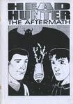</a></td><td><strong>Head Hunter: The Aftermath</strong> </td><td>Gary Parkin</td><td>Comic</td><td>1997</td><td>A5</td><td>UK</td></tr>
<tr><td></td><td><strong>Hero and the Peace-keepers</strong> 1</td><td>Gary Parkin</td><td>Comic</td><td>1997</td><td>A5</td><td>UK</td></tr>
<tr><td><a href="../images/covers/100292_c.jpg">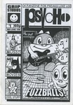</a></td><td><strong>Psycho</strong> 1</td><td>Gary Parkin</td><td>Zine</td><td></td><td>A5</td><td>UK</td></tr>
<tr><td></td><td><strong>A Brief History of Small Press Comics</strong> </td><td>Gav Burrows</td><td>Zine</td><td>2004</td><td>A5</td><td>UK</td></tr>
<tr><td></td><td><strong>Lucid Frenzy</strong> 1</td><td>Gav Burrows</td><td>Zine</td><td>2002</td><td>A5</td><td>UK</td></tr>
<tr><td><a href="../images/covers/100451_c.jpg">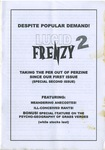</a></td><td><strong>Lucid Frenzy</strong> 2</td><td>Gav Burrows</td><td>Zine</td><td>2003</td><td>A5</td><td>UK</td></tr>
<tr><td></td><td><strong>Lucid Frenzy</strong> 7</td><td>Gav Burrows</td><td>Comic</td><td>2006</td><td>A5</td><td>UK</td></tr>
<tr><td></td><td><strong>Rocket Science</strong> </td><td>Gav Burrows</td><td>Comic</td><td>2003</td><td>A5</td><td>UK</td></tr>
<tr><td></td><td><strong>Surge</strong> 9</td><td>Ger Evans</td><td>Anthology Comic</td><td>1998</td><td>A5</td><td>Ireland</td></tr>
<tr><td></td><td><strong>Surge</strong> 10</td><td>Ger Evans</td><td>Anthology Comic</td><td>1998</td><td>A5</td><td>Ireland</td></tr>
<tr><td></td><td><strong>Memories of a Murderer</strong> </td><td>Giulia Brusco</td><td>Comic</td><td>2000</td><td>A5</td><td>UK</td></tr>
<tr><td></td><td><strong>Aggadon</strong> </td><td>Goodman Bros</td><td>Comic</td><td>2004</td><td>A5</td><td>UK</td></tr>
<tr><td></td><td><strong>Bahala Na!</strong> 3</td><td>Goodman Bros</td><td>Comic</td><td>2003</td><td>A5</td><td>UK</td></tr>
<tr><td></td><td><strong>Zip Gun Presents - Chimera</strong> </td><td>Goodman Bros</td><td>Anthology Comic</td><td>2003</td><td>A5</td><td>UK</td></tr>
<tr><td></td><td><strong>Zip Gun Presents - Japan</strong> </td><td>Goodman Bros</td><td>Anthology Comic</td><td>2001</td><td>A5</td><td>UK</td></tr>
<tr><td></td><td><strong>Zip Gun Presents - Noir</strong> </td><td>Goodman Bros</td><td>Anthology Comic</td><td>2002</td><td>A5</td><td>UK</td></tr>
<tr><td></td><td><strong>Sgt Mike Battle</strong> </td><td>Graham Pearce</td><td>Comic</td><td>2001</td><td>A5</td><td>UK</td></tr>
<tr><td></td><td><strong>Watchblood</strong> </td><td>Graham Pearce</td><td>Comic</td><td></td><td>A5</td><td>UK</td></tr>
<tr><td></td><td><strong>The Journal of Silly</strong> 10</td><td>Ham & Knife</td><td>Anthology Comic</td><td>1997</td><td>A5</td><td>UK</td></tr>
<tr><td></td><td><strong>The Journal of Silly</strong> 12b</td><td>Ham & Knife</td><td>Anthology Comic</td><td></td><td>A5</td><td>UK</td></tr>
<tr><td></td><td><strong>Cheeky Monkey's Fun Book</strong> </td><td>Hisae Arai</td><td>Comic</td><td></td><td>A5</td><td>UK</td></tr>
<tr><td></td><td><strong>After a Night of Improbable and Grotesque Mischief</strong> </td><td>Ian Thomas</td><td>Comic</td><td>2003</td><td>A5</td><td>UK</td></tr>
<tr><td></td><td><strong>Fight Amnesia!</strong> 10</td><td>Into The Abyss</td><td>Zine</td><td>1996</td><td>A5</td><td>UK</td></tr>
<tr><td></td><td><strong>Apollo Astro</strong> 3</td><td>Jack Turnbull</td><td>Comic</td><td>2000</td><td>A5</td><td>USA</td></tr>
<tr><td></td><td><strong>Apollo Astro</strong> 4</td><td>Jack Turnbull</td><td>Comic</td><td>2001</td><td>A5</td><td>USA</td></tr>
<tr><td></td><td><strong>Magic Boy Wins The Moon</strong> </td><td>James Kochalka</td><td>Comic</td><td>1996</td><td>A5</td><td>USA</td></tr>
<tr><td></td><td><strong>Dr Parsons Strips and Boxes</strong> </td><td>James Parsons</td><td>Comic</td><td>2002</td><td>A5</td><td>UK</td></tr>
<tr><td></td><td><strong>This is me by georg bush</strong> </td><td>James Parsons</td><td>Comic</td><td>2001</td><td>A5</td><td>UK</td></tr>
<tr><td></td><td><strong>This is us by Mrs Becem</strong> </td><td>James Parsons</td><td>Comic</td><td>2002</td><td>A5</td><td>UK</td></tr>
<tr><td></td><td><strong>Buldog Empire - preview</strong> </td><td>Jason Cobley</td><td>Comic</td><td></td><td>A5</td><td>UK</td></tr>
<tr><td></td><td><strong>Bulldog Adventure Magazine</strong> 27</td><td>Jason Cobley</td><td>Comic</td><td>2005</td><td>A5</td><td>UK</td></tr>
<tr><td></td><td><strong>Your Living Room</strong> </td><td>Jason Whitley</td><td>Comic</td><td>1996</td><td>A5</td><td></td></tr>
<tr><td></td><td><strong>French Small Press Guide</strong> </td><td>Jean-Paul Jennequin</td><td>Zine</td><td>1997</td><td>A5</td><td>France</td></tr>
<tr><td></td><td><strong>Jeff's Austin Diary</strong> </td><td>Jeffrey Lewis</td><td>Comic</td><td>2001</td><td>A5</td><td>USA</td></tr>
<tr><td></td><td><strong>Bumbalo Above Ground</strong> </td><td>Jenny Zervakis</td><td>Comic</td><td></td><td>A5</td><td>USA</td></tr>
<tr><td></td><td><strong>Strange Growths</strong> 12</td><td>Jenny Zervakis</td><td>Comic</td><td>1991</td><td>A5</td><td>USA</td></tr>
<tr><td><a href="../images/covers/100186_c.jpg">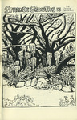</a></td><td><strong>Strange Growths</strong> 13</td><td>Jenny Zervakis</td><td>Comic</td><td></td><td>A5</td><td>USA</td></tr>
<tr><td></td><td><strong>Strange Growths</strong> 14.5</td><td>Jenny Zervakis</td><td>Comic</td><td></td><td>A5</td><td>USA</td></tr>
<tr><td></td><td><strong>3inaBed</strong> 11</td><td>Jeremy Dennis</td><td>Comic</td><td>1995</td><td>A5</td><td>UK</td></tr>
<tr><td></td><td><strong>3inaBed</strong> 13</td><td>Jeremy Dennis</td><td>Comic</td><td></td><td>A5</td><td>UK</td></tr>
<tr><td></td><td><strong>3inaBed</strong> 15</td><td>Jeremy Dennis</td><td>Comic</td><td>1996</td><td>A5</td><td>UK</td></tr>
<tr><td></td><td><strong>Cohabiting Cheapskates</strong> 6</td><td>Jeremy Dennis</td><td>Comic</td><td>1998</td><td>A5</td><td>UK</td></tr>
<tr><td></td><td><strong>Feeding the Geese</strong> </td><td>Jeremy Dennis</td><td>Comic</td><td></td><td>A5</td><td>UK</td></tr>
<tr><td></td><td><strong>Minute Steaks</strong> 22</td><td>Jeremy Dennis</td><td>Comic</td><td></td><td>A5</td><td>UK</td></tr>
<tr><td></td><td><strong>The Little Blue Book Of Extraordinary Interiors</strong> </td><td>Jeremy Dennis</td><td>Comic</td><td>2004</td><td>A5</td><td>UK</td></tr>
<tr><td></td><td><strong>The Weeky Strip</strong> </td><td>Jeremy Dennis</td><td>Comic</td><td>2001</td><td>A5</td><td>UK</td></tr>
<tr><td><a href="../images/covers/100245_c.jpg">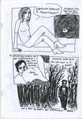</a></td><td><strong>Whatever Happed to Jeremy Dennis</strong> </td><td>Jeremy Dennis</td><td>Comic</td><td>2001</td><td>A5</td><td>UK</td></tr>
<tr><td><a href="../images/covers/100350_c.jpg">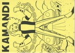</a></td><td><strong>Kamandi</strong> </td><td>Jeremy Lewis</td><td>Comic</td><td>1997</td><td>A5</td><td>UK</td></tr>
<tr><td></td><td><strong>Odetta</strong> 3</td><td>Jeremy Lewis</td><td>Comic</td><td>1997</td><td>A5</td><td>UK</td></tr>
<tr><td></td><td><strong>Funkapotamus</strong> 5</td><td>Jerome Gaynor</td><td>Comic</td><td>1993</td><td>A5</td><td>USA</td></tr>
<tr><td></td><td><strong>Delicious</strong> 11</td><td>Jessica</td><td>Comic</td><td></td><td>A5</td><td>UK</td></tr>
<tr><td></td><td><strong>Happy-Type Heroes</strong> 2</td><td>Jessica</td><td>Comic</td><td>1997</td><td>A5</td><td>UK</td></tr>
<tr><td></td><td><strong>Lore</strong> 1</td><td>Jessica</td><td>Comic</td><td></td><td>A5</td><td>UK</td></tr>
<tr><td></td><td><strong>Psychosense</strong> 1</td><td>Jessica</td><td>Comic</td><td>1996</td><td>A5</td><td>UK</td></tr>
<tr><td></td><td><strong>Psychosense</strong> 4</td><td>Jessica</td><td>Comic</td><td>1996</td><td>A5</td><td>UK</td></tr>
<tr><td></td><td><strong>Psychosense</strong> 5</td><td>Jessica</td><td>Comic</td><td>1996</td><td>A5</td><td>UK</td></tr>
<tr><td></td><td><strong>Psychosense</strong> 9</td><td>Jessica</td><td>Comic</td><td>1997</td><td>A5</td><td>UK</td></tr>
<tr><td></td><td><strong>Psychosense</strong> 10</td><td>Jessica</td><td>Comic</td><td>1998</td><td>A5</td><td>UK</td></tr>
<tr><td></td><td><strong>Psychosense Tales</strong> 1</td><td>Jessica</td><td>Comic</td><td>1997</td><td>A5</td><td>UK</td></tr>
<tr><td></td><td><strong>Coffee Time</strong> 7</td><td>Jez Higgins</td><td>Comic</td><td>1993</td><td>A5</td><td>UK</td></tr>
<tr><td><a href="../images/covers/100348_c.jpg">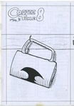</a></td><td><strong>Coffee Time</strong> 8</td><td>Jez Higgins</td><td>Comic</td><td>1994</td><td>A5</td><td>UK</td></tr>
<tr><td></td><td><strong>Coffee Time</strong> 9</td><td>Jez Higgins</td><td>Comic</td><td>1994</td><td>A5</td><td>UK</td></tr>
<tr><td></td><td><strong>TRS3</strong> May 2002</td><td>Jez Higgins</td><td>Review Zine</td><td></td><td>A4</td><td>UK</td></tr>
<tr><td></td><td><strong>Complicity</strong> </td><td>Jim Cameron</td><td>Comic</td><td>1997</td><td>A5</td><td>UK</td></tr>
<tr><td></td><td><strong>Confused</strong> </td><td>Jim Cameron</td><td>Comic</td><td>1996</td><td>A5</td><td>UK</td></tr>
<tr><td></td><td><strong>Disillusion</strong> </td><td>Jim Cameron</td><td>Comic</td><td>1996</td><td>A5</td><td>UK</td></tr>
<tr><td></td><td><strong>Thou Art That</strong> </td><td>Jim Cameron</td><td>Comic</td><td></td><td>A5</td><td>UK</td></tr>
<tr><td></td><td><strong>Rider's Writes</strong> 5</td><td>Jim Jones</td><td>Zine</td><td>1997</td><td>A5</td><td>UK</td></tr>
<tr><td></td><td><strong>Bad Attitude Boy</strong> 1</td><td>Jim Mcgee</td><td>Comic</td><td>2002</td><td>A5</td><td>UK</td></tr>
<tr><td></td><td><strong>RSI</strong> </td><td>Jim Mcgee</td><td>Comic</td><td>2003</td><td>A5</td><td>UK</td></tr>
<tr><td></td><td><strong>Square Eyed Stories</strong> 11</td><td>Jim Mcgee</td><td>Anthology Comic</td><td>1999</td><td>A5</td><td>UK</td></tr>
<tr><td></td><td><strong>Square Eyed Stories</strong> 13</td><td>Jim Mcgee</td><td>Anthology Comic</td><td>2001</td><td>A5</td><td>UK</td></tr>
<tr><td></td><td><strong>Square Eyed Stories</strong> 15</td><td>Jim Mcgee</td><td>Anthology Comic</td><td>2002</td><td>A5</td><td>UK</td></tr>
<tr><td></td><td><strong>Square Eyed Stories</strong> 16</td><td>Jim Mcgee</td><td>Anthology Comic</td><td>2003</td><td>A5</td><td>UK</td></tr>
<tr><td></td><td><strong>Square Eyed Stories</strong> 17</td><td>Jim Mcgee</td><td>Anthology Comic</td><td>2004</td><td>A5</td><td>UK</td></tr>
<tr><td></td><td><strong>The Bruising Pit</strong> </td><td>John Cake</td><td>Comic</td><td>1998</td><td>A5</td><td>UK</td></tr>
<tr><td></td><td><strong>Stop Making Sense</strong> 2</td><td>John Edwards</td><td>Comic</td><td></td><td>A5</td><td></td></tr>
<tr><td></td><td><strong>Tepid</strong> </td><td>John Hankiewicz</td><td>Comic</td><td>1998</td><td>A5</td><td>USA</td></tr>
<tr><td></td><td><strong>Fancy a Brew</strong> 1</td><td>John Jaques</td><td>Zine</td><td>1997</td><td>A5</td><td>UK</td></tr>
<tr><td></td><td><strong>Metaluna</strong> 1</td><td>John Miller</td><td>Zine</td><td></td><td>A5</td><td>UK</td></tr>
<tr><td></td><td><strong>Metaluna</strong> 2</td><td>John Miller</td><td>Zine</td><td></td><td>A5</td><td>UK</td></tr>
<tr><td></td><td><strong>King Cat</strong> 38</td><td>John Porcellino</td><td>Comic</td><td>1993</td><td>A5</td><td>USA</td></tr>
<tr><td></td><td><strong>King Cat</strong> 50</td><td>John Porcellino</td><td>Comic</td><td>1996</td><td>A5</td><td>USA</td></tr>
<tr><td></td><td><strong>King Cat</strong> 52</td><td>John Porcellino</td><td>Comic</td><td>1997</td><td>A5</td><td>USA</td></tr>
<tr><td></td><td><strong>King Cat</strong> 55</td><td>John Porcellino</td><td>Comic</td><td>1999</td><td>A5</td><td>USA</td></tr>
<tr><td></td><td><strong>King Cat</strong> 57</td><td>John Porcellino</td><td>Comic</td><td>2000</td><td>A5</td><td>USA</td></tr>
<tr><td><a href="../images/covers/100412_c.jpg">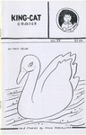</a></td><td><strong>King Cat</strong> 59</td><td>John Porcellino</td><td>Comic</td><td>2001</td><td>A5</td><td>USA</td></tr>
<tr><td></td><td><strong>Goathland</strong> 1</td><td>John Welding</td><td>Comic</td><td>1997</td><td>A5</td><td>UK</td></tr>
<tr><td><a href="../images/covers/100342_c.jpg">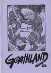</a></td><td><strong>Goathland</strong> 4</td><td>John Welding</td><td>Comic</td><td>1997</td><td>A5</td><td>UK</td></tr>
<tr><td></td><td><strong>Goathland</strong> 6</td><td>John Welding</td><td></td><td>1997</td><td>A5</td><td>UK</td></tr>
<tr><td></td><td><strong>Goathland</strong> 7</td><td>John Welding</td><td>Comic</td><td>1997</td><td>A5</td><td>UK</td></tr>
<tr><td></td><td><strong>Goathland</strong> 9</td><td>John Welding</td><td>Comic</td><td>1998</td><td>A5</td><td>UK</td></tr>
<tr><td></td><td><strong>Ain't Life A Blast</strong> 2</td><td>Jone-Zee</td><td>Comic</td><td></td><td>A5</td><td>UK</td></tr>
<tr><td></td><td><strong>Noe-Fie</strong> 7</td><td>K Wolfgang</td><td>Comic</td><td>1998</td><td>A5</td><td>USA</td></tr>
<tr><td></td><td><strong>Mysterious Tea Party</strong> </td><td>Kalah Allen</td><td>Comic</td><td></td><td>A5</td><td>USA</td></tr>
<tr><td></td><td><strong>Slurpy Sweet</strong> 1</td><td>Ken Grobe</td><td>Comic</td><td>1999</td><td>A5</td><td>USA</td></tr>
<tr><td></td><td><strong>Backwash</strong> 1</td><td>Ken Ives</td><td>Comic</td><td>1998</td><td>A5</td><td>USA</td></tr>
<tr><td></td><td><strong>Impossible</strong> 1</td><td>Kevin Huizenga</td><td>Anthology Comic</td><td>2001</td><td>A5</td><td>USA</td></tr>
<tr><td></td><td><strong>Rinky Dink</strong> 1</td><td>Kevin Lousy</td><td>Zine</td><td>1998</td><td>A5</td><td>USA</td></tr>
<tr><td></td><td><strong>Stories from the Ward</strong> </td><td>Lark Pien</td><td>Comic</td><td>1999</td><td>A5</td><td></td></tr>
<tr><td></td><td><strong>AshCom</strong> 1</td><td>Laura Watton</td><td>Comic</td><td>2002</td><td>A5</td><td>UK</td></tr>
<tr><td></td><td><strong>Mistakes and Regrets</strong> </td><td>Leonie O'Moore</td><td>Comic</td><td>2004</td><td>A5</td><td>UK</td></tr>
<tr><td></td><td><strong>Monstrum Horrendum</strong> 2</td><td>Leonie O'Moore</td><td>Comic</td><td></td><td>A5</td><td>UK</td></tr>
<tr><td></td><td><strong>Euro Liliane</strong> 11</td><td>Liliane</td><td>Comic</td><td>1996</td><td>A5</td><td>UK</td></tr>
<tr><td></td><td><strong>Mitten Brain</strong> 2</td><td>Luella Jane Wright</td><td>Comic</td><td>1994</td><td>A5</td><td>UK</td></tr>
<tr><td></td><td><strong>Weird Astral Detective Fiction</strong> </td><td>Luke Walsh</td><td>Comic</td><td>1992</td><td>A5</td><td>UK</td></tr>
<tr><td></td><td><strong>A Lone Still</strong> </td><td>Malcy Duff</td><td>Comic</td><td>2005</td><td>A5</td><td>UK</td></tr>
<tr><td></td><td><strong>Cute Yuck</strong> 1</td><td>Malcy Duff</td><td>Comic</td><td>2000</td><td>A5</td><td>UK</td></tr>
<tr><td></td><td><strong>Gunk</strong> </td><td>Malcy Duff</td><td>Comic</td><td>2000</td><td>A5</td><td>UK</td></tr>
<tr><td></td><td><strong>Hoofprints</strong> </td><td>Malcy Duff</td><td>Comic</td><td>2001</td><td>A5</td><td>UK</td></tr>
<tr><td></td><td><strong>I Can't Draw</strong> 2</td><td>Malcy Duff</td><td>Comic</td><td>2005</td><td>A5</td><td>UK</td></tr>
<tr><td></td><td><strong>Kerry</strong> </td><td>Malcy Duff</td><td>Comic</td><td>2002</td><td>A5</td><td>UK</td></tr>
<tr><td></td><td><strong>The Cloud Dog Agency</strong> </td><td>Malcy Duff</td><td>Comic</td><td>1999</td><td>A5</td><td>UK</td></tr>
<tr><td></td><td><strong>Zero Termite</strong> 3</td><td>Malcy Duff</td><td>Comic</td><td>1998</td><td>A5</td><td>UK</td></tr>
<tr><td></td><td><strong>Zero Termite</strong> 4</td><td>Malcy Duff</td><td>Comic</td><td>1998</td><td>A5</td><td>UK</td></tr>
<tr><td></td><td><strong>Zero Termite</strong> 7</td><td>Malcy Duff</td><td>Comic</td><td>1999</td><td>A5</td><td>UK</td></tr>
<tr><td></td><td><strong>Amzacourt</strong> 2</td><td>Marc Parker</td><td>Zine</td><td>1998</td><td>A5</td><td>USA</td></tr>
<tr><td></td><td><strong>Azmacourt</strong> 3</td><td>Marc Parker</td><td>Zine</td><td>1998</td><td>A5</td><td>USA</td></tr>
<tr><td></td><td><strong>Stiro</strong> 2</td><td>Mardou</td><td>Comic</td><td>2002</td><td>A5</td><td>UK</td></tr>
<tr><td></td><td><strong>Sputnik</strong> 1</td><td>Mark Bickley</td><td>Comic</td><td>1999</td><td>A5</td><td>UK</td></tr>
<tr><td></td><td><strong>Disinfotainment - Armchair Shopping</strong> </td><td>Mark Pawson</td><td>Other</td><td>1996</td><td>A6</td><td>UK</td></tr>
<tr><td></td><td><strong>Mapk Пaвcoн</strong> </td><td>Mark Pawson</td><td>Art Book</td><td></td><td>A5</td><td>UK</td></tr>
<tr><td></td><td><strong>The Palindromist</strong> 2</td><td>Mark Saltveit</td><td>Zine</td><td>1996</td><td>A5</td><td>USA</td></tr>
<tr><td><a href="../images/covers/100206_c.jpg">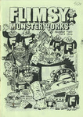</a></td><td><strong>Flimsy Monsterworks</strong> 2</td><td>Martin Hand</td><td>Comic</td><td>1997</td><td>A5</td><td>UK</td></tr>
<tr><td></td><td><strong>Hawaii</strong> </td><td>Matt Broersma</td><td>Comic</td><td>2004</td><td>A5</td><td>UK</td></tr>
<tr><td></td><td><strong>Les 9 cries du chat blanc</strong> </td><td>Matt Broersma</td><td>Comic</td><td>2004</td><td>A5</td><td>UK</td></tr>
<tr><td></td><td><strong>The Ant's Own Tram Wheel</strong> 1</td><td>Matthew Lawrenson</td><td>Zine</td><td>1993</td><td>A5</td><td>UK</td></tr>
<tr><td></td><td><strong>The Ant's Own Tram Wheel</strong> 3</td><td>Matthew Lawrenson</td><td>Zine</td><td>1994</td><td>A5</td><td>UK</td></tr>
<tr><td></td><td><strong>The Ant's Own Tram Wheel</strong> 4</td><td>Matthew Lawrenson</td><td>Zine</td><td>1994</td><td>A5</td><td>UK</td></tr>
<tr><td></td><td><strong>Thoughts and Words</strong> 2</td><td>Matthew Lawrenson</td><td>Zine</td><td>2002</td><td>A5</td><td>UK</td></tr>
<tr><td></td><td><strong>Diary of Neo-Psychedelic Man</strong> 17</td><td>Maximum Traffic</td><td>Comic</td><td></td><td>A5</td><td>USA</td></tr>
<tr><td></td><td><strong>Diary of Neo-Psychedelic Man</strong> 26</td><td>Maximum Traffic</td><td>Comic</td><td></td><td>A5</td><td>USA</td></tr>
<tr><td></td><td><strong>White Buffalo Gazette</strong> Apr 96</td><td>Maximum Traffic</td><td>Mail Art</td><td>1996</td><td>A5</td><td>USA</td></tr>
<tr><td></td><td><strong>Unspoken</strong> </td><td>Megan Kelso</td><td>Comic</td><td>1996</td><td>A5</td><td>USA</td></tr>
<tr><td><a href="../images/covers/100302_c.jpg">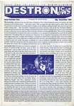</a></td><td><strong>Destronic News</strong> 1</td><td>Michael Perridge</td><td>Zine</td><td>1991</td><td>A5</td><td>UK</td></tr>
<tr><td></td><td><strong>Destronic News</strong> 2</td><td>Michael Perridge</td><td>Anthology Comic</td><td>1992</td><td>A5</td><td>UK</td></tr>
<tr><td></td><td><strong>Empty Life [Filthy Shit flip]</strong> 10</td><td>Mike Tolento</td><td>Comic</td><td>1997</td><td>A5</td><td>USA</td></tr>
<tr><td></td><td><strong>The Sugar Paper Rebellion</strong> </td><td>Mike Weller</td><td>Comic</td><td>1998</td><td>A5</td><td>UK</td></tr>
<tr><td><a href="../images/covers/100098_c.jpg">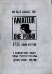</a></td><td><strong>Amateur demo edition</strong> </td><td>Mitch & Murray</td><td>Comic</td><td>1997</td><td>A5</td><td>UK</td></tr>
<tr><td></td><td><strong>Mooncat's very own comic</strong> </td><td>Mooncat</td><td>Comic</td><td>1993</td><td>A5</td><td>UK</td></tr>
<tr><td><a href="../images/covers/100019_c.jpg">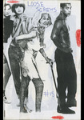</a></td><td><strong>Loose Screws</strong> 15</td><td>Mr Biggers</td><td>Zine</td><td>1998</td><td>A5</td><td>USA</td></tr>
<tr><td><a href="../images/covers/100440_c.jpg">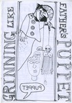</a></td><td><strong>Grinning Like Fathers Puppet</strong> </td><td>n/a</td><td>Comic</td><td>2002</td><td>A5</td><td>UK</td></tr>
<tr><td></td><td><strong>Neil Jam</strong> 7</td><td>Neil Fitzpatrick</td><td>Comic</td><td>2001</td><td>A5</td><td>USA</td></tr>
<tr><td></td><td><strong>Sunspots</strong> </td><td>Nick Abadzis</td><td>Comic</td><td>2001</td><td>A5</td><td>UK</td></tr>
<tr><td></td><td><strong>The Adventures of Hamish and Dwarf</strong> </td><td>Nigel Roberts</td><td>Comic</td><td>1996</td><td>A5</td><td>UK</td></tr>
<tr><td></td><td><strong>Nightfall</strong> 2</td><td>Noel K Hannan</td><td>Anthology Comic</td><td>1990</td><td>A5</td><td>UK</td></tr>
<tr><td></td><td><strong>Muppet Babies</strong> </td><td>Paper Rad</td><td>Art Book</td><td></td><td>A5</td><td>USA</td></tr>
<tr><td><a href="../images/covers/100335_c.jpg">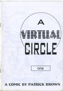</a></td><td><strong>A Virtual Circle</strong> 1</td><td>Patrick Brown</td><td>Comic</td><td>1995</td><td>A5</td><td>UK</td></tr>
<tr><td></td><td><strong>A Virtual Circle</strong> 2</td><td>Patrick Brown</td><td>Comic</td><td>1996</td><td>A5</td><td>UK</td></tr>
<tr><td></td><td><strong>A Virtual Circle</strong> 4</td><td>Patrick Brown</td><td>Comic</td><td>1996</td><td>A5</td><td>UK</td></tr>
<tr><td></td><td><strong>A Virtual Circle</strong> 5</td><td>Patrick Brown</td><td>Comic</td><td>1996</td><td>A5</td><td>UK</td></tr>
<tr><td></td><td><strong>Tamara Knight</strong> </td><td>Patrick Brown</td><td>Comic</td><td>1996</td><td>A5</td><td>UK</td></tr>
<tr><td><a href="../images/covers/100334_c.jpg">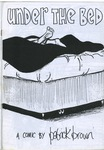</a></td><td><strong>Under the Bed</strong> </td><td>Patrick Brown</td><td>Comic</td><td>1996</td><td>A5</td><td>UK</td></tr>
<tr><td></td><td><strong>Holocron</strong> 0</td><td>Paul & Neil Bristow</td><td>Zine</td><td></td><td>A5</td><td>UK</td></tr>
<tr><td></td><td><strong>Holocron</strong> 1</td><td>Paul & Neil Bristow</td><td>Zine</td><td>1995</td><td>A5</td><td>UK</td></tr>
<tr><td></td><td><strong>Refractor</strong> 1</td><td>Paul & Neil Bristow</td><td>Zine</td><td></td><td>A5</td><td>UK</td></tr>
<tr><td></td><td><strong>Refractor</strong> 2</td><td>Paul & Neil Bristow</td><td>Zine</td><td></td><td>A5</td><td>UK</td></tr>
<tr><td></td><td><strong>Refractor</strong> 3</td><td>Paul & Neil Bristow</td><td>Zine</td><td></td><td>A5</td><td>UK</td></tr>
<tr><td></td><td><strong>Refractor</strong> 4</td><td>Paul & Neil Bristow</td><td>Zine</td><td></td><td>A5</td><td>UK</td></tr>
<tr><td></td><td><strong>The Whistleblowers</strong> </td><td>Paul & Neil Bristow</td><td>Zine</td><td>1995</td><td>A5</td><td>UK</td></tr>
<tr><td></td><td><strong>Mean Time</strong> </td><td>Paul Carstairs</td><td>Comic</td><td>1995</td><td>A5</td><td>UK</td></tr>
<tr><td></td><td><strong>Beer Frame</strong> 6</td><td>Paul Lukas</td><td>Zine</td><td>1996</td><td>A5</td><td>USA</td></tr>
<tr><td></td><td><strong>Beer Frame</strong> 7</td><td>Paul Lukas</td><td>Zine</td><td>1997</td><td>A5</td><td>USA</td></tr>
<tr><td></td><td><strong>Beer Frame</strong> 10</td><td>Paul Lukas</td><td>Zine</td><td>2000</td><td>A5</td><td>USA</td></tr>
<tr><td></td><td><strong>Fun Comics</strong> 1</td><td>Paul M Davies</td><td>Comic</td><td>1995</td><td>A5</td><td>UK</td></tr>
<tr><td></td><td><strong>Fun Comics</strong> 2</td><td>Paul M Davies</td><td>Comic</td><td>1995</td><td>A5</td><td>UK</td></tr>
<tr><td></td><td><strong>Fun Comics</strong> 3</td><td>Paul M Davies</td><td>Comic</td><td>1996</td><td>A5</td><td>UK</td></tr>
<tr><td></td><td><strong>Fun Comics</strong> 5</td><td>Paul M Davies</td><td>Comic</td><td>1996</td><td>A5</td><td>UK</td></tr>
<tr><td></td><td><strong>Dear Robert and Partner</strong> </td><td>Paul Rainey</td><td>Comic</td><td>2007</td><td>A5</td><td>UK</td></tr>
<tr><td></td><td><strong>Fume!</strong> </td><td>Peet Clack</td><td>Comic</td><td>2002</td><td>A6</td><td></td></tr>
<tr><td></td><td><strong>Round Midnight</strong> 2</td><td>Peter Bangs</td><td>Comic</td><td>1996</td><td>A5</td><td>UK</td></tr>
<tr><td></td><td><strong>Pavement</strong> 1</td><td>Peter Pavement</td><td>Comic</td><td>1992</td><td>A5</td><td>UK</td></tr>
<tr><td></td><td><strong>Pavement</strong> 2+3</td><td>Peter Pavement</td><td>Anthology Comic</td><td>1992</td><td>A5</td><td>UK</td></tr>
<tr><td></td><td><strong>The Information</strong> 4</td><td>Peter Poole</td><td>Zine</td><td>1999</td><td>A5</td><td>UK</td></tr>
<tr><td></td><td><strong>Worm</strong> 1998 - 2</td><td>Peter Van Laarhoven</td><td>Review Zine</td><td>1998</td><td>A5</td><td>Belgium</td></tr>
<tr><td></td><td><strong>Worm</strong> 1998 - 3</td><td>Peter Van Laarhoven</td><td>Review Zine</td><td>1998</td><td>A5</td><td>Belgium</td></tr>
<tr><td></td><td><strong>Jonni Star</strong> </td><td>Phil Elliott</td><td>Comic</td><td>1998</td><td>A5</td><td>UK</td></tr>
<tr><td></td><td><strong>Art Students Stole My Vibrator</strong> </td><td>Rachel House</td><td>Comic</td><td>2000</td><td>A5</td><td>UK</td></tr>
<tr><td><a href="../images/covers/100233_c.jpg">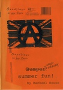</a></td><td><strong>Bumper Summer Fun</strong> </td><td>Rachel House</td><td>Comic</td><td>2003</td><td>A5</td><td>UK</td></tr>
<tr><td></td><td><strong>Captain Dolphin</strong> 5</td><td>Ralph Kidson</td><td>Comic</td><td></td><td>A5</td><td>UK</td></tr>
<tr><td></td><td><strong>Two To Beam Up</strong> 2</td><td>Ralph Kidson</td><td>Comic</td><td>2001</td><td>A5</td><td>UK</td></tr>
<tr><td></td><td><strong>Zeen</strong> </td><td>Ray Man</td><td>Comic</td><td>2000</td><td>A5</td><td>Belgium</td></tr>
<tr><td></td><td><strong>IK</strong> 3</td><td>Reinder Dijkhuis</td><td>Comic</td><td>1997</td><td>A5</td><td>Netherlands</td></tr>
<tr><td></td><td><strong>IK</strong> 5</td><td>Reinder Dijkhuis</td><td>Comic</td><td>1997</td><td>A5</td><td>Netherlands</td></tr>
<tr><td></td><td><strong>IK</strong> 6</td><td>Reinder Dijkhuis</td><td>Comic</td><td>1998</td><td>A5</td><td>Netherlands</td></tr>
<tr><td></td><td><strong>Sub Rosa</strong> 1</td><td>Richard Argent</td><td>Comic</td><td>1993</td><td>A5</td><td>UK</td></tr>
<tr><td></td><td><strong>Automatic</strong> 6</td><td>Richard Z Starbuck</td><td>Anthology Comic</td><td>1996</td><td>A5</td><td>UK</td></tr>
<tr><td></td><td><strong>Chain Mesh</strong> 4</td><td>Richard Z Starbuck</td><td>Anthology Comic</td><td>1992</td><td>A5</td><td>UK</td></tr>
<tr><td></td><td><strong>Tiddles the Wonder Cat's Super Silly Fun Book</strong> </td><td>Rick Olsen</td><td>Comic</td><td>1997</td><td>A5</td><td>UK</td></tr>
<tr><td></td><td><strong>Lifewish Bay</strong> </td><td>Ricky Douglas</td><td>Comic</td><td></td><td>A5</td><td>UK</td></tr>
<tr><td></td><td><strong>American Ant</strong> 1</td><td>Rik Hoskin</td><td>Comic</td><td>1993</td><td>A5</td><td>UK</td></tr>
<tr><td><a href="../images/covers/100145_c.jpg">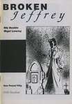</a></td><td><strong>Broken Jeffrey</strong> </td><td>Rik Hoskin</td><td>Comic</td><td>1996</td><td>A5</td><td>UK</td></tr>
<tr><td></td><td><strong>Shrapnel Kiss</strong> </td><td>Rik Rawling</td><td>Comic</td><td>1995</td><td>A5</td><td>UK</td></tr>
<tr><td></td><td><strong>Pride of an Angel</strong> 1</td><td>Robert Martin</td><td>Comic</td><td>2003</td><td>A5</td><td>UK</td></tr>
<tr><td></td><td><strong>Pride of an Angel</strong> 1</td><td>Robert Martin</td><td>Comic</td><td>2001</td><td>A5</td><td>UK</td></tr>
<tr><td></td><td><strong>Pride of an Angel</strong> 2</td><td>Robert Martin</td><td>Comic</td><td>2001</td><td>A5</td><td>UK</td></tr>
<tr><td></td><td><strong>Pride of an Angel</strong> One Shot</td><td>Robert Martin</td><td>Comic</td><td>2002</td><td>A5</td><td>UK</td></tr>
<tr><td></td><td><strong>Minds Eye Presents</strong> 10</td><td>Robin Bougie</td><td>Anthology Comic</td><td>2001</td><td>A5</td><td>USA</td></tr>
<tr><td></td><td><strong>Minds Eye Presents</strong> 11</td><td>Robin Bougie</td><td>Comic</td><td>1999</td><td>A5</td><td>USA</td></tr>
<tr><td></td><td><strong>The Incest Project</strong> 3</td><td>Robin Bougie</td><td>Zine</td><td>2005</td><td>A5</td><td>USA</td></tr>
<tr><td></td><td><strong>The Mice in RAID</strong> </td><td>Roger Mason</td><td>Comic</td><td>2003</td><td>A5</td><td>UK</td></tr>
<tr><td></td><td><strong>A Jock Gallery</strong> </td><td>Rol Hirst</td><td>Comic</td><td>1994</td><td>A5</td><td>UK</td></tr>
<tr><td></td><td><strong>Escape Committee</strong> 1</td><td>Rol Hirst</td><td>Comic</td><td>1999</td><td>A5</td><td>UK</td></tr>
<tr><td></td><td><strong>Escape Committee</strong> 2</td><td>Rol Hirst</td><td>Comic</td><td></td><td>A5</td><td>UK</td></tr>
<tr><td></td><td><strong>The Jock</strong> 1</td><td>Rol Hirst</td><td>Comic</td><td>1993</td><td>A5</td><td>UK</td></tr>
<tr><td></td><td><strong>The Jock</strong> 2</td><td>Rol Hirst</td><td>Comic</td><td>1993</td><td>A5</td><td>UK</td></tr>
<tr><td></td><td><strong>The Jock</strong> 3</td><td>Rol Hirst</td><td>Comic</td><td>1993</td><td>A5</td><td>UK</td></tr>
<tr><td></td><td><strong>The Jock</strong> 4</td><td>Rol Hirst</td><td>Comic</td><td>1993</td><td>A5</td><td>UK</td></tr>
<tr><td></td><td><strong>The Jock</strong> 5</td><td>Rol Hirst</td><td>Comic</td><td>1993</td><td>A5</td><td>UK</td></tr>
<tr><td></td><td><strong>The Jock</strong> 6</td><td>Rol Hirst</td><td>Comic</td><td>1993</td><td>A5</td><td>UK</td></tr>
<tr><td></td><td><strong>The Jock</strong> 8</td><td>Rol Hirst</td><td>Comic</td><td>1993</td><td>A5</td><td>UK</td></tr>
<tr><td></td><td><strong>The Jock</strong> 9</td><td>Rol Hirst</td><td>Comic</td><td>1993</td><td>A5</td><td>UK</td></tr>
<tr><td></td><td><strong>The Jock</strong> 10</td><td>Rol Hirst</td><td>Comic</td><td>1994</td><td>A5</td><td>UK</td></tr>
<tr><td></td><td><strong>The Jock</strong> 11</td><td>Rol Hirst</td><td>Comic</td><td>1994</td><td>A5</td><td>UK</td></tr>
<tr><td></td><td><strong>The Jock</strong> 12</td><td>Rol Hirst</td><td>Comic</td><td>1994</td><td>A5</td><td>UK</td></tr>
<tr><td></td><td><strong>The Jock</strong> 13</td><td>Rol Hirst</td><td>Comic</td><td>1994</td><td>A5</td><td>UK</td></tr>
<tr><td></td><td><strong>The Jock</strong> 14</td><td>Rol Hirst</td><td>Comic</td><td>1994</td><td>A5</td><td>UK</td></tr>
<tr><td></td><td><strong>The Jock</strong> 15</td><td>Rol Hirst</td><td>Comic</td><td>1994</td><td>A5</td><td>UK</td></tr>
<tr><td></td><td><strong>The Jock</strong> 16</td><td>Rol Hirst</td><td>Comic</td><td>1994</td><td>A5</td><td>UK</td></tr>
<tr><td></td><td><strong>The Jock</strong> 18</td><td>Rol Hirst</td><td>Comic</td><td>1995</td><td>A5</td><td>UK</td></tr>
<tr><td></td><td><strong>The Jock</strong> 19</td><td>Rol Hirst</td><td>Comic</td><td>1995</td><td>A5</td><td>UK</td></tr>
<tr><td></td><td><strong>The Jock</strong> 20</td><td>Rol Hirst</td><td>Comic</td><td>1995</td><td>A5</td><td>UK</td></tr>
<tr><td></td><td><strong>The Jock</strong> 21</td><td>Rol Hirst</td><td>Comic</td><td>1995</td><td>A5</td><td>UK</td></tr>
<tr><td></td><td><strong>The Jock</strong> 22</td><td>Rol Hirst</td><td>Comic</td><td>1995</td><td>A5</td><td>UK</td></tr>
<tr><td></td><td><strong>The Jock</strong> 23</td><td>Rol Hirst</td><td>Comic</td><td>1995</td><td>A5</td><td>UK</td></tr>
<tr><td></td><td><strong>The Jock</strong> 24</td><td>Rol Hirst</td><td>Comic</td><td>1996</td><td>A5</td><td>UK</td></tr>
<tr><td></td><td><strong>Garbles</strong> 6</td><td>Ros Garbles</td><td>Comic</td><td>1993</td><td>A5</td><td>UK</td></tr>
<tr><td></td><td><strong>Garbles</strong> 7</td><td>Ros Garbles</td><td>Comic</td><td>1993</td><td>A5</td><td>UK</td></tr>
<tr><td></td><td><strong>Garbles</strong> 9</td><td>Ros Garbles</td><td>Comic</td><td>1994</td><td>A5</td><td>UK</td></tr>
<tr><td></td><td><strong>Garbles</strong> 10</td><td>Ros Garbles</td><td>Comic</td><td>1995</td><td>A5</td><td>UK</td></tr>
<tr><td></td><td><strong>Garbles</strong> 11</td><td>Ros Garbles</td><td>Comic</td><td>1997</td><td>A5</td><td>UK</td></tr>
<tr><td></td><td><strong>Rough Cut Presents Trailers</strong> 1</td><td>Rough Cut Comics</td><td>Comic</td><td>2001</td><td>A5</td><td>UK</td></tr>
<tr><td></td><td><strong>Amusing Yourself To Death</strong> 15</td><td>Ruel Gaviola</td><td>Zine</td><td>1999</td><td>A5</td><td>USA</td></tr>
<tr><td><a href="../images/covers/100001_c.jpg">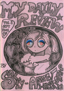</a></td><td><strong>My Daily Review</strong> 1</td><td>Sally Anne Hickman</td><td>Comic</td><td>2001</td><td>A5</td><td>UK</td></tr>
<tr><td></td><td><strong>Phobias</strong> </td><td>Sammy Wammy</td><td>Zine</td><td>2000</td><td>A5</td><td>UK</td></tr>
<tr><td></td><td><strong>Me and Edith Head</strong> </td><td>Sara Ryan</td><td>Comic</td><td>2002</td><td>A5</td><td>USA</td></tr>
<tr><td></td><td><strong>Soft</strong> 1</td><td>Sarah Gunn</td><td>Comic</td><td></td><td>A5</td><td>UK</td></tr>
<tr><td></td><td><strong>Soft</strong> 2</td><td>Sarah Gunn</td><td>Comic</td><td></td><td>A5</td><td>UK</td></tr>
<tr><td><a href="../images/covers/100026_c.jpg">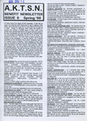</a></td><td><strong>AKTSN</strong> 6</td><td>SchNEWS</td><td>Zine</td><td>1998</td><td>A4</td><td>UK</td></tr>
<tr><td></td><td><strong>SchNEWS</strong> 158</td><td>SchNEWS</td><td>Zine</td><td>1998</td><td>A4</td><td>UK</td></tr>
<tr><td></td><td><strong>SchNEWS</strong> 159</td><td>SchNEWS</td><td>Zine</td><td>1998</td><td>A4</td><td>UK</td></tr>
<tr><td></td><td><strong>SchNEWS</strong> 160</td><td>SchNEWS</td><td>Zine</td><td>1998</td><td>A4</td><td>UK</td></tr>
<tr><td></td><td><strong>SchNEWS</strong> 161</td><td>SchNEWS</td><td>Zine</td><td>1998</td><td>A5</td><td>UK</td></tr>
<tr><td></td><td><strong>SchNEWS</strong> 162</td><td>SchNEWS</td><td>Zine</td><td>1998</td><td>A5</td><td>UK</td></tr>
<tr><td></td><td><strong>Ed</strong> </td><td>Sean Azzopardi</td><td>Comic</td><td>2005</td><td>A5</td><td>UK</td></tr>
<tr><td></td><td><strong>Twelve Hour Shift</strong> </td><td>Sean Azzopardi</td><td>Comic</td><td>2005</td><td>A5</td><td>UK</td></tr>
<tr><td></td><td><strong>Paper Tiger Comix</strong> 1</td><td>Sean Duffield</td><td>Anthology Comic</td><td>2004</td><td>A5</td><td>UK</td></tr>
<tr><td></td><td><strong>Paper Tiger Comix</strong> 2</td><td>Sean Duffield</td><td>Anthology Comic</td><td>2005</td><td>A5</td><td>UK</td></tr>
<tr><td></td><td><strong>The Girly Comic</strong> 1</td><td>Selina Locke</td><td>Anthology Comic</td><td>2002</td><td>A5</td><td>UK</td></tr>
<tr><td></td><td><strong>Imagineers</strong> 4</td><td>Shane Chesby</td><td>Zine</td><td>2001</td><td>A5</td><td>UK</td></tr>
<tr><td></td><td><strong>Ten Foot Rule</strong> 2</td><td>Shawn Granton</td><td>Comic</td><td>1997</td><td>A5</td><td>USA</td></tr>
<tr><td></td><td><strong>Ten Foot Rule</strong> 3</td><td>Shawn Granton</td><td>Comic</td><td>2000</td><td>A5</td><td>USA</td></tr>
<tr><td></td><td><strong>Ten Foot Rule</strong> 5</td><td>Shawn Granton</td><td>Anthology Comic</td><td>2000</td><td>A5</td><td>USA</td></tr>
<tr><td></td><td><strong>Ten Foot Rule 2.5 - Empty Life 10.5 flip</strong> </td><td>Shawn Granton & Mike Tolento</td><td>Comic</td><td>1998</td><td>A5</td><td>USA</td></tr>
<tr><td></td><td><strong>The Comics Reviewer</strong> 2</td><td>Simon Baker</td><td>Review Zine</td><td>1996</td><td>A5</td><td>UK</td></tr>
<tr><td></td><td><strong>Strimp</strong> </td><td>Simon Mackie</td><td>Comic</td><td>1996</td><td>A5</td><td>UK</td></tr>
<tr><td></td><td><strong>Flying Monkey</strong> 3</td><td>Simon Perrins</td><td>Comic</td><td>1998</td><td>A5</td><td>UK</td></tr>
<tr><td></td><td><strong>Hope for the Future</strong> 1</td><td>Simon Perrins</td><td>Comic</td><td>2000</td><td>A5</td><td>UK</td></tr>
<tr><td></td><td><strong>Hope for the Future</strong> 3</td><td>Simon Perrins</td><td>Comic</td><td>2001</td><td>A5</td><td>UK</td></tr>
<tr><td></td><td><strong>Anarchy in the UK... the Comic!</strong> </td><td>Slab-o-Concrete</td><td>Anthology Comic</td><td>1994</td><td>A5</td><td>UK</td></tr>
<tr><td><a href="../images/covers/100100_c.jpg">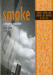</a></td><td><strong>Smoke - A London Peculiar</strong> 4</td><td>Smoke</td><td>Zine</td><td>2003</td><td>A5</td><td>UK</td></tr>
<tr><td></td><td><strong>Smoke - A London Peculiar</strong> 6</td><td>Smoke</td><td>Zine</td><td></td><td>A5</td><td>UK</td></tr>
<tr><td><a href="../images/covers/100044_c.jpg">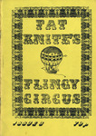</a></td><td><strong>Fat Knite</strong> 3</td><td>Steve Blincoe</td><td>Zine</td><td>1988</td><td>A5</td><td>UK</td></tr>
<tr><td></td><td><strong>Fat Knite</strong> 4</td><td>Steve Blincoe</td><td>Zine</td><td></td><td>A5</td><td>UK</td></tr>
<tr><td></td><td><strong>Fat Knite</strong> 5</td><td>Steve Blincoe</td><td>Zine</td><td></td><td>A5</td><td>UK</td></tr>
<tr><td></td><td><strong>Fat Knite</strong> 6</td><td>Steve Blincoe</td><td>Zine</td><td></td><td>A5</td><td>UK</td></tr>
<tr><td></td><td><strong>Terracotta</strong> </td><td>Terracotta</td><td>Zine</td><td>1996</td><td>A5</td><td>UK</td></tr>
<tr><td></td><td><strong>The Desyre Foundation Newsletter</strong> 1</td><td>The Desyre Foundation</td><td>Zine</td><td>1996</td><td>A5</td><td>UK</td></tr>
<tr><td></td><td><strong>Delirium Tremens</strong> 5</td><td>Three Drunken Goths</td><td>Zine</td><td>1999</td><td>A5</td><td>UK</td></tr>
<tr><td></td><td><strong>Brin</strong> 2</td><td>Tim Brown</td><td>Comic</td><td>1998</td><td>A5</td><td>UK</td></tr>
<tr><td></td><td><strong>Mystic Jam</strong> 8</td><td>Tim Brown</td><td>Comic</td><td>1996</td><td>A5</td><td>UK</td></tr>
<tr><td><a href="../images/covers/100062_c.jpg">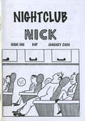</a></td><td><strong>Nightclub Nick</strong> 1</td><td>Tim Brown</td><td>Comic</td><td>2000</td><td>A5</td><td>UK</td></tr>
<tr><td></td><td><strong>Nightclub Nick</strong> 2</td><td>Tim Brown</td><td>Comic</td><td>2000</td><td>A5</td><td>UK</td></tr>
<tr><td></td><td><strong>Nightclub Nick</strong> 4</td><td>Tim Brown</td><td>Comic</td><td>2000</td><td>A5</td><td>UK</td></tr>
<tr><td></td><td><strong>Nightclub Nick</strong> 6</td><td>Tim Brown</td><td>Comic</td><td>2000</td><td>A5</td><td>UK</td></tr>
<tr><td></td><td><strong>The Mystic Stones</strong> 1</td><td>Tim Brown</td><td>Comic</td><td>1996</td><td>A5</td><td>UK</td></tr>
<tr><td></td><td><strong>The Mystic Stones</strong> 4</td><td>Tim Brown</td><td>Comic</td><td>1996</td><td>A5</td><td>UK</td></tr>
<tr><td></td><td><strong>The Mystic Stones</strong> 5</td><td>Tim Brown</td><td>Comic</td><td>1996</td><td>A5</td><td>UK</td></tr>
<tr><td><a href="../images/covers/100199_c.jpg">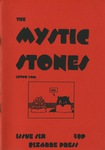</a></td><td><strong>The Mystic Stones</strong> 6</td><td>Tim Brown</td><td>Comic</td><td>1996</td><td>A5</td><td>UK</td></tr>
<tr><td></td><td><strong>The Mystic Stones</strong> 7</td><td>Tim Brown</td><td>Comic</td><td>1996</td><td>A5</td><td>UK</td></tr>
<tr><td></td><td><strong>Struggle</strong> v14 n1</td><td>Tim Hall</td><td>Zine</td><td>1998</td><td>A5</td><td>USA</td></tr>
<tr><td></td><td><strong>Japanize</strong> 2</td><td>Toko</td><td>Comic</td><td>1999</td><td>A5</td><td>UK</td></tr>
<tr><td></td><td><strong>Japanize</strong> 3</td><td>Toko</td><td>Comic</td><td>1999</td><td>A5</td><td>UK</td></tr>
<tr><td></td><td><strong>Japanize</strong> 10</td><td>Toko</td><td>Comic</td><td>2001</td><td>A5</td><td>UK</td></tr>
<tr><td></td><td><strong>Shelton</strong> </td><td>Tom Spurgeon</td><td>Comic</td><td>1999</td><td>A5</td><td>USA</td></tr>
<tr><td></td><td><strong>Angel Nebula</strong> 4</td><td>Tony McGee</td><td>Comic</td><td>1999</td><td>A5</td><td>UK</td></tr>
<tr><td></td><td><strong>Angel Nebula</strong> 9</td><td>Tony McGee</td><td>Comic</td><td>2001</td><td>A5</td><td>UK</td></tr>
<tr><td></td><td><strong>Dark Weather</strong> 4</td><td>Tony McGee</td><td>Comic</td><td>1997</td><td>A5</td><td>UK</td></tr>
<tr><td></td><td><strong>Dark Weather</strong> 5</td><td>Tony McGee</td><td>Comic</td><td>1998</td><td>A5</td><td>UK</td></tr>
<tr><td></td><td><strong>Dark Weather Special</strong> 1</td><td>Tony McGee</td><td>Comic</td><td>1998</td><td>A5</td><td>UK</td></tr>
<tr><td></td><td><strong>Dark Weather Special</strong> 2</td><td>Tony McGee</td><td>Comic</td><td>1998</td><td>A5</td><td>UK</td></tr>
<tr><td></td><td><strong>Frontiers</strong> 2</td><td>Tony McGee</td><td>Comic</td><td>2002</td><td>A5</td><td>UK</td></tr>
<tr><td></td><td><strong>Frontiers</strong> 6</td><td>Tony McGee</td><td>Comic</td><td>2003</td><td>A5</td><td>UK</td></tr>
<tr><td></td><td><strong>Frontiers</strong> 7</td><td>Tony McGee</td><td>Comic</td><td>2004</td><td>A5</td><td>UK</td></tr>
<tr><td></td><td><strong>Fun Bag</strong> </td><td>Tony McGee</td><td>Comic</td><td></td><td>A5</td><td>UK</td></tr>
<tr><td><a href="../images/covers/100429_c.jpg">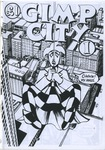</a></td><td><strong>Gimp City</strong> 1/2</td><td>Tony McGee</td><td>Comic</td><td></td><td>A5</td><td>UK</td></tr>
<tr><td></td><td><strong>True Stories</strong> 2</td><td>Tony McGee</td><td>Comic</td><td>2005</td><td>A5</td><td>UK</td></tr>
<tr><td></td><td><strong>Sharkpool</strong> 2</td><td>Tracy B</td><td>Zine</td><td>1998</td><td>A5</td><td>UK</td></tr>
<tr><td></td><td><strong>Typewriter</strong> 4</td><td>Typewriter</td><td>Anthology Comic</td><td>2001</td><td>A5</td><td></td></tr>
<tr><td></td><td><strong>Robot Investigator</strong> </td><td>Vincent Stall</td><td>Comic</td><td>2001</td><td>A5</td><td>USA</td></tr>
<tr><td></td><td><strong>The Smell of Napalm</strong> 1</td><td>Wayne Clarke</td><td>Zine</td><td></td><td>A5</td><td>UK</td></tr>
<tr><td></td><td><strong>The Smell of Napalm</strong> 2</td><td>Wayne Clarke</td><td>Zine</td><td></td><td>A5</td><td>UK</td></tr>
<tr><td></td><td><strong>Something Fast</strong> 1</td><td>Will Pickering</td><td>Comic</td><td>1996</td><td>A5</td><td>UK</td></tr>
<tr><td></td><td><strong>Something Fast</strong> 2</td><td>Will Pickering</td><td>Comic</td><td>1996</td><td>A5</td><td>UK</td></tr>
<tr><td></td><td><strong>Something Fast</strong> 3</td><td>Will Pickering</td><td>Comic</td><td>1996</td><td>A5</td><td>UK</td></tr>
<tr><td></td><td><strong>Wow Cool</strong> Spring 97</td><td>Wow Cool</td><td>Catalogue</td><td>1997</td><td>A5</td><td>USA</td></tr>
<tr><td></td><td><strong>Wonky Fascination</strong> </td><td>Yurt Barron</td><td>Comic</td><td>2003</td><td>A5</td><td>UK</td></tr>

</table>

---
end

